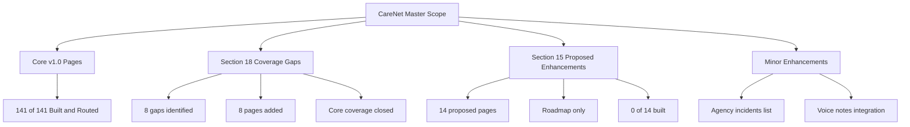

# D001 - Executive Overview & Current Reality Check

## 1. Purpose & Reading Frame [✅ 100% Built] [🔴 High]
This document is the executive entry point for the CareNet Master Planning Suite. It establishes the current platform reality using the wireframe build audit, the spec-compliance audit, and the system architecture specification.

This document answers three questions:

| Question | Source Basis | Forward Link |
|---|---|---|
| What is the platform status right now? | Wireframes Section 21 | → D007 §6, → D008 §10 |
| What was completed versus what remains? | Wireframes Sections 18 and 21 | → D009 §2 |
| How strong is coverage by module? | Wireframes Sections 18 and 21 | → D007 §6 |

## 2. Executive Summary [✅ 100% Built] [🔴 High]
CareNet v1.0 is documented as fully built at the wireframed core scope. The build audit states that all 141 core pages are built and routed, all major platform modules are covered, and all five major workflow families are represented in the documented UI surface. The system architecture also confirms the agency-mediated operating model as the governing business structure: guardians submit care requirements, agencies create jobs, caregivers apply, agencies place caregivers, shifts are assigned, care is delivered, and guardians monitor care.

The main planning distinction is not between "built" and "missing core scope." It is between:

1. Core v1.0 scope that is already built and routed.
2. Section 18 gaps that were identified and then explicitly closed by additional pages.
3. Section 15 v2.0 enhancements that are designed but explicitly not built.
4. Minor enhancements that remain outside the core completion claim.

## 3. Current Reality Check [✅ 100% Built] [🔴 High]
The documented current reality is straightforward:

| Area | Current Reality | Status |
|---|---|---|
| Core wireframed platform | 141 of 141 core pages are built and routed | [✅ 100% Built] |
| Core modules | Public, Auth, Guardian, Caregiver, Patient, Agency, Admin, Moderator, Shop, Community, Support, Utility, Agency Directory are all covered | [✅ 100% Built] |
| Workflow coverage | Care Requirement, Job, Application, Placement, Shift, and care monitoring flows are covered across the corpus | [✅ 100% Built] |
| Section 18 compliance gaps | 8 identified gaps were addressed by 8 additional pages | [✅ 100% Built] |
| Section 15 proposed improvement pages | 14 proposed pages are tracked as v2.0 items and not built | [❌ Not Built – v2.0] |
| Minor enhancements | Agency incidents list enhancement and voice notes integration remain pending | [🔄 Enhancement] |

The most important executive conclusion is that the platform is not in a partial-core state. It is in a complete-core state with a defined enhancement backlog.

## 4. What Is 100% Complete [✅ 100% Built] [🔴 High]
Section 21 provides the final build summary below.

| Module | Wireframed | Built | Confidence Basis |
|---|---:|---:|---|
| Public | 13 | 13 | Section 21 module audit |
| Auth | 8 | 8 | Section 21 module audit |
| Caregiver | 20 | 20 | Section 21 + Section 17 alignment additions |
| Guardian | 20 | 20 | Section 21 + Section 17 alignment corrections |
| Patient | 9 | 9 | Section 21 module audit |
| Agency | 20 | 20 | Section 21 + Sections 17 and 18 additions |
| Admin | 19 | 19 | Section 21 + Section 18 additions |
| Moderator | 4 | 4 | Section 21 module audit |
| Shop Merchant | 9 | 9 | Section 21 module audit |
| Shop Front | 10 | 10 | Section 21 module audit |
| Community | 3 | 3 | Section 21 module audit |
| Support | 4 | 4 | Section 21 module audit |
| Utility | 1 | 1 | Section 21 module audit |
| Agency Directory | 1 | 1 | Section 18 addition confirmed in Section 21 |
| Total Core | 141 | 141 | Final verdict in Section 21 |

Section 21 also confirms that the shared structural layer is present: Layout, PublicNavBar, BottomNav, RootLayout, ThemeProvider, design tokens, and theme CSS. This matters because the platform is documented not only as a set of isolated pages, but as a navigable system shell. Related reading: → D002 §2 and → D007 §2.

## 5. Gaps: Closed Versus Remaining [⚠️ Partially Built] [🔴 High]
This section distinguishes historical gaps from active gaps.

### 5.1 Section 18 Gaps That Were Identified and Closed [✅ 100% Built] [🔴 High]
The spec-compliance audit identifies eight missing coverage areas, then explicitly closes them through eight new pages.

| Closed Gap Area | Closing Page(s) | Current State |
|---|---|---|
| Public agency discovery | Agency Directory | [✅ 100% Built] |
| Agency job operations | Job Management | [✅ 100% Built] |
| Agency application review | Job Applications Review | [✅ 100% Built] |
| Agency caregiver payout operations | Payroll & Payouts | [✅ 100% Built] |
| Admin placement oversight | Placement Monitoring | [✅ 100% Built] |
| Admin agency approval workflow | Agency Approvals | [✅ 100% Built] |
| Marketplace and hiring alignment | Section 18 workflow additions | [✅ 100% Built] |
| Care timeline and operational monitoring coverage | Placement and shift monitoring views | [✅ 100% Built] |

Therefore, these are not open gaps in the current master status. They are already integrated into the built scope. Related reading: → D004 §2, → D006 §2, and → D007 §6.

### 5.2 v2.0 Scope That Is Explicitly Not Built [❌ Not Built – v2.0] [🔴 High]
Section 15 is the active roadmap backlog. These items were designed as proposed improvements and are explicitly documented as not yet built.

| Priority | Proposed Pages | Count | Current State |
|---|---|---:|---|
| 🔴 High | Daily Care Log, Patient Care Plan, Smart Health Alerts, Live Tracking, Shift Handoff | 5 | [❌ Not Built – v2.0] |
| 🟠 Medium | Symptom Journal, Photo Journal, Guardian Live Dashboard, Care Quality Scorecard, Telehealth | 5 | [❌ Not Built – v2.0] |
| 🟡 Low | Nutrition Tracker, Rehab Tracker, Family Board, Insurance Tracker | 4 | [❌ Not Built – v2.0] |
| Total | Section 15 roadmap pages | 14 | [❌ Not Built – v2.0] |

These are roadmap extensions, not evidence of unfinished v1.0 execution. Related reading: → D009 §2.

### 5.3 Minor Enhancements Still Pending [🔄 Enhancement] [🟡 Low]
Two items remain outside the core completion claim.

| Enhancement | Source | Current State |
|---|---|---|
| Agency Incidents List at `/agency/incidents` | Section 18.2.8 and Section 21.13 | [🔄 Enhancement] |
| Voice notes integration in Care Log, Messages, Shift Detail | Section 15.11 and Section 21.13 | [🔄 Enhancement] |

## 6. Confidence by Module [✅ 100% Built] [🟠 Medium]
The confidence rating below is a planning confidence score derived from documented build confirmation, spec-alignment evidence, and whether the corpus still flags pending enhancement work. It is not a code-quality audit.

| Module | Documented Status | Confidence | Basis |
|---|---|---|---|
| Public | 13 of 13 built | High | Full module audit plus agency directory addition |
| Auth | 8 of 8 built | High | Full module audit |
| Guardian | 20 of 20 built | High | Section 17 corrected direct-hire assumptions and Section 21 confirms build |
| Caregiver | 20 of 20 built | High | Agency-mediated flow fully reflected in Section 17 and Section 21 |
| Patient | 9 of 9 built | High | Full module audit |
| Agency | 20 of 20 built | Medium-High | Core coverage complete, but incidents list enhancement remains pending |
| Admin | 19 of 19 built | High | Section 18 oversight pages added and built |
| Moderator | 4 of 4 built | High | Full module audit |
| Shop Merchant | 9 of 9 built | High | Full module audit |
| Shop Front | 10 of 10 built | High | Full module audit |
| Community | 3 of 3 built | High | Full module audit |
| Support | 4 of 4 built | High | Full module audit |
| Utility | 1 of 1 built | High | Full module audit |
| Shared platform shell | Shared components documented as built | High | Section 21.11 component inventory |
| v2.0 enhancement surface | 14 proposed pages not built | Low | Explicitly roadmap-only in Section 21.12 |

## 7. Architectural Reality Statement [✅ 100% Built] [🔴 High]
The most important architectural reality is that CareNet is not a direct caregiver-booking marketplace. The corpus is explicit that care delivery is agency mediated. That principle now governs page structure, workflow ownership, messaging rules, placement logic, and payment flow.

| Architectural Rule | Current Documented Reality | Forward Link |
|---|---|---|
| Hiring path | Guardian creates care requirement; agency creates job; caregiver applies; agency places caregiver | → D004 §2 |
| Messaging access | Guardian-to-caregiver communication is allowed after placement begins | → D003 §6 |
| Financial path | Guardian pays agency-facing service flow; agency manages caregiver payroll internally | → D003 §6, → D006 §3 |
| Service contract model | Placement is the operational contract; shifts and caregiver rotation sit beneath it | → D004 §6, → D005 §2 |

This correction matters because it removes the largest historical architecture mismatch from the planning baseline.

## 8. Executive Planning Conclusion [✅ 100% Built] [🔴 High]
CareNet enters the v1.1 to v2.0 planning cycle from a strong baseline:

1. Core v1.0 product scope is fully built and routed.
2. Section 18 compliance gaps have been closed and should be treated as complete scope, not backlog.
3. The remaining substantive backlog is the Section 15 enhancement set plus a small number of low-severity enhancements.
4. The agency-mediated operating model is now the authoritative product architecture and should anchor all future planning documents.

For the rest of the suite, the practical reading order is:

| Next Document | Why It Follows D001 |
|---|---|
| → D002 | Establishes the navigation and shell that make the 141-page system coherent |
| → D003 | Locks the role and ownership model behind all workflow decisions |
| → D004 | Defines the operational state machines that drive requirements, jobs, placements, shifts, and care logging |
| → D009 | Converts the remaining Section 15 and enhancement backlog into the v2.0 roadmap |
