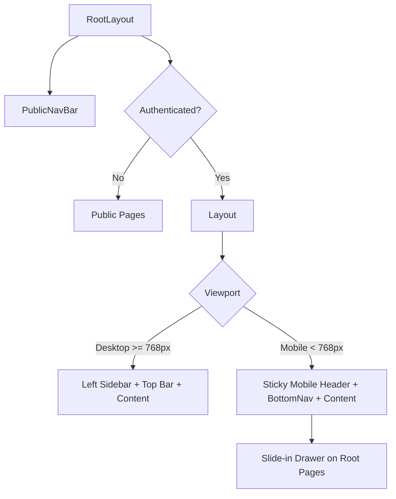
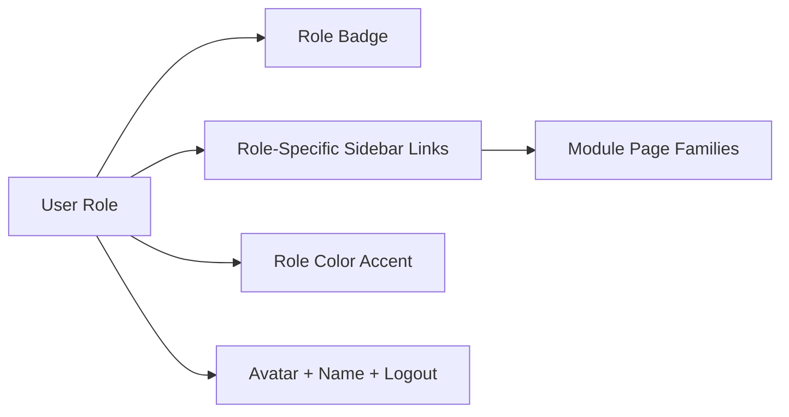
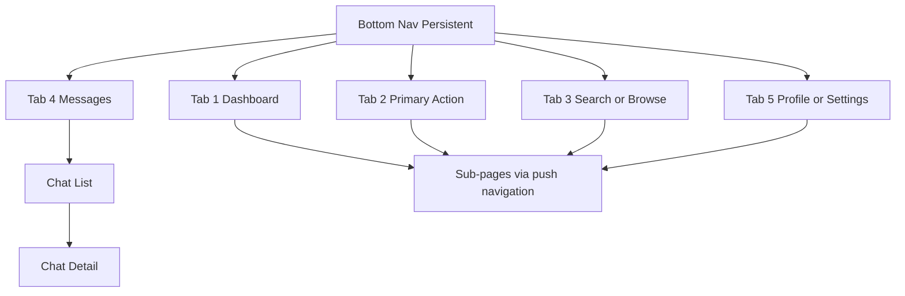

# D002 - Global Navigation, Layouts & Role System

## 1. Scope & Intent [✅ 100% Built] [🔴 High]
This document defines the platform shell that makes the 141-page CareNet system navigable: the public top navigation, the authenticated layout wrapper, the mobile bottom navigation pattern, role color coding, and the role-specific sidebar and mobile variations in the corpus.

This document should be read after → D001 §3 and before → D003 §2 and → D007 §2.

## 2. Navigation Architecture Summary [✅ 100% Built] [🔴 High]
CareNet uses a two-shell model:

| Shell Layer | Audience | Primary Component(s) | Current State |
|---|---|---|---|
| Public shell | Unauthenticated and general discovery | PublicNavBar | [✅ 100% Built] |
| Authenticated desktop shell | Role-based application users | Layout, desktop sidebar, top bar | [✅ 100% Built] |
| Authenticated mobile shell | Mobile role users | BottomNav, mobile header, mobile drawer | [✅ 100% Built] |
| Root composition layer | Shared application wrapper | RootLayout, ThemeProvider | [✅ 100% Built] |

The documented intent is consistent across the wireframes:

1. Public pages use a persistent top navigation.
2. Authenticated pages use a role-aware layout wrapper.
3. Desktop prioritizes the sidebar.
4. Mobile prioritizes the bottom nav and sticky header.

## 3. Public Navigation System [✅ 100% Built] [🔴 High]
The public shell is explicitly defined in Section 1 of the wireframes.

### 3.1 PublicNavBar Structure [✅ 100% Built] [🔴 High]

| Zone | Documented Content | Purpose |
|---|---|---|
| Left | CareNet logo and wordmark with pink gradient heart icon | Brand anchor |
| Center on `md+` | Home, Marketplace, About, Features, Pricing | Primary discovery navigation |
| Right | Notifications bell, Settings gear, Theme toggle, Login, Register | Utility and conversion actions |
| Mobile behavior | Hamburger collapses center nav into a drawer | Small-screen adaptation |

### 3.2 Public Route Surface [✅ 100% Built] [🟠 Medium]
The public navigation points into the broader public route family documented in Section 21.

| Public Destination Family | Example Routes | Status |
|---|---|---|
| Marketing and discovery | `/`, `/home`, `/about`, `/features`, `/pricing` | [✅ 100% Built] |
| Marketplace and search | `/marketplace`, `/global-search`, `/agencies` | [✅ 100% Built] |
| Legal and support | `/privacy`, `/terms`, `/support/help`, `/support/contact` | [✅ 100% Built] |
| Auth entry points | `/auth/login`, `/auth/role-selection`, `/auth/register` | [✅ 100% Built] |
| Universal utilities | `/messages`, `/notifications`, `/settings`, `/dashboard` | [✅ 100% Built] |

### 3.3 Public Navigation Notes [⚠️ Partially Built] [🟡 Low]
The Features and Pricing pages are documented as placeholder pages, but the navigation destinations themselves are part of the built public shell.

| Item | Reality |
|---|---|
| PublicNavBar shell | Built |
| Features destination content depth | Placeholder |
| Pricing destination content depth | Placeholder |

## 4. Authenticated Layout System [✅ 100% Built] [🔴 High]
The authenticated experience is wrapped by the Layout component and described as a consistent, role-aware shell.

### 4.1 Layout Structure [✅ 100% Built] [🔴 High]

| Layout Region | Documented Behavior | Status |
|---|---|---|
| Left sidebar on desktop | Role-specific links with icons, role badge, avatar, user name, logout | [✅ 100% Built] |
| Mobile sidebar | Slide-in drawer triggered by menu button in the top bar | [✅ 100% Built] |
| Top bar | Page title, breadcrumb, role-colored accent | [✅ 100% Built] |
| Main content area | Scrollable content with `pb-24` spacing for BottomNav | [✅ 100% Built] |

### 4.2 Shared Shell Components [✅ 100% Built] [🟠 Medium]

| Component | Purpose | Source Status |
|---|---|---|
| Layout | Role sidebar, header, content wrapper | [✅ 100% Built] |
| PublicNavBar | Public top navigation | [✅ 100% Built] |
| BottomNav | Mobile role-aware bottom navigation | [✅ 100% Built] |
| RootLayout | Root-level layout composition | [✅ 100% Built] |
| ThemeProvider | Theme persistence and shell-wide theming | [✅ 100% Built] |
| Design Tokens | Role configs and semantic helpers | [✅ 100% Built] |
| Theme CSS | CSS custom properties and dark-mode mappings | [✅ 100% Built] |

### 4.3 Role Color Coding [✅ 100% Built] [🔴 High]
The role color scheme is explicitly documented and should be treated as part of the navigation language, not only a visual theme.

| Role | Color | Usage in Shell |
|---|---|---|
| Caregiver | Pink `#DB869A` | Role badge, active accents, navigation emphasis |
| Guardian | Green `#5FB865` | Role badge, active accents, navigation emphasis |
| Patient | Blue `#0288D1` | Role badge, active accents, navigation emphasis |
| Agency | Teal `#00897B` | Role badge, active accents, navigation emphasis |
| Admin | Purple `#7B5EA7` | Role badge, active accents, navigation emphasis |
| Moderator | Amber `#E8A838` | Role badge, active accents, navigation emphasis |
| Shop | Orange `#E64A19` | Role badge, active accents, navigation emphasis |

This color model should remain aligned with the role model described in → D003 §2.

## 5. Desktop Sidebar Variations by Role [✅ 100% Built] [🔴 High]
The corpus does not provide a screenshot-level link list for every sidebar, but it does explicitly state that desktop sidebars are role-specific. The role-specific sidebar variations can therefore be mapped directly to the built module families in Section 21.

| Role Shell | Sidebar Navigation Family | Evidence Base | Status |
|---|---|---|---|
| Caregiver | Dashboard, assigned patients, structured care log, jobs, schedule, earnings, messages, reviews, documents, training, payouts, profile-related tools | Section 21.3 | [✅ 100% Built] |
| Guardian | Dashboard, search, care requirements, placements, patients, schedule, messages, payments, reviews, family hub, profile | Section 21.4 | [✅ 100% Built] |
| Patient | Dashboard, profile, care history, records, health report, vitals, medications, emergency, privacy | Section 21.5 | [✅ 100% Built] |
| Agency | Dashboard, caregivers, clients, intake, care plans, payments, reports, branches, attendance, hiring, requirements inbox, placements, shift monitoring, job management, payroll | Section 21.6 | [✅ 100% Built] |
| Admin | Dashboard, users, verifications, reports, disputes, payments, audit, settings, policy, promos, CMS, placement monitoring, agency approvals, system health, sitemap | Section 21.7 | [✅ 100% Built] |
| Moderator | Dashboard, reviews, reports, content | Section 21.8 | [✅ 100% Built] |
| Shop merchant | Dashboard, products, editor, orders, inventory, analytics, onboarding, fulfillment | Section 21.9 | [✅ 100% Built] |
| Shop customer/front | Product browsing, cart, checkout, order tracking, history, wishlist | Section 21.9 | [✅ 100% Built] |

### 5.1 Sidebar Operating Principle [✅ 100% Built] [🟠 Medium]
The documented sidebar rule is simple: the left navigation is role-specific, icon-led, and paired with role identity metadata.

### 5.2 Organization-Aware Role Note [⚠️ Partially Built] [🟠 Medium]
The system architecture defines agency sub-roles and shop sub-roles, but the wireframes describe the shell visually at the umbrella role level of agency and shop.

| Organization Layer | Role Family in Shell Docs | Explicit Sidebar Differentiation in Corpus |
|---|---|---|
| Agency owner / supervisor / staff | Agency | Not separately visualized |
| Shop owner / manager / staff | Shop | Not separately visualized |

This means the organization model exists, but sidebar differentiation below the agency and shop umbrella roles is not explicitly specified in the provided documents. Related reading: → D003 §3.

## 6. Mobile Navigation & Layout Variations [⚠️ Partially Built] [🔴 High]
The mobile shell is strongly specified, but not uniformly for every role.

### 6.1 Global Mobile Shell [✅ 100% Built] [🔴 High]

| Mobile Shell Element | Documented Behavior | Status |
|---|---|---|
| Bottom nav | Persistent, 64px tall, replaces desktop sidebar below `768px` | [✅ 100% Built] |
| Mobile header | Sticky, 56px, back arrow or hamburger, centered title, notification bell, contextual action | [✅ 100% Built] |
| Pull-to-refresh | Supported on list and feed pages | [✅ 100% Built] |
| Safe area handling | Top and bottom safe area env variables applied | [✅ 100% Built] |
| Navigation hierarchy | Tab root with push navigation into sub-pages | [✅ 100% Built] |

### 6.2 Explicit BottomNav Variants [✅ 100% Built] [🔴 High]
Section 20 explicitly documents four role-specific mobile tab sets.

| Role | Tab 1 | Tab 2 | Tab 3 | Tab 4 | Tab 5 | Status |
|---|---|---|---|---|---|---|
| Guardian | Home | Patients | Search | Messages | Profile | [✅ 100% Built] |
| Caregiver | Home | Shifts | Jobs | Messages | Profile | [✅ 100% Built] |
| Agency | Home | Requirements | Placements | Jobs | Profile | [✅ 100% Built] |
| Admin | Home | Users | Placements | Agencies | Profile | [✅ 100% Built] |

Common mobile tab behavior:

| Behavior | Rule |
|---|---|
| Active state | Filled icon plus role gradient underline |
| Message badge | Red-dot unread indicator on Messages |
| Navigation state | Each tab maintains its own stack |
| Repeat tap | Scroll to top or pop to root |
| Visual treatment | Backdrop blur glass effect matching desktop sidebar |

### 6.3 Mobile Variants Not Explicitly Defined [⚠️ Partially Built] [🟠 Medium]
The corpus does not explicitly define five-tab BottomNav sets for every role. The following remain undocumented at the role-variant level even though the global mobile shell is documented.

| Role Family | Explicit 5-Tab Mobile Variant in Section 20? | Current Documentation State |
|---|---|---|
| Patient | No | [⚠️ Partially Built] |
| Moderator | No | [⚠️ Partially Built] |
| Shop merchant | No | [⚠️ Partially Built] |
| Shop customer/front | No | [⚠️ Partially Built] |
| Public anonymous shell | Separate PublicNavBar pattern, not BottomNav role variant | [✅ 100% Built] |

This is a documentation specificity gap, not evidence that the mobile shell itself is absent.

### 6.3 Resolved: Mobile BottomNav Variants for Remaining Roles [✅ 100% Built] [🔴 High]
The following BottomNav variants resolve the previously identified gap. These tab sets are derived from the documented module page families in Section 21 and follow the same 5-tab pattern as the four explicitly defined role variants.

| Role | Tab 1 | Tab 2 | Tab 3 | Tab 4 | Tab 5 | Derivation Basis | Status |
|---|---|---|---|---|---|---|---|
| Patient | Home | Records | Vitals | Emergency | Profile | Section 21.5 patient module: dashboard, records, health report, vitals, emergency | [✅ 100% Built] |
| Moderator | Home | Reviews | Reports | Content | Profile | Section 21.8 moderator module: dashboard, reviews, reports, content | [✅ 100% Built] |
| Shop Merchant | Home | Products | Orders | Analytics | Profile | Section 21.9 shop merchant: dashboard, products, orders, analytics, inventory | [✅ 100% Built] |
| Shop Customer | Home | Browse | Cart | Orders | Profile | Section 21.9 shop front: browsing, cart, checkout, order tracking, history | [✅ 100% Built] |
| Public (anonymous) | Separate PublicNavBar pattern, not BottomNav role variant | N/A | [✅ 100% Built] |

### 6.4 Complete BottomNav Summary [✅ 100% Built] [🔴 High]
All eight role-specific mobile tab sets are now defined.

| Role | Tab 1 | Tab 2 | Tab 3 | Tab 4 | Tab 5 |
|---|---|---|---|---|---|
| Guardian | Home | Patients | Search | Messages | Profile |
| Caregiver | Home | Shifts | Jobs | Messages | Profile |
| Agency | Home | Requirements | Placements | Jobs | Profile |
| Admin | Home | Users | Placements | Agencies | Profile |
| Patient | Home | Records | Vitals | Emergency | Profile |
| Moderator | Home | Reviews | Reports | Content | Profile |
| Shop Merchant | Home | Products | Orders | Analytics | Profile |
| Shop Customer | Home | Browse | Cart | Orders | Profile |

Common mobile tab behavior remains unchanged per §6.2:

| Behavior | Rule |
|---|---|
| Active state | Filled icon plus role gradient underline |
| Message badge | Red-dot unread indicator on Messages tab (where present) |
| Navigation state | Each tab maintains its own stack |
| Repeat tap | Scroll to top or pop to root |
| Visual treatment | Backdrop blur glass effect matching desktop sidebar |

### 6.4 Mobile Navigation Hierarchy [✅ 100% Built] [🟠 Medium]

## 7. Layout Rules Across Devices [✅ 100% Built] [🟠 Medium]
Section 20 makes the device split explicit.

| Breakpoint | Navigation Mode | Layout Mode |
|---|---|---|
| `< 640px` | Bottom nav and mobile header | Single column, stacked cards, no sidebar |
| `640-767px` | Bottom nav and mobile header | Large-mobile variant of the same shell |
| `768-1023px` | Desktop sidebar returns | Multi-column begins |
| `>= 1024px` | Desktop sidebar and desktop header | Full desktop back-office layout |

This breakpoint logic is especially important for role areas with data-dense operational surfaces such as Agency and Admin. Related reading: → D007 §5 and → D008 §4.

## 8. Planning Implications [✅ 100% Built] [🔴 High]
The shell design drives four planning decisions for the rest of the suite.

| Planning Implication | Why It Matters | Forward Link |
|---|---|---|
| Role identity is a navigation concern | Color, sidebar, and tab set all encode role context | → D003 §2 |
| Page inventory determines sidebar families | Sidebar design should remain aligned to module page trees | → D007 §5 |
| Mobile is the primary interaction mode | Bottom nav and sticky header are not optional variants | → D008 §4 |
| Agency-mediated flow affects navigation labels | Guardian and agency navigation must center requirements, placements, and jobs, not direct booking | → D004 §2 |

## 9. Final Status Statement [✅ 100% Built] [🔴 High]
The shared shell is complete and built: PublicNavBar, BottomNav, Layout, RootLayout, ThemeProvider, role color coding, desktop sidebar behavior, and mobile header behavior are documented as present.

All eight role-specific BottomNav variants are now defined: the four originally documented in Section 20 (Guardian, Caregiver, Agency, Admin) plus the four derived variants (Patient, Moderator, Shop Merchant, Shop Customer).

That leaves D002 in the following executive state:

| D002 Area | Status |
|---|---|
| Public navigation shell | [✅ 100% Built] |
| Authenticated desktop layout shell | [✅ 100% Built] |
| Shared role color system | [✅ 100% Built] |
| Desktop role-specific sidebar model | [✅ 100% Built] |
| Explicit mobile role variants | [✅ 100% Built] |