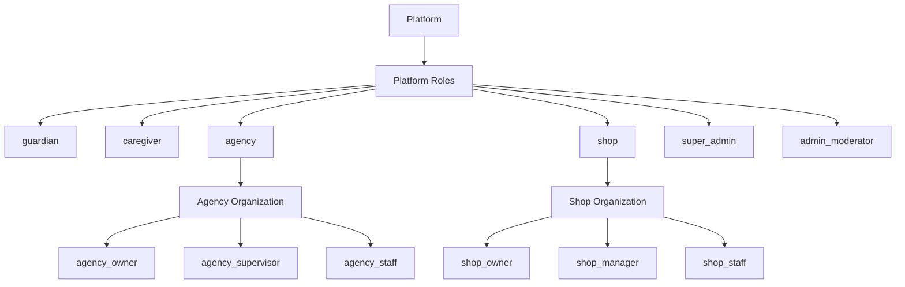
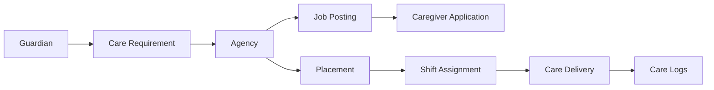

# D003 - Roles, RBAC & Organization Model

## 1. Scope & Authority [✅ 100% Built] [🔴 High]
This document defines the CareNet role system, RBAC structure, organization hierarchy, and access rules using the system architecture specification plus the agency-mediated corrections in the wireframes.

This document should be read with → D001 §7, → D002 §4, and before → D004 §2 and → D006 §2.

## 2. Final Role Model [⚠️ Partially Built] [🔴 High]
The corpus describes roles in two different but compatible ways:

1. System actors and platform roles in the engineering specification.
2. Registration-facing role options in the wireframe role-selection screen.

### 2.1 System Actors [✅ 100% Built] [🔴 High]

| Actor | Architectural Meaning | Core Responsibility |
|---|---|---|
| Patient | Person receiving care | Care subject, not job or payment owner |
| Guardian | Responsible party for patient | Create patient profiles, submit care requirements, monitor care, pay |
| Caregiver | Care delivery worker | Apply, accept placements, perform shifts, log care, report incidents |
| Caregiving Agency | Operational intermediary | Review requirements, create jobs, hire caregivers, manage shifts, supervise care |
| Medical Shop | Merchant entity | Sell medicines, equipment, and care supplies |
| Super Admin | Platform owner authority | Approvals, verification, suspensions, monitoring, disputes, analytics |

### 2.2 Platform Roles in the Spec [✅ 100% Built] [🔴 High]

| Platform Role | Meaning | Current State |
|---|---|---|
| `guardian` | Family or guardian account | [✅ 100% Built] |
| `caregiver` | Individual caregiver account | [✅ 100% Built] |
| `agency` | Agency organization role | [✅ 100% Built] |
| `shop` | Merchant organization role | [✅ 100% Built] |
| `super_admin` | Platform owner authority | [✅ 100% Built] |
| `admin_moderator` | Platform administration/moderation role family | [✅ 100% Built] |

### 2.3 Organization Sub-Roles in the Spec [✅ 100% Built] [🟠 Medium]

| Layer | Roles | Meaning |
|---|---|---|
| Agency roles | `agency_owner`, `agency_supervisor`, `agency_staff` | Agency-internal permission segmentation |
| Shop roles | `shop_owner`, `shop_manager`, `shop_staff` | Shop-internal permission segmentation |

### 2.4 Registration-Facing Roles in the Wireframes [⚠️ Partially Built] [🟠 Medium]
The role-selection UI exposes nine choices:

| Registration Choice | Relationship to Spec |
|---|---|
| Guardian / Family Member | Maps to `guardian` |
| Caregiving Agency | Maps to `agency` |
| Agency Manager | Agency-internal role, aligned to organization sub-role model |
| Caregiver | Maps to `caregiver` |
| Patient | Actor in the spec, not listed as a platform role |
| Medical Shop / Pharmacy | Maps to `shop` |
| Shop Manager | Shop-internal role, aligned to organization sub-role model |
| Platform Moderator | Operationally within `admin_moderator` |
| Platform Admin | Operationally adjacent to `super_admin` and `admin_moderator` |

This produces one important planning rule: the product has a broader operational identity model than the strict platform-role list alone. Patient exists as a first-class product identity in the wireframes, even though the spec lists Patient as an actor rather than a platform role.

## 3. Organization Hierarchy [✅ 100% Built] [🔴 High]
The architecture defines a layered identity model using `users`, `roles`, `permissions`, `user_roles`, `organizations`, `organization_users`, and `organization_roles`.

### 3.1 Ownership Layers [✅ 100% Built] [🔴 High]

| Layer | Governing Unit | Examples |
|---|---|---|
| Individual user layer | User account | Guardian, caregiver, patient-facing identity |
| Organization membership layer | Organization-user relation | Agency staff, shop staff |
| Organization-role layer | Role within organization | Agency owner, agency supervisor, shop manager |
| Platform authority layer | Platform-level administrative roles | Super admin, moderator/admin |

### 3.2 Hierarchy Rules [✅ 100% Built] [🟠 Medium]

| Rule | Interpretation |
|---|---|
| Guardians and caregivers operate as direct platform users | They are not organization sub-roles in the documented model |
| Agencies and shops own staff hierarchies | Their internal permissions sit below the platform role |
| Platform authority remains separate from business organizations | Admin and moderation powers do not belong to agencies or shops |
| Patient is managed, not autonomous in business workflows | Patients do not manage jobs or payments |

## 4. Permission Matrix [✅ 100% Built] [🔴 High]
The table below consolidates the permissions explicitly stated in the corpus.

| Capability | Guardian | Patient | Caregiver | Agency | Shop | Super Admin / Admin-Moderator |
|---|---|---|---|---|---|---|
| Create patient profiles | Yes | No | No | Not stated as primary owner | No | Oversight only |
| Submit care requirements | Yes | No | No | Review only | No | Oversight only |
| Review care requirements | No | No | No | Yes | No | Oversight only |
| Create jobs | No | No | No | Yes | No | Oversight only |
| Apply to jobs | No | No | Yes | No | No | No |
| Hire caregivers | No | No | No | Yes | No | Oversight only |
| Accept placements | No | No | Yes | Assign/manage | No | Oversight only |
| Assign shifts | No | No | No | Yes | No | Oversight only |
| Perform care shifts | No | No | Yes | Supervise only | No | No |
| Log care activities | Monitor only | No direct ownership stated | Yes | Supervise only | No | Oversight only |
| Report incidents | No primary duty stated | No | Yes | Yes via incident handling | No | Oversight only |
| Make care payments | Yes | No | No | Receive and administer | No | Oversight only |
| Run caregiver payroll | No | No | No | Yes | No | Oversight only |
| Initiate shop orders | Yes | Not stated | Yes | Yes | Receive/fulfill | Oversight only |
| Approve agencies | No | No | No | No | No | Yes |
| Verify caregivers | No | No | No | No | No | Yes |
| Monitor placements platform-wide | No | No | No | Own placements | No | Yes |
| Manage disputes | No | No | No | Operationally involved | No | Yes |

## 5. Agency and Shop Internal RBAC [⚠️ Partially Built] [🟠 Medium]
The spec gives explicit responsibility detail for selected organization sub-roles, but not every sub-role receives a full permission list.

### 5.1 Agency Sub-Roles [⚠️ Partially Built] [🔴 High]

| Agency Role | Explicit Permissions in Corpus | Status |
|---|---|---|
| `agency_owner` | Manage agency profile, manage staff, configure service areas, manage billing, view financial reports | [✅ 100% Built] |
| `agency_supervisor` | Review requirements, create caregiver jobs, interview caregivers, assign caregivers, monitor shifts, handle incidents, manage replacement | [✅ 100% Built] |
| `agency_staff` | Exists in role model and schema | [⚠️ Partially Built] |

### 5.2 Shop Sub-Roles [⚠️ Partially Built] [🟠 Medium]

| Shop Role | Explicit Permissions in Corpus | Status |
|---|---|---|
| `shop_owner` | Manage store, configure payment accounts, view analytics, invite staff | [✅ 100% Built] |
| `shop_manager` | Manage products, process orders, manage inventory, respond to customer queries | [✅ 100% Built] |
| `shop_staff` | Exists in role model and schema | [⚠️ Partially Built] |

The role existence is fully documented. The only partial area is permission granularity for `agency_staff` and `shop_staff`.

## 6. Access Rules: Messaging, Hiring, and Data Ownership [✅ 100% Built] [🔴 High]

### 6.1 Hiring and Relationship Rule [✅ 100% Built] [🔴 High]
The most important access boundary in CareNet is architectural, not cosmetic:

1. Guardians do not hire caregivers directly.
2. Agencies mediate all care delivery.
3. Caregiver profiles are research surfaces for guardians, not direct booking endpoints.
4. Placements are service contracts between guardian and agency.

### 6.2 Messaging Access by Stage [✅ 100% Built] [🔴 High]

| Stage | Guardian Can Message | Caregiver Can Message | Rule Status |
|---|---|---|---|
| Requirement stage | Agency only | Not involved | [✅ 100% Built] |
| Job stage | Agency only | Agency only | [✅ 100% Built] |
| Interview stage | Agency only | Agency only, moderated | [✅ 100% Built] |
| Placement active | Agency and assigned caregiver | Agency and assigned guardian | [✅ 100% Built] |
| Placement completed | Agency for follow-up | Agency for follow-up | [✅ 100% Built] |

Additional enforcement rules:

| Rule | Meaning |
|---|---|
| Composer is stage-aware | New conversations are blocked when the stage does not permit access |
| Conversation list shows role badges | Agency, caregiver, and guardian are visibly distinguished |
| Agency staff can see all conversations related to their placements | Agency oversight extends across placement-bound communications |

### 6.3 Data Ownership Rules [✅ 100% Built] [🔴 High]

| Data / Contract Object | Primary Owner or Steward | Access Rule |
|---|---|---|
| Patient profile | Guardian as manager | Patient does not manage jobs or payments |
| Care requirement | Guardian creates; agency reviews | Requirement is the guardian-to-agency intake object |
| Agency job | Agency | Not a guardian-owned hiring object |
| Caregiver application | Caregiver submits; agency reviews | Part of agency hiring workflow |
| Placement | Guardian-agency service contract | Supports multiple caregivers through shifts |
| Shift | Agency assigns; caregiver performs | Guardian monitors rather than assigns |
| Care log | Caregiver records | Guardian monitors; agency supervises |
| Caregiver payroll | Agency | Guardian does not see payout split |
| Shop order | Initiated by guardian, caregiver, or agency | Shop fulfills marketplace order |

### 6.4 Payment Ownership Rules [✅ 100% Built] [🔴 High]

| Flow Step | Owner |
|---|---|
| Care service bill initiation | Placement-linked guardian billing |
| Service payment path | Guardian → Platform → Agency |
| Caregiver payout administration | Agency |
| Caregiver split visibility to guardian | Not visible |

## 7. Administrative Oversight Model [✅ 100% Built] [🟠 Medium]

| Authority | Explicit Power |
|---|---|
| Super admin | Approve agencies, verify caregivers, suspend accounts, monitor placements, manage disputes, view analytics |
| Admin / moderator family | User management, agency approval, caregiver verification, placement monitoring, dispute resolution, payments, audit logs |

This confirms that platform oversight is not delegated to agencies. Agencies operate care delivery; platform authority governs platform trust and control.

## 8. Final Planning Position [⚠️ Partially Built] [🔴 High]
The CareNet RBAC model is complete at the architectural level:

1. Platform roles are defined.
2. Agency and shop organization sub-roles are defined.
3. Messaging access is explicitly stage-gated.
4. Hiring ownership and payment ownership are explicitly agency-mediated.
5. Placement, shift, and care-log responsibilities are clearly separated.

The only partial area is sub-role granularity for `agency_staff` and `shop_staff`, plus the role-taxonomy mismatch between the spec's platform-role list and the wireframe registration list, where Patient, Agency Manager, Shop Manager, Platform Moderator, and Platform Admin are surfaced as user-facing identities.

That leaves D003 in this final state:

| Area | Status |
|---|---|
| Core platform role model | [✅ 100% Built] |
| Organization hierarchy | [✅ 100% Built] |
| Permission matrix | [✅ 100% Built] |
| Messaging and ownership rules | [✅ 100% Built] |
| Sub-role granularity for all org staff roles | [⚠️ Partially Built] |
