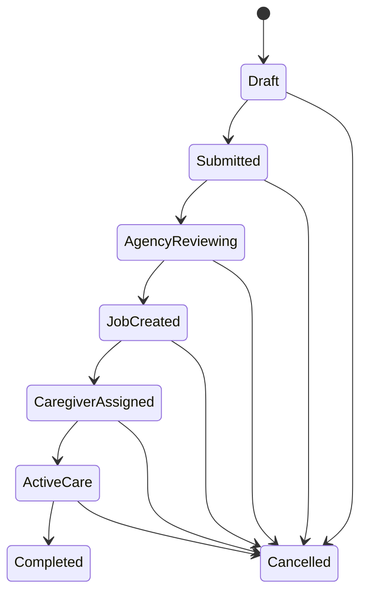
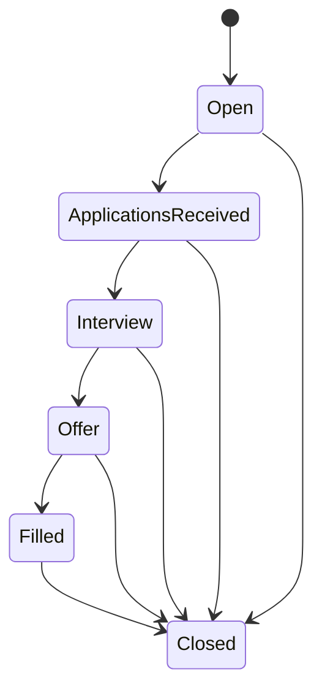
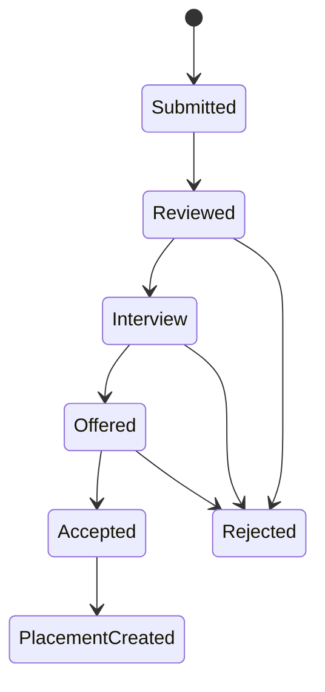
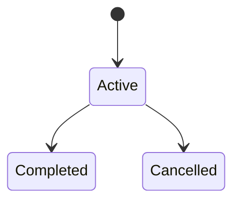
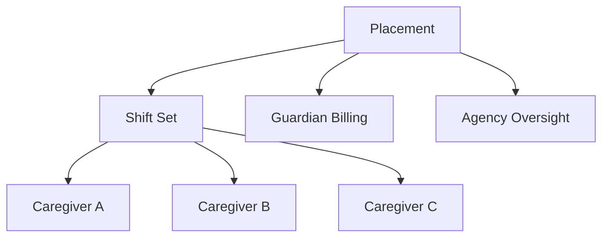
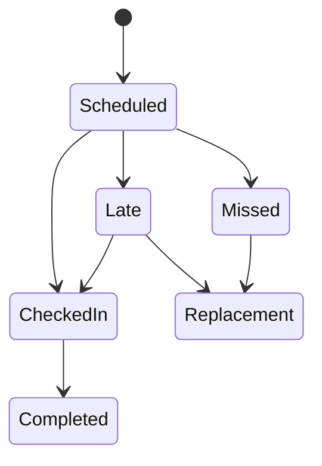
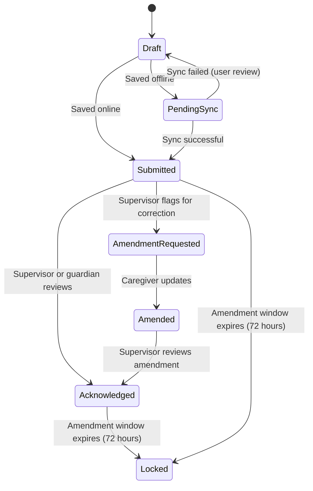
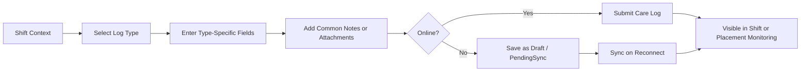

# D004 - Core Business Workflows & State Machines

## 1. Scope & Governing Principle [✅ 100% Built] [🔴 High]
This document defines the operational workflows that govern care delivery in CareNet: Care Requirement, Job, Application, Placement, Shift, and Care Log.

All flows are controlled by one non-negotiable rule from the corpus: CareNet is agency mediated. Guardians do not hire caregivers directly. Agencies review demand, create jobs, hire caregivers, create placements, assign shifts, and supervise service continuity. Related reading: → D003 §6.

## 2. Canonical End-to-End Flow [✅ 100% Built] [🔴 High]
The engineering specification and Section 17 align on one final operating chain.

```mermaid
flowchart LR
    A[Guardian creates Care Requirement] --> B[Agency reviews Requirement]
    B --> C[Agency creates Job]
    C --> D[Caregiver applies]
    D --> E[Agency reviews and interviews]
    E --> F[Agency hires Caregiver]
    F --> G[Agency creates Placement]
    G --> H[Agency assigns Shifts]
    H --> I[Caregiver performs Shift]
    I --> J[Caregiver logs Care]
    J --> K[Guardian monitors care via placement, logs, alerts]
```

| Workflow Stage | Primary Owner | Secondary Participant | Output |
|---|---|---|---|
| Requirement intake | Guardian | Agency | Care requirement |
| Job creation and hiring | Agency | Caregiver | Filled job |
| Service contract formation | Agency and guardian | Caregiver | Placement |
| Operational delivery | Agency | Caregiver | Shift execution |
| Clinical/activity recording | Caregiver | Agency and guardian monitor | Care logs |

## 3. Care Requirement Lifecycle [✅ 100% Built] [🔴 High]
The care requirement is the intake object created by the guardian and consumed by the agency.

| State | Meaning | Primary Actor |
|---|---|---|
| Draft | Requirement is being prepared and can still be edited | Guardian |
| Submitted | Requirement has been sent to agency | Guardian |
| Agency Reviewing | Agency is assessing need and response | Agency |
| Job Created | Agency has converted requirement into a hiring workflow | Agency |
| Caregiver Assigned | Agency has identified or secured a caregiver | Agency |
| Active Care | Requirement has turned into live service delivery | Agency and caregiver |
| Completed | Service has finished | Agency and guardian |
| Cancelled | Requirement was terminated before or during service | Guardian or agency |

### 3.1 Workflow Notes [✅ 100% Built] [🟠 Medium]

| Rule | Operational Meaning |
|---|---|
| Requirement replaces direct booking | The old booking wizard was architecturally removed in favor of a care requirement wizard |
| Guardian communicates with agency at this stage | Guardian-to-caregiver messaging is blocked before placement |
| Requirement may lead to direct proposal or to job creation | Agency can use existing roster or open a job |

## 4. Job Lifecycle [✅ 100% Built] [🔴 High]
Jobs are agency-created hiring objects, never guardian-posted requests.

| State | Meaning | Primary Actor |
|---|---|---|
| Open | Job is available for application | Agency |
| Applications Received | One or more caregiver applications exist | Agency |
| Interview | Screening or interview activity is underway | Agency |
| Offer | Agency has advanced a candidate to offer stage | Agency |
| Filled | Caregiver has been secured for the need | Agency |
| Closed | Job is no longer active | Agency |

### 4.1 Job Rules [✅ 100% Built] [🟠 Medium]

| Rule | Meaning |
|---|---|
| Jobs are posted by agencies | Guardian demand becomes agency hiring action, not a public guardian posting |
| Patient and guardian identity may be anonymized in the job layer | The corrected caregiver marketplace should not behave like direct guardian hiring |
| Filled job is a bridge state, not the service contract itself | The service contract is the placement, not the job |

## 5. Caregiver Application Lifecycle [✅ 100% Built] [🔴 High]
Applications are caregiver-owned submissions reviewed by agencies.

| State | Meaning | Primary Actor |
|---|---|---|
| Submitted | Caregiver has applied | Caregiver |
| Reviewed | Agency has assessed the application | Agency |
| Interview | Interview or evaluation is underway | Agency |
| Offered | Agency has sent a proposed engagement | Agency |
| Accepted | Caregiver accepted the offer | Caregiver |
| Rejected | Application was declined | Agency or caregiver outcome |
| Placement Created | Accepted candidate is converted into live assignment structure | Agency |

### 5.1 Application Notes [✅ 100% Built] [🟠 Medium]

| Rule | Meaning |
|---|---|
| Applications belong to agency jobs | They do not connect directly to guardian booking |
| Interview scheduling is agency-controlled | The corpus describes moderated interview handling |
| Acceptance does not end the process | Placement creation is the downstream operational handoff |

## 6. Placement Lifecycle [✅ 100% Built] [🔴 High]
The placement is the active service contract between guardian and agency. It is the central operational object in live care.

| State | Meaning | Primary Owner |
|---|---|---|
| Active | Placement is live and delivering care | Guardian-agency contract managed by agency |
| Completed | Placement ended normally | Agency and guardian |
| Cancelled | Placement ended early or was terminated | Agency and guardian |

### 6.1 Placement Structural Rules [✅ 100% Built] [🔴 High]

| Rule | Meaning |
|---|---|
| Placement is the service contract | It links the guardian’s approved need to live care delivery |
| One placement can contain multiple caregivers | Rotation across shifts is expected and supported |
| Guardian monitors quality, not staffing | Agency owns rotation, replacement, and staffing continuity |
| Financial visibility is placement-linked | Guardian billing references agency and placement, not direct caregiver payout |

## 7. Shift Lifecycle [✅ 100% Built] [🔴 High]
Shifts are the operational delivery units nested inside a placement.

| State | Meaning | Primary Actor |
|---|---|---|
| Scheduled | Shift exists and awaits execution | Agency |
| Checked In | Caregiver has started duty | Caregiver |
| Completed | Shift finished successfully | Caregiver and agency |
| Missed | Scheduled shift was not fulfilled | Agency monitors |
| Late | Check-in missed expected timing window | Agency monitors |
| Replacement | Alternate caregiver was inserted | Agency |

### 7.1 Shift Control Rules [✅ 100% Built] [🟠 Medium]

| Rule | Meaning |
|---|---|
| Agency assigns shifts | Caregiver does not self-assign |
| Caregiver check-in/check-out is operationally significant | Missed-shift alerts route to supervision |
| Replacement is a supported state | It operationalizes the agency continuity promise |

## 8. Care Log Workflow [✅ 100% Built] [🔴 High]
The corpus fully defines care-log obligation, types, and fields. The formal care-log lifecycle state machine below resolves the previously identified gap, providing state definitions consistent with the offline strategy (→ D016), audit compliance requirements (→ D011 §6, 7-year retention), and the agency-mediated supervision model.

### 8.1 What Is Explicitly Defined [✅ 100% Built] [🔴 High]

| Defined Element | Corpus Definition |
|---|---|
| Responsibility | Caregivers must log all activities |
| Log types | Meal, Medication, Vitals, Exercise, Bathroom, Sleep, Observation, Incident |
| Core fields | `timestamp`, `caregiver_id`, `patient_id`, `shift_id`, `notes`, `attachments` |
| Structured UI | Section 17.3.12 defines type-specific form inputs by log type |

### 8.2 Care Log Lifecycle State Machine [✅ 100% Built] [🔴 High]

| State | Meaning | Primary Actor |
|---|---|---|
| Draft | Log is being composed or saved offline; not yet submitted | Caregiver |
| Pending Sync | Log was created offline and is queued for server submission | System (per → D016) |
| Submitted | Log has been received by server and is visible to supervisors | Caregiver |
| Acknowledged | Agency supervisor or guardian has reviewed and acknowledged the log | Agency supervisor or Guardian |
| Amendment Requested | Supervisor has flagged the log for correction or additional detail | Agency supervisor |
| Amended | Caregiver has updated the log in response to amendment request; original preserved in audit trail | Caregiver |
| Locked | Log has passed the amendment window and is immutable for compliance purposes | System |

### 8.3 Care Log Lifecycle Rules [✅ 100% Built] [🔴 High]

| Rule | Specification |
|---|---|
| Draft persistence | Drafts are stored in IndexedDB per → D016 §4 and survive app restarts |
| Amendment window | 72 hours from submission; after window closes, log transitions to Locked |
| Amendment audit | Original log content is preserved alongside amendment; both are retained for 7 years per → D011 §6 |
| Locked immutability | Locked logs cannot be edited by any user; only admin can add compliance annotations |
| Offline drafts | PendingSync state is unique to offline operation; online users skip directly to Submitted |
| Incident logs | Incident-type logs trigger immediate notification on submission per → D021 §4.1; amendment rules still apply |
| Attachment handling | Photos and files attached during Draft or PendingSync are staged locally per → D016 §4.1 and uploaded with the log on sync |

### 8.4 Care Log Operational Flow [✅ 100% Built] [🔴 High]

### 8.5 Care Log Types [✅ 100% Built] [🟠 Medium]

| Type | Primary Purpose |
|---|---|
| Meal | Nutrition intake record |
| Medication | Administration record |
| Vitals | Measurement capture |
| Exercise | Mobility or rehab activity capture |
| Bathroom | Elimination and assistance tracking |
| Sleep | Rest-quality capture |
| Observation | General care note |
| Incident | Exception and risk event recording |

Care logs are shift-linked evidence records and supervisory visibility inputs. The lifecycle state machine ensures that logs are auditable, amendable within a defined window, and permanently locked for compliance after the amendment period. Related reading: → D005 §2, → D006 §2, → D011 §6, and → D016 §4.

## 9. Agency-Mediated Corrections That Change Workflow Meaning [✅ 100% Built] [🔴 High]
Section 17 does not merely add pages. It changes the interpretation of the entire product flow.

| Corrected Area | Old Assumption | Final Rule |
|---|---|---|
| Guardian search | Direct caregiver marketplace | Agency-first discovery with caregiver research surfaces |
| Caregiver profile | Book-now endpoint | Read-only research surface with agency affiliation |
| Booking wizard | Direct hire flow | Replaced by care requirement submission |
| Guardian messages | Unrestricted direct communication | Stage-gated access based on requirement or placement state |
| Guardian payments | Direct caregiver payment implication | Agency-facing placement billing; agency handles caregiver payroll |

## 10. Workflow Control Matrix [✅ 100% Built] [🔴 High]

| Workflow | Creation Owner | Transition Owner | Monitoring Owner | Completion Signal |
|---|---|---|---|---|
| Care Requirement | Guardian | Agency after submission | Guardian and agency | Active care, completion, or cancellation |
| Job | Agency | Agency | Agency | Filled or closed |
| Application | Caregiver | Agency and caregiver | Agency | Placement creation or rejection |
| Placement | Agency with guardian contract context | Agency | Guardian, agency, platform admin oversight | Completed or cancelled |
| Shift | Agency | Caregiver and agency | Agency | Completed, missed, late, or replacement |
| Care Log | Caregiver | Caregiver (Draft → Submitted); Agency supervisor (Amendment Requested); System (Locked) | Guardian and agency visibility | Locked after 72-hour amendment window |

## 11. Final Planning Position [✅ 100% Built] [🔴 High]
The workflow architecture is strong and explicit across the core operating model.

| Workflow Area | Status |
|---|---|
| Care Requirement lifecycle | [✅ 100% Built] |
| Job lifecycle | [✅ 100% Built] |
| Application lifecycle | [✅ 100% Built] |
| Placement lifecycle | [✅ 100% Built] |
| Shift lifecycle | [✅ 100% Built] |
| Care Log structured workflow | [✅ 100% Built] |
| Care Log formal state machine | [✅ 100% Built] |

All six core workflow state machines are now fully defined. The care-log lifecycle closure connects to the offline strategy (→ D016), audit compliance (→ D011), and notification design (→ D021).