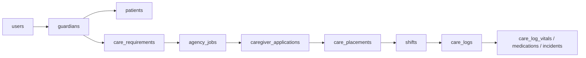
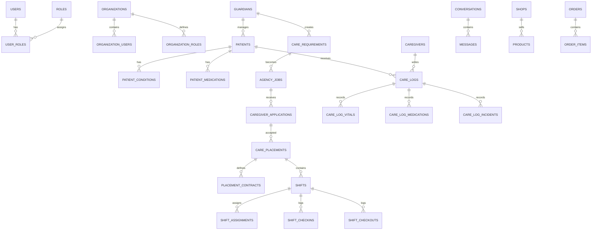

# D005 - Master Data Model & Critical Tables

## 1. Scope & Model Boundary [✅ 100% Built] [🔴 High]
This document condenses the CareNet data model into the most operationally important table groups for planning. It does not restate the full schema. It extracts the core entities that drive identity, organizations, patients, requirements, jobs, applications, placements, shifts, care logs, messaging, shop operations, and platform oversight.

This document should be read after → D003 §3 and → D004 §2, and before → D006 §2.

## 2. Core Data Chain [✅ 100% Built] [🔴 High]
The corpus repeatedly converges on one central operational chain:



Everything else branches around this chain: organizations govern staffing, messaging governs communication, shop tables govern commerce, and platform tables govern oversight.

## 3. Condensed Domain Table Map [✅ 100% Built] [🔴 High]
The following list captures 45 critical tables or table families from the corpus.

| Domain | Critical Tables | Why They Matter |
|---|---|---|
| Identity & access | `users`, `roles`, `permissions`, `user_roles` | Foundational identity and RBAC layer |
| Organizations | `organizations`, `organization_users`, `organization_roles` | Agency and shop hierarchy model |
| Guardian & patient | `guardians`, `patients`, `patient_conditions`, `patient_medications`, `patient_documents` | Care subject, guardian ownership, health context |
| Requirements | `care_requirements`, `requirement_notes`, `requirement_documents`, `requirement_status_history` | Intake and requirement lifecycle |
| Agency | `agencies`, `agency_staff`, `agency_documents` | Agency identity and operating structure |
| Jobs | `agency_jobs`, `job_skills`, `job_requirements`, `job_status_history` | Agency hiring layer |
| Applications | `caregiver_applications`, `application_interviews`, `application_notes` | Candidate pipeline |
| Caregiver | `caregivers`, `caregiver_skills`, `caregiver_certifications`, `caregiver_background_checks`, `caregiver_ratings` | Workforce profile and trust layer |
| Placements | `care_placements`, `placement_contracts`, `placement_status` | Live service contract model |
| Shifts | `shifts`, `shift_assignments`, `shift_checkins`, `shift_checkouts` | Scheduling and attendance control |
| Care logs | `care_logs`, `care_log_meals`, `care_log_medications`, `care_log_vitals`, `care_log_incidents` | Structured care evidence |
| Messaging | `conversations`, `messages`, `message_attachments` | Stage-gated communication |
| Shop | `shops`, `products`, `product_categories`, `orders`, `order_items`, `payments`, `shipments` | Marketplace operations |
| Platform oversight | `notifications`, `audit_logs`, `support_tickets`, `files` | Alerts, compliance, support, file assets |

## 4. Domain Grouping View [✅ 100% Built] [🟠 Medium]

### 4.1 Identity & Organization Layer [✅ 100% Built] [🔴 High]

| Table Family | Function | Ownership Rule |
|---|---|---|
| `users`, `roles`, `permissions`, `user_roles` | Global identity and RBAC | Platform-owned security layer |
| `organizations`, `organization_users`, `organization_roles` | Agency and shop organizational membership | Organization-scoped membership under platform control |

### 4.2 Care Demand & Clinical Context Layer [✅ 100% Built] [🔴 High]

| Table Family | Function | Ownership Rule |
|---|---|---|
| `guardians` | Responsible party identity | Guardian-managed account domain |
| `patients` | Care recipient entity | Managed by guardian; not job or payment owner |
| `patient_conditions`, `patient_medications`, `patient_documents` | Patient context | Patient-linked supporting data |
| `care_requirements`, related notes/docs/history | Intake and request lifecycle | Created by guardian, reviewed by agency |

### 4.3 Agency Hiring & Staffing Layer [✅ 100% Built] [🔴 High]

| Table Family | Function | Ownership Rule |
|---|---|---|
| `agencies`, `agency_staff`, `agency_documents` | Agency business entity and staff structure | Agency-owned organizational layer |
| `agency_jobs`, `job_skills`, `job_requirements`, `job_status_history` | Hiring demand created from requirements | Agency-owned |
| `caregiver_applications`, `application_interviews`, `application_notes` | Candidate response and review pipeline | Caregiver-submitted, agency-reviewed |
| `caregivers`, skills/certs/checks/ratings | Workforce record | Caregiver profile supervised by platform and agencies |

### 4.4 Service Delivery Layer [✅ 100% Built] [🔴 High]

| Table Family | Function | Ownership Rule |
|---|---|---|
| `care_placements`, `placement_contracts`, `placement_status` | Service contract between guardian and agency | Guardian-agency contract governed operationally by agency |
| `shifts`, `shift_assignments`, `shift_checkins`, `shift_checkouts` | Delivery scheduling and attendance | Agency schedules; caregiver executes |
| `care_logs` and subtype tables | Evidence of delivered care | Caregiver writes; guardian and agency observe |

### 4.5 Communication, Commerce, and Platform Layer [✅ 100% Built] [🟠 Medium]

| Table Family | Function | Ownership Rule |
|---|---|---|
| `conversations`, `messages`, `message_attachments` | Placement-stage communications | Access gated by workflow stage |
| Shop tables | Order and fulfillment operations | Shop-owned commerce domain |
| `notifications`, `audit_logs`, `support_tickets`, `files` | Platform operations and compliance | Platform-owned oversight domain |

## 5. Condensed ER View [✅ 100% Built] [🔴 High]
The corpus includes a larger ER structure. The condensed planning view below keeps only the highest-value relationships.



## 6. Ownership & Stewardship Rules [✅ 100% Built] [🔴 High]
The most important planning issue is not just foreign-key structure. It is ownership.

| Entity | Business Owner | Operational Steward | Notes |
|---|---|---|---|
| Patient | Guardian-managed | Guardian, with agency/caregiver interaction | Patient does not manage jobs or payments |
| Care requirement | Guardian | Agency after submission | Entry point into care workflow |
| Agency job | Agency | Agency | Hiring object, not service contract |
| Caregiver application | Caregiver | Agency reviews | Candidate pipeline record |
| Placement | Guardian-agency contract | Agency | Supports multiple caregivers |
| Shift | Agency | Caregiver executes, agency supervises | Operational unit inside placement |
| Care log | Caregiver | Agency and guardian monitor | Evidence record attached to patient and shift |
| Payroll and payout data | Agency | Agency | Guardian does not see caregiver split |
| Messages | Participating users within stage rules | Agency oversight where placement-related | Controlled by placement stage |
| Shop order | Initiator may be guardian, caregiver, or agency | Shop fulfills | Separate from care placement billing |

## 7. Critical Relationship Rules [✅ 100% Built] [🔴 High]

| Relationship | Rule | Planning Importance |
|---|---|---|
| `guardians` → `patients` | Guardians manage patients | Patient record ownership |
| `care_requirements` → `agency_jobs` | Requirements can be converted into jobs | Intake-to-hiring bridge |
| `caregiver_applications` → `care_placements` | Accepted applications can create placements | Hiring-to-service bridge |
| `care_placements` → `placement_contracts` | Placement is contract-backed | Financial and legal anchor |
| `care_placements` → `shifts` | Placement expands into scheduled care operations | Multi-caregiver rotation support |
| `shifts` → `shift_checkins` / `shift_checkouts` | Attendance is shift-linked | Compliance and live operations |
| `patients` and `caregivers` → `care_logs` | Patient receives, caregiver writes | Clinical and operational evidence |
| `care_logs` → subtype tables | Specialized logging extends base log record | Structured care data capture |
| `conversations` → `messages` | Messaging is conversation-based | Access control surface |

## 8. High-Volume Tables & Scaling Notes [✅ 100% Built] [🔴 High]
The architecture spec is explicit that large installations must partition high-growth tables.

### 8.1 High-Growth Table Family [✅ 100% Built] [🔴 High]

| Table or Family | Why It Grows Fast | Corpus Guidance |
|---|---|---|
| `care_logs` | Every shift can generate multiple care records | High-growth, partition candidate |
| `care_log_vitals` / vitals readings | Repeated measurements and device-linked future extensions | Very large dataset, partition candidate |
| `messages` | Continuous conversation traffic | High-growth, partition candidate |
| `notifications` | System-wide fan-out | High-growth, partition candidate |
| `analytics_events` | Monitoring and analytics accumulation | High-growth, partition candidate |

### 8.2 Partitioning Strategy [✅ 100% Built] [🔴 High]

| Strategy | Explicitly Documented Use |
|---|---|
| Time partitioning | Month-based partitions |
| Organization partitioning | Organization-level partition segmentation |
| Patient partitioning | Patient-centered large-volume slicing |

Example given in the corpus:

| Example Partition | Meaning |
|---|---|
| `care_log_vitals_2026_01` | January vitals partition |
| `care_log_vitals_2026_02` | February vitals partition |

### 8.3 Scaling Notes for Requested High-Volume Domains [✅ 100% Built] [🔴 High]

| Domain | Scaling Note |
|---|---|
| Care logs | Retention is seven years and volume is high, so partitioning and traceability from shift to log are core design concerns |
| Vitals | Vitals are called out as very large datasets and are explicitly shown as partition examples |
| Shifts | Shifts are operationally dense and sit in the middle of check-ins, checkouts, and downstream care logs, making indexing by placement and trace-path design important |

The corpus also includes a concrete trace example:

```text
Shift Check-in
→ shifts
→ shift_assignments
→ shift_checkins
→ care_logs
```

## 9. Planning Implications [✅ 100% Built] [🟠 Medium]

| Implication | Why It Matters | Forward Link |
|---|---|---|
| Placement is the center of live operations | It connects billing, shifts, care delivery, and oversight | → D004 §6, → D006 §2 |
| Care logs are not standalone notes | They are patient-linked, caregiver-written, shift-linked records | → D004 §8, → D006 §2 |
| Organization tables are foundational | Agency and shop scaling depend on organization membership and role tables | → D003 §3 |
| Vitals need special treatment | They are both clinical and volume-heavy | → D009 §2 |

## 10. Final Planning Position [✅ 100% Built] [🔴 High]
The corpus provides a stable planning-grade data model:

1. Identity and organization tables define RBAC and staff hierarchy.
2. Guardian, patient, and requirement tables define care demand.
3. Job and application tables define agency-mediated hiring.
4. Placement, shift, and care-log tables define service execution.
5. Messaging, shop, and platform tables define surrounding platform behavior.
6. Partitioning guidance is explicit for large-volume operational data, especially care logs and vitals.

That is sufficient for D005 to be treated as architecturally complete for planning purposes.
