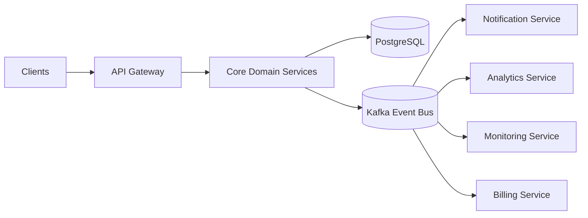
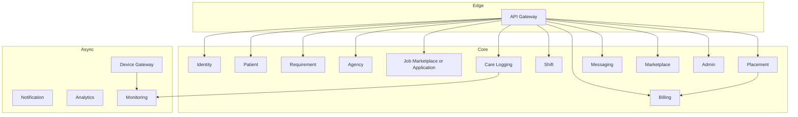
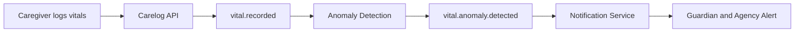
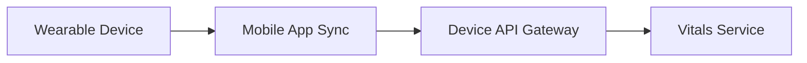

# D006 - API & Backend Service Outline

## 1. Scope & Reading Frame [✅ 100% Built] [🔴 High]
This document defines the CareNet backend outline at planning level: service boundaries, priority API surfaces, service-to-service communication style, and Kafka event topics.

The corpus describes two layers at once:

1. A base REST service grouping using `/auth`, `/guardian`, `/patient`, `/caregiver`, `/agency`, `/shop`, and `/admin`.
2. A deeper event-driven microservice decomposition using Kafka, domain services, consumer services, and independent deployments.

This document reconciles those two views without adding new domains beyond the source corpus.

This document should be read with → D004 §2, → D005 §2, → D011 §4, and → D014 §3.

## 2. Backend Architecture Summary [⚠️ Partially Built] [🔴 High]
The architectural direction is explicit: REST APIs in front of domain services, Kafka for asynchronous domain events, PostgreSQL for core transaction data, and an API gateway at the edge.

| Layer | Explicit Direction in Corpus | Status |
|---|---|---|
| Edge | API Gateway, auth, rate limiting | [✅ 100% Built] |
| Core APIs | REST endpoints grouped by domain | [✅ 100% Built] |
| Async backbone | Kafka or equivalent event bus | [✅ 100% Built] |
| Deployment | Independent services with versioned APIs and independent databases | [⚠️ Partially Built] |

The partial area is not the architecture recommendation itself. It is that the corpus presents a recommended scalable target architecture rather than a confirmed implemented microservice estate.

Related reading: → D011 and → D014.

## 3. Service Boundary Model [⚠️ Partially Built] [🔴 High]

### 3.1 Core Domain Services [✅ 100% Built] [🔴 High]

| Service | Primary Responsibility | Key Data / Tables |
|---|---|---|
| Identity Service | Login, registration, role assignment, sessions | `users`, `roles`, `permissions` |
| Patient Service | Patient profiles, conditions, medications, history | `patients`, `patient_conditions`, `patient_medications` |
| Requirement Service | Care requirement submission, updates, lifecycle | `care_requirements`, `requirement_documents` |
| Agency Service | Agency registration, staff, service coverage areas | `agencies`, `agency_staff`, `agency_documents` |
| Job Marketplace Service | Job posting, applications, interviews, hiring decisions | `jobs`, `applications`, `interviews` |
| Placement Service | Care contracts, caregiver assignments, placement lifecycle, coverage management | `placements`, `placement_history` |
| Shift Service | Shift planning, check-in/out, attendance monitoring | `shifts`, `shift_assignments`, `shift_checkins` |
| Care Logging Service | Activity logs, medication logs, vitals | `care_logs`, `vital_logs`, `incident_logs` |

### 3.2 Supporting Platform Services [✅ 100% Built] [🟠 Medium]

| Service | Responsibility | Corpus Signal |
|---|---|---|
| Messaging Service | Chat, attachments, communication handling | Fully named and described |
| Marketplace Service | Products, orders, inventory | Fully named and described |
| Billing Service | Invoices, commissions, payouts | Fully named and described |
| Notification Service | Push, SMS, email; event-driven only | Fully named and described |
| Analytics Service | Aggregated reporting from care logs, placements, jobs, payments | Fully named and described |
| Admin Service | Moderation, suspension, disputes | Fully named and described |

### 3.3 Extension and Scale-Oriented Services [⚠️ Partially Built] [🟠 Medium]

| Service | Responsibility | Source Basis |
|---|---|---|
| Monitoring Service | Anomaly detection, alert generation, trend analysis | Detailed microservice decomposition |
| Vitals Monitoring Service | Vitals-specific monitoring layer | Full platform architecture map and vitals sections |
| Device Gateway Service | Device ingestion path between mobile sync and vitals services | Wearable/device integration section |
| Organization Service | Organization membership and role structure | Full platform architecture map |
| Search Service | Search layer for platform discovery | Full platform architecture map |
| Payments Service | Separated payment handling path alongside billing | Full platform architecture map |

These boundaries are documented, but some are described more deeply than others.

## 4. Recommended Service Topology [⚠️ Partially Built] [🔴 High]
The corpus contains two naming schemes. The planning view below harmonizes them.

## 5. Communication Model [✅ 100% Built] [🔴 High]
The corpus defines two communication modes.

| Mode | Use | Example |
|---|---|---|
| Synchronous REST | Immediate request-response domain actions | `agency-service -> job-service` |
| Asynchronous Kafka events | Workflow propagation, notifications, analytics, monitoring | `shift.started -> notification-service` |

| Architectural Rule | Meaning |
|---|---|
| Eventual consistency | Cross-service data coordination is asynchronous |
| Independent databases | Each service owns its data boundary in the recommended model |
| Versioned APIs | Deployment independence is expected |

## 6. Priority API Surface (OpenAPI-Style Summary) [✅ 100% Built] [🔴 High]
The corpus does not provide a full OpenAPI contract. It does provide a priority endpoint surface sufficient for planning.

### 6.1 Identity & Access [✅ 100% Built] [🔴 High]

| Method | Path | Purpose | Priority |
|---|---|---|---|
| `POST` | `/auth/login` | User authentication | 🔴 High |
| `POST` | `/auth/register` | User registration | 🔴 High |
| `GET/POST` | `/users` | User management surface | 🟠 Medium |
| `GET/POST` | `/roles` | Role administration | 🟠 Medium |

### 6.2 Care Demand, Patient, and Requirement [✅ 100% Built] [🔴 High]

| Method | Path | Purpose | Priority |
|---|---|---|---|
| `POST` | `/guardian/requirements` | Submit care requirement | 🔴 High |
| `GET` | `/patient/{id}/carelogs` | Read patient care history | 🔴 High |
| `GET` | `/patients/{id}/vitals` | Read patient vitals | 🔴 High |
| `GET` | `/patients/{id}/alerts` | Read patient alerts | 🟠 Medium |

### 6.3 Agency, Hiring, and Placements [✅ 100% Built] [🔴 High]

| Method | Path | Purpose | Priority |
|---|---|---|---|
| `GET` | `/agency/requirements` | Agency requirements inbox | 🔴 High |
| `POST` | `/agency/jobs` | Create agency job | 🔴 High |
| `POST` | `/caregiver/apply` | Submit caregiver application | 🔴 High |
| `POST` | `/agency/placements` | Create placement | 🔴 High |
| `GET` | `/admin/placements` | Platform/admin placement view | 🟠 Medium |

### 6.4 Shift & Care Logging [✅ 100% Built] [🔴 High]

| Method | Path | Purpose | Priority |
|---|---|---|---|
| `POST` | `/shifts/{id}/checkin` | Start shift operationally | 🔴 High |
| `POST` | `/shifts/{id}/checkout` | End shift operationally | 🔴 High |
| `POST` | `/caregiver/carelogs` | Caregiver log submission entry point | 🔴 High |
| `POST` | `/carelogs` | General care log creation | 🔴 High |
| `POST` | `/carelogs/vitals` | Structured vitals log creation | 🔴 High |
| `POST` | `/carelogs/meal` | Structured meal log creation | 🟠 Medium |
| `POST` | `/carelogs/medication` | Structured medication log creation | 🟠 Medium |

### 6.5 Marketplace, Billing, and Device Ingestion [⚠️ Partially Built] [🟠 Medium]

| Method | Path | Purpose | Priority |
|---|---|---|---|
| `POST` | `/shop/orders` | Place marketplace order | 🟠 Medium |
| `POST` | `/devices/register` | Register device | 🟠 Medium |
| `POST` | `/devices/data` | Submit device data | 🟠 Medium |
| `GET` | `/patients/{id}/device-readings` | Retrieve device readings | 🟠 Medium |

The billing boundary is explicitly defined as a service, but the corpus does not provide a similarly detailed invoice or payout endpoint list beyond the service responsibility description and payment events.

## 7. Kafka Topic Design [✅ 100% Built] [🔴 High]
The event bus is explicitly documented as Kafka in the recommended stack.

### 7.1 Domain Topics [✅ 100% Built] [🔴 High]

| Domain | Kafka Topics |
|---|---|
| Identity | `user.created`, `user.updated`, `role.assigned` |
| Patient | `patient.created`, `patient.updated`, `patient.condition.updated`, `patient.medication.updated` |
| Requirement | `requirement.created`, `requirement.updated`, `requirement.cancelled`, `requirement.approved` |
| Job marketplace | `job.created`, `job.updated`, `job.closed`, `application.submitted`, `application.reviewed`, `application.accepted`, `application.rejected` |
| Placement | `placement.created`, `placement.started`, `placement.completed`, `placement.cancelled` |
| Shift | `shift.created`, `shift.updated`, `shift.started`, `shift.completed`, `shift.missed`, `shift.replacement.assigned` |
| Care logging | `carelog.created`, `carelog.updated`, `carelog.deleted` |
| Vitals monitoring | `vital.recorded`, `vital.anomaly.detected`, `patient.alert.generated` |
| Messaging | `message.sent`, `conversation.created` |
| Marketplace | `order.created`, `order.paid`, `order.shipped`, `order.delivered` |
| Platform operations | `incident.reported`, `payment.completed`, `payment.failed`, `refund.processed` |

### 7.2 Event Envelope [✅ 100% Built] [🟠 Medium]
The corpus defines a uniform event envelope.

| Field | Meaning |
|---|---|
| `event_id` | Unique event identifier |
| `event_type` | Domain event name such as `shift.started` |
| `timestamp` | Event time |
| `source_service` | Producing service |
| `data` | Event payload |

## 8. Kafka Consumers & Event Flow [✅ 100% Built] [🔴 High]

| Consumer Service | Consumes |
|---|---|
| Notification | `shift.started` |
| Analytics | `carelog.created` |
| Alert Engine | `vital.recorded` |
| Scheduling | `shift.missed` |
| Billing | `placement.completed` |

This same pattern appears again in the device flow:

## 9. Deployment & Storage Notes [⚠️ Partially Built] [🟠 Medium]

| Area | Recommended Direction |
|---|---|
| Deployment | Kubernetes cluster with independent services |
| Service ownership | Independent database per service |
| Core transactional store | PostgreSQL |
| Event store / bus | Kafka |
| Cache | Redis |
| Search | Elasticsearch |
| Analytics store | ClickHouse |

This is a planning target architecture, not a confirmed deployed production topology in the corpus.

Related reading: → D011 §5, → D011 §6, and → D014 §5.

## 10. Final Planning Position [⚠️ Partially Built] [🔴 High]
The backend planning model is architecturally strong and sufficiently detailed for service decomposition:

1. Core business domains have named services and responsibilities.
2. Priority REST endpoints are documented for the highest-value actions.
3. Kafka topic design is explicit and domain-oriented.
4. Consumer-service patterns are documented for notifications, analytics, billing, and monitoring.
5. Device ingestion and vitals monitoring are present as extension-ready backend domains.

The only partial area is precision depth: some services such as Billing, Payments, Search, Organization, and Device Gateway are clearly present in the architecture corpus but are not described with the same endpoint-level completeness as Identity, Requirement, Shift, or Care Logging.
