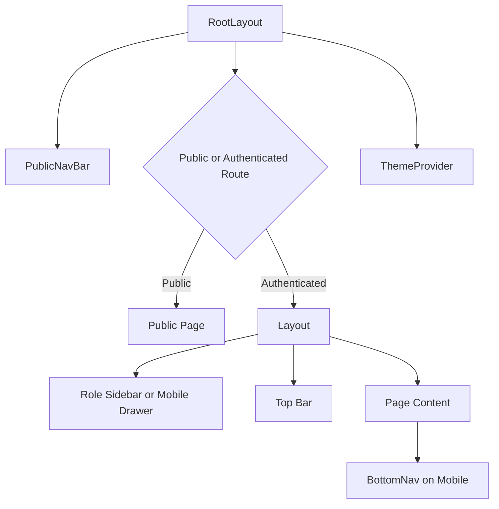

# D007 - Frontend Architecture & Page Tree

## 1. Scope & Current Frontend Position [✅ 100% Built] [🔴 High]
This document defines the documented CareNet frontend architecture: shared shell components, route structure, page tree, and build-status distribution across all modules.

The corpus is explicit that the frontend baseline is complete for v1.0 core scope: 141 of 141 core wireframed pages are built and routed. The frontend planning problem is therefore not coverage of core pages, but clarity of structure.

This document should be read with → D001 §4, → D002 §2, → D012 §3, → D013 §2, and → D015 §3.

## 2. Shared Frontend Architecture [✅ 100% Built] [🔴 High]
The shared frontend layer is described directly in the wireframe audit.

Related reading: → D012 and → D013 §5.

| Shared Component | Purpose | Status |
|---|---|---|
| Layout | Role sidebar, header, content wrapper for authenticated pages | [✅ 100% Built] |
| PublicNavBar | Top navigation for public pages | [✅ 100% Built] |
| BottomNav | Mobile role-aware bottom navigation | [✅ 100% Built] |
| RootLayout | Root layout wrapper using PublicNavBar, BottomNav, and route outlet | [✅ 100% Built] |
| ThemeProvider | Theme state and persistence | [✅ 100% Built] |
| Design Tokens | Brand colors, role configs, semantic helpers | [✅ 100% Built] |
| Theme CSS | CSS custom properties and Tailwind mapping | [✅ 100% Built] |



## 3. Page-Folder Architecture [✅ 100% Built] [🔴 High]
The build audit gives an explicit page-folder distribution.

| Frontend Folder | Documented File Count | Status |
|---|---:|---|
| `/src/app/pages/` root | 17 | [✅ 100% Built] |
| `/src/app/pages/admin/` | 19 | [✅ 100% Built] |
| `/src/app/pages/agency/` | 20 | [✅ 100% Built] |
| `/src/app/pages/auth/` | 6 | [✅ 100% Built] |
| `/src/app/pages/caregiver/` | 20 | [✅ 100% Built] |
| `/src/app/pages/guardian/` | 20 | [✅ 100% Built] |
| `/src/app/pages/moderator/` | 4 | [✅ 100% Built] |
| `/src/app/pages/patient/` | 9 | [✅ 100% Built] |
| `/src/app/pages/shop/` | 9 | [✅ 100% Built] |
| `/src/app/pages/shop-front/` | 10 | [✅ 100% Built] |
| `/src/app/pages/community/` | 3 | [✅ 100% Built] |
| `/src/app/pages/support/` | 4 | [✅ 100% Built] |
| Total page files | 141 | [✅ 100% Built] |

### 3.1 Structural Reading [✅ 100% Built] [🟠 Medium]
This implies a frontend organized primarily by module domain, not by low-level technical layer. Public and shared utility routes live at the root page layer, while role and business modules are split into dedicated page directories.

## 4. Frontend Route Tree [✅ 100% Built] [🔴 High]
The condensed route tree below reflects the documented route structure.

```mermaid
flowchart TD
    A[/] --> B[Public Pages]
    A --> C[/auth/*]
    A --> D[/guardian/*]
    A --> E[/caregiver/*]
    A --> F[/patient/*]
    A --> G[/agency/*]
    A --> H[/admin/*]
    A --> I[/moderator/*]
    A --> J[/shop/*]
    A --> K[/community/*]
    A --> L[/support/*]
    A --> M[/dashboard]
    A --> N[/messages]
    A --> O[/notifications]
    A --> P[/settings]
```

### 4.1 Public & Shared Route Layer [✅ 100% Built] [🔴 High]

| Route Group | Representative Routes | Status |
|---|---|---|
| Marketing/public | `/`, `/home`, `/about`, `/features`, `/pricing`, `/contact` | [✅ 100% Built] |
| Legal/public utility | `/privacy`, `/terms` | [✅ 100% Built] |
| Discovery/public marketplace | `/marketplace`, `/global-search`, `/agencies` | [✅ 100% Built] |
| Shared utility | `/dashboard`, `/messages`, `/notifications`, `/settings` | [✅ 100% Built] |
| Fallback | `*` 404 | [✅ 100% Built] |

### 4.2 Auth Route Layer [✅ 100% Built] [🟠 Medium]

| Route Group | Representative Routes | Status |
|---|---|---|
| Authentication | `/auth/login`, `/auth/role-selection`, `/auth/register`, `/auth/forgot-password`, `/auth/reset-password`, `/auth/mfa-setup`, `/auth/mfa-verify`, `/auth/verification-result` | [✅ 100% Built] |

## 5. Module Page Tree by Domain [✅ 100% Built] [🔴 High]

### 5.1 Guardian Tree [✅ 100% Built] [🔴 High]

| Guardian Route Family | Notes | Status |
|---|---|---|
| `/guardian/dashboard` | Corrected to agency-mediated dashboard model | [✅ 100% Built] |
| `/guardian/search` | Agency-first search, caregiver secondary | [✅ 100% Built] |
| `/guardian/caregiver/:id` | Read-only caregiver research page | [✅ 100% Built] |
| `/guardian/caregiver-comparison` | Research comparison, not direct selection | [✅ 100% Built] |
| `/guardian/booking` | Deprecated redirect to the care requirement flow | [🔄 Redirect/Deprecated] |
| `/guardian/patients`, `/guardian/patient-intake` | Patient management branch | [✅ 100% Built] |
| `/guardian/messages`, `/guardian/payments`, `/guardian/reviews`, `/guardian/profile`, `/guardian/family-hub`, `/guardian/schedule` | Guardian operations branch | [✅ 100% Built] |
| `/guardian/agency/:id` | New agency-facing public profile route | [✅ 100% Built] |
| `/guardian/care-requirements`, `/guardian/care-requirement-wizard`, `/guardian/care-requirement/:id` | Requirement branch replacing booking | [✅ 100% Built] |
| `/guardian/placements`, `/guardian/placement/:id` | Placement and care timeline branch | [✅ 100% Built] |

### 5.2 Caregiver Tree [✅ 100% Built] [🔴 High]

| Caregiver Route Family | Notes | Status |
|---|---|---|
| `/caregiver/dashboard`, `/caregiver/profile` | Core identity and overview | [✅ 100% Built] |
| `/caregiver/jobs`, job detail, application detail | Agency-posted job marketplace branch | [✅ 100% Built] |
| `/caregiver/assigned-patients` | New patient assignment branch | [✅ 100% Built] |
| `/caregiver/care-log`, `/caregiver/shift/:id`, `/caregiver/schedule` | Care execution branch | [✅ 100% Built] |
| Earnings, payout, documents, references, portfolio, training, skills, tax | Workforce operations branch | [✅ 100% Built] |
| `/caregiver/messages`, `/caregiver/reviews` | Communication and reputation branch | [✅ 100% Built] |

### 5.3 Patient Tree [✅ 100% Built] [🟠 Medium]

| Patient Route Family | Status |
|---|---|
| Dashboard, profile, care history, medical records, health report | [✅ 100% Built] |
| Vitals, medications, emergency, data privacy | [✅ 100% Built] |

### 5.4 Agency Tree [✅ 100% Built] [🔴 High]

| Agency Route Family | Notes | Status |
|---|---|---|
| Dashboard, caregivers, clients, client intake, care plan | Agency client operations | [✅ 100% Built] |
| Payments, reports, storefront, branches, attendance, hiring | Agency business operations | [✅ 100% Built] |
| Incident report wizard | Incident creation workflow | [✅ 100% Built] |
| `/agency/requirements-inbox`, `/agency/requirement-review/:id` | Intake and proposal branch | [✅ 100% Built] |
| `/agency/placements`, `/agency/placement/:id`, `/agency/shift-monitoring` | Live operations branch | [✅ 100% Built] |
| `/agency/job-management`, `/agency/jobs/:id/applications`, `/agency/payroll` | Section 18 compliance branch | [✅ 100% Built] |
| `/agency/incidents` list view | Pending enhancement, not page-counted as separate built file | [🔄 Enhancement] |

### 5.5 Admin and Moderator Trees [✅ 100% Built] [🟠 Medium]

| Module | Representative Branches | Status |
|---|---|---|
| Admin | Dashboard, users, verifications, reports, disputes, payments, audit, settings, CMS, placement monitoring, agency approvals | [✅ 100% Built] |
| Moderator | Dashboard, reviews, reports, content | [✅ 100% Built] |

### 5.6 Shop, Community, and Support Trees [✅ 100% Built] [🟠 Medium]

| Module | Representative Branches | Status |
|---|---|---|
| Shop merchant | Dashboard, products, editor, orders, inventory, analytics, onboarding, fulfillment | [✅ 100% Built] |
| Shop front | Product list, detail, category, reviews, cart, checkout, order tracking, history, wishlist | [✅ 100% Built] |
| Community | Blog list, blog detail, careers | [✅ 100% Built] |
| Support | Help center, contact, ticket, refund | [✅ 100% Built] |

## 6. Frontend Status by Module [✅ 100% Built] [🔴 High]
The module status table is explicit in the build audit.

Related reading: → D013 and → D015.

| Module | Built / Wireframed | Status |
|---|---:|---|
| Public | 13 / 13 | [✅ 100% Built] |
| Auth | 8 / 8 | [✅ 100% Built] |
| Caregiver | 20 / 20 | [✅ 100% Built] |
| Guardian | 20 / 20 | [✅ 100% Built] |
| Patient | 9 / 9 | [✅ 100% Built] |
| Agency | 20 / 20 | [✅ 100% Built] |
| Admin | 19 / 19 | [✅ 100% Built] |
| Moderator | 4 / 4 | [✅ 100% Built] |
| Shop merchant | 9 / 9 | [✅ 100% Built] |
| Shop front | 10 / 10 | [✅ 100% Built] |
| Community | 3 / 3 | [✅ 100% Built] |
| Support | 4 / 4 | [✅ 100% Built] |
| Utility | 1 / 1 | [✅ 100% Built] |
| Agency Directory | 1 / 1 | [✅ 100% Built] |
| Core Total | 141 / 141 | [✅ 100% Built] |

## 7. Corrected Route Logic [✅ 100% Built] [🔴 High]
The frontend architecture is materially shaped by Section 17 route corrections.

| Old Frontend Assumption | Final Frontend Rule |
|---|---|
| Direct caregiver search and booking | Agency-mediated discovery and requirement submission |
| Caregiver profile as conversion endpoint | Caregiver profile as research page with agency affiliation |
| Booking wizard as primary hiring flow | Care requirement wizard as primary intake flow |
| Guardian care timeline missing | Placement detail absorbs care timeline view |

```mermaid
flowchart LR
    A[/guardian/search] --> B[/guardian/agency/:id]
    B --> C[/guardian/care-requirements]
    C --> D[/guardian/care-requirement/:id]
    D --> E[/guardian/placements]
    E --> F[/guardian/placement/:id]
```

## 8. Roadmap Pages Outside the Core Tree [❌ Not Built – v2.0] [🔴 High]
Section 15 defines a second frontend layer: proposed v2.0 pages that are designed but not built.

| Route Family | Examples | Status |
|---|---|---|
| Patient enhancement pages | `/patient/care-log`, `/patient/care-plan`, `/patient/alerts`, `/patient/symptoms`, `/patient/photo-journal`, `/patient/telehealth`, `/patient/nutrition`, `/patient/rehab`, `/patient/insurance` | [❌ Not Built – v2.0] |
| Guardian enhancement pages | `/guardian/care-log`, `/guardian/alerts`, `/guardian/live-tracking`, `/guardian/live-monitor`, `/guardian/care-scorecard`, `/guardian/family-board` | [❌ Not Built – v2.0] |
| Caregiver enhancement pages | `/caregiver/handoff` | [❌ Not Built – v2.0] |

## 9. Final Planning Position [⚠️ Partially Built] [🔴 High]
The core frontend architecture is complete and clearly structured:

1. Shared shell components are built.
2. Route families are grouped by public, auth, and role modules.
3. The page tree aligns to the agency-mediated business architecture.
4. All 141 core pages are built and routed.

The only partial layer is future scope separation: the frontend page tree is complete for v1.0, but the Section 15 page family remains a planned v2.0 extension rather than part of the live core tree.

Related reading: → D012, → D013, and → D015.
