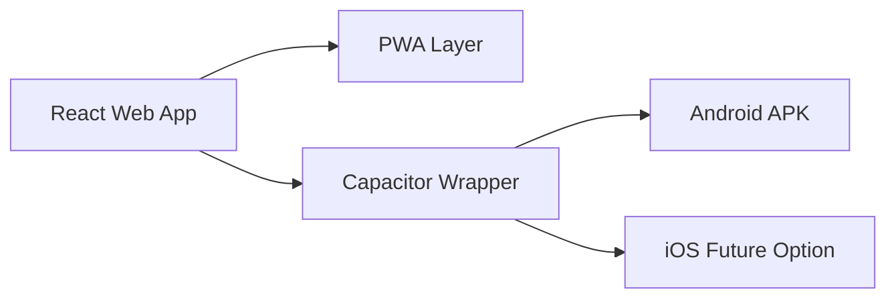
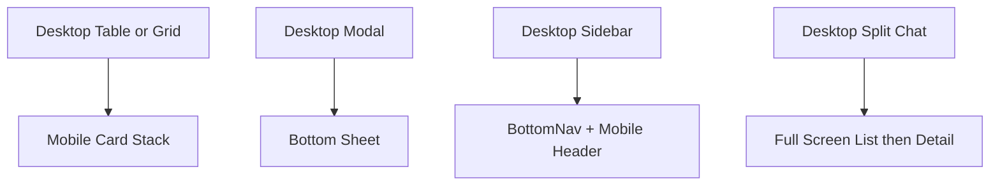
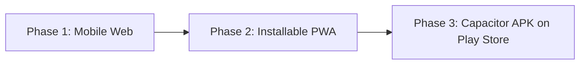
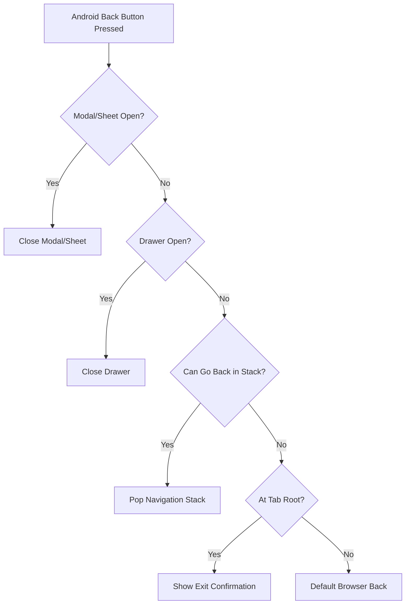

# D008 - Mobile Architecture & Deployment Strategy

## 1. Scope & Mobile Reality [⚠️ Partially Built] [🔴 High]
This document defines the documented mobile strategy for CareNet: why Capacitor was chosen, which mobile-first UI patterns are mandatory, which plugins and native integrations are required, and how the platform moves from web access to installable PWA to Play Store APK.

The corpus is explicit that CareNet is a mobile-first product for Bangladesh, with 95%+ expected mobile usage. It is also explicit that mobile delivery is not yet complete end to end: the web app is complete, the PWA phase is pending, and the Capacitor APK phase is not yet built.

## 2. Architecture Decision [✅ 100% Built] [🔴 High]
The decision is explicit: keep the existing React web application and wrap it with Capacitor. Do not rewrite in React Native.

| Option | Performance on Budget Android | Native Access | Code Reuse | Documented Verdict |
|---|---|---|---|---|
| Raw WebView wrapper | Poor | None | 100% | Avoid |
| Capacitor | Good | Full via native bridge | 100% | Best fit |
| React Native | Excellent | Full | 0% | Not practical |
| PWA | Good | Limited | 100% | Strong companion layer |

### 2.1 Why Capacitor Wins [✅ 100% Built] [🔴 High]

| Reason | Corpus Basis |
|---|---|
| No rewrite of the 141-page frontend | Existing React + Tailwind + React Router app stays intact |
| Native bridge support | Camera, GPS, push, biometrics, filesystem, app lifecycle |
| Better fit for budget Android | Explicitly preferred over raw WebView wrapper |
| Mobile launch path without architectural reset | Same codebase supports web, PWA, and native distribution |

## 3. Bangladesh Device & Network Constraints [✅ 100% Built] [🔴 High]
The mobile strategy is explicitly grounded in local market conditions.

| Constraint | Documented Reality | Design Response |
|---|---|---|
| Device class | Budget Android devices in the ৳8K–15K range | Keep app lightweight |
| RAM | Typically 2–3GB | Reduce memory pressure, lazy-load aggressively |
| OS mix | Android 9–12 dominant | Favor broad WebView compatibility |
| Network | Patchy 3G/4G and data-cost sensitive | Service-worker caching, offline drafts, compressed assets |
| Battery behavior | Users close background apps aggressively | Push over polling, batch sync |
| Screen sizes | 5.5"–6.5" touch-centric usage | Large touch targets, bottom nav, swipe patterns |

This means mobile architecture is not optional presentation polish. It is the operating baseline for the product. Related reading: → D002 §6 and → D007 §2.

## 4. Global Mobile Shell [✅ 100% Built] [🔴 High]
The mobile shell is described as a first-class layout mode.

| Shell Element | Definition | Status |
|---|---|---|
| Bottom navigation | Persistent 64px tab bar below `768px` | [✅ 100% Built] |
| Mobile header | Sticky 56px header with back or hamburger, title, bell, contextual action | [✅ 100% Built] |
| Pull-to-refresh | Supported for list and feed pages | [✅ 100% Built] |
| Safe areas | Top and bottom safe-area insets applied | [✅ 100% Built] |
| Mobile navigation stacks | Each bottom-nav tab maintains its own stack | [✅ 100% Built] |

### 4.1 Explicit Role-Specific Mobile Tabs [✅ 100% Built] [🔴 High]

| Role | Tab Set |
|---|---|
| Guardian | Home, Patients, Search, Messages, Profile |
| Caregiver | Home, Shifts, Jobs, Messages, Profile |
| Agency | Home, Requirements, Placements, Jobs, Profile |
| Admin | Home, Users, Placements, Agencies, Profile |

### 4.2 Shared Mobile Behaviors [✅ 100% Built] [🟠 Medium]

| Behavior | Rule |
|---|---|
| Active tab state | Filled icon and role gradient underline |
| Messages badge | Unread red-dot indicator |
| Same-tab tap | Scroll to top or pop to root |
| Header usage | Back arrow on sub-pages, hamburger on root pages |
| Visual styling | Backdrop blur and glass effect consistent with desktop shell |

## 5. Mobile-First Component Patterns [✅ 100% Built] [🔴 High]

### 5.1 Touch Standards [✅ 100% Built] [🔴 High]

| Element | Minimum Standard |
|---|---|
| Primary buttons | 48px height |
| Secondary buttons | 44px height |
| Icon buttons | 44x44px tap area |
| Tappable list items | 56px minimum height |
| Form inputs | 48px height |
| Checkbox / radio targets | 44x44px tap area |

### 5.2 Layout Conversion Rules [✅ 100% Built] [🔴 High]

| Desktop Pattern | Mobile Pattern |
|---|---|
| Sidebar | Bottom nav + mobile header |
| Tables | Stacked cards |
| Centered modals | Bottom sheets |
| Multi-column grids | Single-column or reduced-column layouts |
| Inline-heavy forms | Single-column forms with labels above inputs |

### 5.3 Interaction Patterns [✅ 100% Built] [🟠 Medium]

| Pattern | Documented Rule |
|---|---|
| Filters | Sticky bar plus bottom-sheet expansion |
| Messages | Full-screen list to full-screen conversation, no split-pane |
| Form submission | Sticky submit button at bottom of viewport |
| Date and time inputs | Large touch-friendly pickers |

## 6. Pages Requiring Special Mobile Treatment [✅ 100% Built] [🔴 High]
Section 20 explicitly names the pages that need non-trivial mobile adaptation.

| Page | Mobile Concern | Required Treatment |
|---|---|---|
| CaregiverSearchPage | Filters plus results density | Sticky filter bar, scrollable results, bottom-sheet filters |
| CaregiverComparisonPage | Side-by-side comparison layout | Swipeable comparison cards |
| MessagesPage | Desktop split-pane is unsuitable | Full-screen chat list and chat detail |
| GuardianSchedulePage | Calendar density | Horizontal-scrolling week view |
| AgencyJobManagementPage | Data-table density | Status-card list with swipe actions |
| AdminPlacementMonitoringPage | Complex administrative table | Filterable card list plus expandable detail |
| ShiftMonitoringPage | Real-time operational grid | Scrollable shift cards with live status |
| CaregiverCareLogPage | Multi-step data entry | Step-by-step form with sticky progress treatment |

## 7. Plugin & Native Capability Stack [✅ 100% Built] [🔴 High]
The plugin inventory is explicit and maps directly to product use cases.

| Capability | Use Case | Plugin |
|---|---|---|
| Camera | Care-log photos, incident evidence, wound journal | `@capacitor/camera` |
| Geolocation | Shift check-in verification, service-area logic | `@capacitor/geolocation` |
| Push notifications | Shift reminders, missed shifts, incidents, messages | `@capacitor/push-notifications` + FCM |
| Biometric auth | Quick unlock for on-duty users | `capacitor-native-biometric` |
| Offline storage | Draft care logs and reconnect sync | `@capacitor/preferences` + IndexedDB |
| File system | Invoice and report downloads | `@capacitor/filesystem` |
| Status bar | Native theming by role module | `@capacitor/status-bar` |
| Haptics | Tactile confirmation on mobile actions | `@capacitor/haptics` |
| App lifecycle | Foreground/background and back-button behavior | `@capacitor/app` |
| Quick-call behavior | Agency or guardian contact actions | `@capacitor/action-sheet` |

## 8. Device & Wearable Extension Path [⚠️ Partially Built] [🟠 Medium]
The architecture corpus extends mobile into wearable and device ingestion.

| Element | Documented Definition | Status |
|---|---|---|
| Device path | Wearable Device → Mobile App Sync → Device API Gateway → Vitals Service | [⚠️ Partially Built] |
| Device registry | `devices` table | [⚠️ Partially Built] |
| Device data storage | `device_readings` table | [⚠️ Partially Built] |
| Device endpoints | `POST /devices/register`, `POST /devices/data`, `GET /patients/{id}/device-readings` | [⚠️ Partially Built] |
| Fall detection alerting | Immediate alert to caregiver, agency supervisor, guardian | [⚠️ Partially Built] |

This extension path belongs to future or advanced mobile capability rather than current v1.0 mobile delivery.

## 9. Performance Targets [✅ 100% Built] [🔴 High]
The mobile performance budget is explicit.

| Metric | Target | Method |
|---|---|---|
| First Contentful Paint | `< 2s` on 3G | Route-based code splitting, critical CSS |
| Time to Interactive | `< 4s` on 3G | Lazy-load non-visible components |
| Bundle per route | `< 50KB` gzipped | Dynamic imports per page |
| Image handling | Lazy plus placeholder | Skeleton shimmer |
| Offline capability | Cached pages plus care-log draft support | Service worker plus IndexedDB |
| Memory usage | `< 150MB` | Long-list virtualization and cleanup on unmount |

These targets are not cosmetic. They are direct responses to the Bangladesh device and network constraints in Section 19.

## 10. Deployment Roadmap [⚠️ Partially Built] [🔴 High]
The rollout path is explicitly three-phase.

| Phase | Description | Current Status |
|---|---|---|
| Phase 1 | React web app accessible via mobile browser | [✅ 100% Built] |
| Phase 2 | Installable PWA with offline support | [⚠️ Partially Built] |
| Phase 3 | Capacitor APK with native features and Play Store distribution | [❌ Not Built – v2.0] |

### 10.1 Current Rollout Reality [⚠️ Partially Built] [🔴 High]

| Area | Current State |
|---|---|
| React web app framework | Complete |
| Core mobile-first UI shell | Built |
| BottomNav component | Built |
| PWA setup | Pending |
| APK packaging | Not yet built |
| Performance optimization | In progress |

## 11. Frontend Project Structure for Mobile [✅ 100% Built] [🟠 Medium]

| Path | Role in Mobile Strategy |
|---|---|
| `/src/app/` | Existing React frontend remains primary application code |
| `/android/` | Capacitor-generated Android project for Play Store distribution |
| `/ios/` | Future optional native project |
| `/supabase/` | Backend support path when connected |
| `capacitor.config.ts` | Mobile wrapper configuration |

The key planning point is reuse: the existing frontend remains the canonical UI codebase through all mobile phases.

## 12. Capacitor Implementation Specifics [✅ 100% Built] [🔴 High]
This section provides the implementation-level Capacitor details required for Android build and distribution.

### 12.1 Capacitor Configuration [✅ 100% Built] [🔴 High]

| Configuration Field | Value | Notes |
|---|---|---|
| `appId` | `com.carenet.app` | Reverse-domain identifier for Play Store |
| `appName` | `CareNet` | Display name on device |
| `webDir` | `dist` | Build output directory from Vite |
| `server.url` | Production URL in release; `http://localhost:5173` in dev | Development uses live reload |
| `server.cleartext` | `true` in dev only | Required for HTTP in development |
| `android.minSdkVersion` | 23 (Android 6.0) | Covers 99%+ of Bangladesh Android devices |
| `android.targetSdkVersion` | 34 (Android 14) | Play Store requirement |
| `plugins.SplashScreen.launchShowDuration` | 2000 | 2-second splash screen |
| `plugins.SplashScreen.backgroundColor` | `#FFFFFF` (light) / `#1A1A2E` (dark) | Matches theme |
| `plugins.StatusBar.style` | Dynamic per role | Role-colored status bar per D012 §2.1 |

### 12.2 Android WebView Compatibility [✅ 100% Built] [🔴 High]

| Concern | Specification |
|---|---|
| Minimum WebView version | Chrome 80+ (ships with Android 10+; updatable on Android 5+) |
| Polyfill requirements | `core-js` for `Promise.allSettled`, `Array.flat`, `Object.fromEntries` |
| CSS compatibility | CSS Grid, Custom Properties, `gap` property require Chrome 66+ (covered) |
| IndexedDB | Fully supported in Android WebView Chrome 80+ |
| Service Workers | Supported in Capacitor WebView |
| `Intl` API | `Intl.DateTimeFormat('bn-BD')` supported Chrome 80+ for Bangla formatting per → D017 |
| Testing requirement | Always test on Android System WebView, not Chrome browser app |

### 12.3 Android Back Button Behavior [✅ 100% Built] [🔴 High]
Android hardware/gesture back button is a notorious pain point with Capacitor SPAs.

| Context | Back Button Behavior |
|---|---|
| Sub-page within a tab | Pop to previous page in navigation stack |
| Tab root page | Show exit confirmation dialog ("Exit CareNet?") |
| Modal or bottom sheet open | Close the modal/sheet |
| Keyboard open | Dismiss keyboard |
| Drawer/sidebar open | Close drawer |
| Login/registration flow | Standard browser back behavior |

Implementation: Use `@capacitor/app` `backButton` event listener and integrate with React Router navigation state.

### 12.4 Deep Linking & Android App Links [✅ 100% Built] [🟠 Medium]

| Configuration | Value |
|---|---|
| URL scheme | `carenet://` for custom scheme deep links |
| App Links domain | `app.carenet.com.bd` (verified Android App Links) |
| Supported deep link patterns | `carenet://shift/{id}`, `carenet://message/{conversationId}`, `carenet://placement/{id}` |
| Notification deep links | All push notifications include `data.route` per → D021 §5.2 |
| Play Store fallback | Deep link to Play Store listing if app not installed |

### 12.5 App Update Strategy [✅ 100% Built] [🟠 Medium]

| Strategy | Specification |
|---|---|
| WebView content updates | Deploy web assets to server; Capacitor loads from server URL in production |
| Critical native updates | Play Store update with in-app update prompt via Google Play In-App Updates API |
| Force update | Server-side version check; block app usage if native version is below minimum |
| Update prompt frequency | Check on app launch; prompt once per day for non-critical updates |

### 12.6 Splash Screen & App Icon [✅ 100% Built] [🟠 Medium]

| Asset | Specification |
|---|---|
| App icon | CareNet heart logo; adaptive icon with pink gradient foreground and white background |
| Splash screen | Centered CareNet logo on white (light) or dark (#1A1A2E) background |
| Adaptive icon foreground | 108x108dp (432x432px at xxxhdpi) |
| Adaptive icon background | Solid white or gradient |
| Play Store listing icon | 512x512px PNG |
| Feature graphic | 1024x500px for Play Store listing |

### 12.7 Status Bar Theming Per Role [✅ 100% Built] [🟠 Medium]

| Role | Status Bar Color (Light Mode) | Status Bar Color (Dark Mode) |
|---|---|---|
| Caregiver | `#DB869A` | `#8B4A5E` |
| Guardian | `#5FB865` | `#3A7A3E` |
| Patient | `#0288D1` | `#015A8C` |
| Agency | `#00897B` | `#005A50` |
| Admin | `#7B5EA7` | `#4E3A6E` |
| Moderator | `#E8A838` | `#A07028` |
| Shop | `#E64A19` | `#9C3010` |
| Public | White / transparent | Dark (#1A1A2E) |

Implementation: Use `@capacitor/status-bar` plugin; update on role switch and theme toggle.

## 13. Final Planning Position [✅ 100% Built] [🔴 High]
The mobile strategy is well-defined and now includes implementation-level Capacitor specifics.

1. The product has a confirmed mobile-first UX model.
2. Capacitor is the chosen native delivery strategy.
3. The plugin stack and performance targets are clearly documented.
4. Capacitor configuration, WebView compatibility, and Android-specific behaviors are now specified.
5. Back-button handling, deep linking, update strategy, and status-bar theming are defined.
6. The current product is live as mobile web.
7. PWA remains pending.
8. Native APK packaging is implementation-ready.

That leaves D008 in this final status shape:

| D008 Area | Status |
|---|---|
| Mobile-first design system | [✅ 100% Built] |
| Capacitor decision rationale | [✅ 100% Built] |
| Plugin and native capability plan | [✅ 100% Built] |
| Web mobile delivery | [✅ 100% Built] |
| Capacitor implementation specifics | [✅ 100% Built] |
| Android back-button and deep linking | [✅ 100% Built] |
| App update strategy | [✅ 100% Built] |
| Status bar theming | [✅ 100% Built] |
| PWA phase | [⚠️ Partially Built] |
| APK launch phase | [⚠️ Partially Built] |