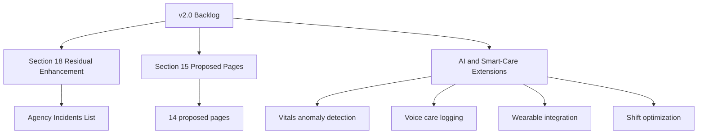
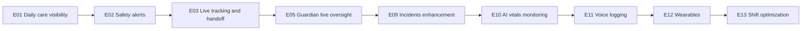

# D009 - Gap Analysis + v2.0 Roadmap (Prioritized)

## 1. Scope & Roadmap Rule [⚠️ Partially Built] [🔴 High]
This document defines the remaining backlog for CareNet after the documented completion of the 141-page core scope. It includes:

1. The unresolved remainder of Section 18.
2. The 14 proposed pages from Section 15.
3. The explicitly documented AI and smart-system extensions.

Roadmap rule: this document does not treat already closed Section 18 gaps as open backlog. It only tracks unresolved items or future extensions that the corpus explicitly leaves unbuilt.

## 2. Executive Gap Position [⚠️ Partially Built] [🔴 High]
The corpus shows a strong distinction between closed compliance gaps and real remaining roadmap work.

| Gap Source | Current Position | Status |
|---|---|---|
| Section 18 core compliance gaps | Closed through added pages and route corrections | [✅ 100% Built] |
| Section 18 residual enhancement | Agency incidents list/dashboard still pending | [🔄 Enhancement] |
| Section 15 proposed pages | 14 pages explicitly not built | [❌ Not Built – v2.0] |
| Voice notes enhancement | Proposed, not built | [❌ Not Built – v2.0] |
| AI and smart-care extensions | Explicitly future-state in the architecture corpus | [❌ Not Built – v2.0] |



## 3. Section 18 Remaining Gaps [⚠️ Partially Built] [🔴 High]
Section 18 identifies eight compliance gaps, but seven are already closed and one remains as an enhancement item.

| Section 18 Item | Current State | Roadmap Treatment |
|---|---|---|
| Agency job management | Closed | Not backlog |
| Agency applications review | Closed | Not backlog |
| Public agency directory | Closed | Not backlog |
| Admin placement monitoring | Closed | Not backlog |
| Admin agency approval | Closed | Not backlog |
| Agency payroll and payouts | Closed | Not backlog |
| Caregiver job marketplace alignment | Closed correction | Not backlog |
| Care timeline coverage | Closed via placement detail | Not backlog |
| Agency incidents management list view | Still described as enhancement needed | Active backlog |

### 3.1 Residual Section 18 Backlog [🔄 Enhancement] [🟠 Medium]

| Item | Route | Source Statement | Dependency |
|---|---|---|---|
| Agency incidents list and management dashboard | `/agency/incidents` | Existing incident wizard creates incidents, but viewing and resolving dashboard is still needed | → D006 §6, → D007 §5.4 |

## 4. Section 15 Proposed Pages [❌ Not Built – v2.0] [🔴 High]
Section 15 is the main v2.0 page backlog.

### 4.1 High-Priority Pages [❌ Not Built – v2.0] [🔴 High]

| ID | Proposed Page | Route(s) | Priority |
|---|---|---|---|
| P1 | Daily Care Log / Care Diary | `/patient/care-log`, `/guardian/care-log` | 🔴 High |
| P2 | Patient Care Plan | `/patient/care-plan` | 🔴 High |
| P3 | Smart Health Alerts / Alert Rules | `/guardian/alerts`, `/patient/alerts`, `/caregiver/alerts` | 🔴 High |
| P4 | Caregiver Arrival / Real-Time Tracking | `/guardian/live-tracking` | 🔴 High |
| P5 | Care Transition / Shift Handoff | `/caregiver/handoff` | 🔴 High |

### 4.2 Medium-Priority Pages [❌ Not Built – v2.0] [🟠 Medium]

| ID | Proposed Page | Route(s) | Priority |
|---|---|---|---|
| P6 | Symptom & Pain Journal | `/patient/symptoms` | 🟠 Medium |
| P7 | Wound / Condition Photo Journal | `/patient/photo-journal` | 🟠 Medium |
| P8 | Guardian Live Dashboard | `/guardian/live-monitor` | 🟠 Medium |
| P9 | Care Quality Scorecard | `/guardian/care-scorecard`, `/agency/care-scorecard` | 🟠 Medium |
| P10 | Telehealth / Video Consultation | `/patient/telehealth` | 🟠 Medium |

### 4.3 Nice-to-Have Pages [❌ Not Built – v2.0] [🟡 Low]

| ID | Proposed Page | Route(s) | Priority |
|---|---|---|---|
| P11 | Nutrition & Diet Tracker | `/patient/nutrition` | 🟡 Low |
| P12 | Rehabilitation / Exercise Tracker | `/patient/rehab` | 🟡 Low |
| P13 | Family Communication Board | `/guardian/family-board` | 🟡 Low |
| P14 | Insurance & Coverage Tracker | `/patient/insurance` | 🟡 Low |

### 4.4 Cross-Cutting Enhancement [❌ Not Built – v2.0] [🟡 Low]

| Item | Scope | Source |
|---|---|---|
| Voice Notes in Care Logs | Care Log, Messages, Shift Detail, Symptom Journal | Section 15.11 |

## 5. Explicit AI and Smart-System Extensions [❌ Not Built – v2.0] [🔴 High]
The architecture corpus names four future extensions directly.

| Extension | Purpose | Key Assets Mentioned in Corpus |
|---|---|---|
| AI anomaly detection for vitals | Detect emergencies, deterioration, side-effects, abnormal trends | `patient_vitals`, `vital_alerts`, anomaly detection service, alert engine |
| Voice care logging | Convert speech into structured logs | `voice_care_logs`, speech-to-text engine, NLP care parser |
| Caregiver wearable integration | Automatic monitoring via devices and fall detection | `devices`, `device_readings`, Device API Gateway |
| Automatic shift optimization | Improve matching and reduce supervisor workload | `shift_candidates`, optimizer workflow, scoring algorithms |

## 6. Numbered Epic Roadmap [⚠️ Partially Built] [🔴 High]
The epics below only group items already present in the corpus. The `Effort` column is marked as source-limited because the provided documents do not specify delivery estimates.

| Epic | Scope | Included Items | Priority | Effort | Dependencies |
|---|---|---|---|---|---|
| E01 | Daily care visibility | P1 Daily Care Log, P2 Patient Care Plan | 🔴 High | Not specified in source corpus | → D004 §8, → D005 §6 |
| E02 | Automated safety alerts | P3 Smart Health Alerts | 🔴 High | Not specified in source corpus | → D006 §7, → D008 §7 |
| E03 | Live care presence and handoff | P4 Real-Time Tracking, P5 Shift Handoff | 🔴 High | Not specified in source corpus | → D004 §7, → D008 §7 |
| E04 | Subjective and visual monitoring | P6 Symptom Journal, P7 Photo Journal | 🟠 Medium | Not specified in source corpus | → D005 §8, → D008 §5 |
| E05 | Real-time guardian oversight | P8 Guardian Live Dashboard, P9 Care Quality Scorecard | 🟠 Medium | Not specified in source corpus | → D004 §6, → D006 §8 |
| E06 | Remote clinical access | P10 Telehealth | 🟠 Medium | Not specified in source corpus | → D007 §5.3, → D008 §10 |
| E07 | Daily wellness tracking | P11 Nutrition, P12 Rehab | 🟡 Low | Not specified in source corpus | → D005 §4.2, → D005 §4.4 |
| E08 | Family and financial support tools | P13 Family Board, P14 Insurance Tracker | 🟡 Low | Not specified in source corpus | → D003 §6, → D007 §5.1 |
| E09 | Residual operational enhancement | Agency incidents list enhancement | 🟠 Medium | Not specified in source corpus | → D006 §6, → D007 §5.4 |
| E10 | AI vitals monitoring | AI anomaly detection for vitals | 🔴 High | Not specified in source corpus | → D006 §8, → D005 §8 |
| E11 | Voice-driven documentation | Voice care logging and voice notes integration | 🟠 Medium | Not specified in source corpus | → D004 §8, → D008 §7 |
| E12 | Wearable and device ingestion | Caregiver wearable integration | 🟠 Medium | Not specified in source corpus | → D006 §6, → D008 §8 |
| E13 | Scheduling intelligence | Automatic shift optimization | 🟠 Medium | Not specified in source corpus | → D004 §7, → D006 §6 |

## 7. Suggested Sequencing from the Corpus [⚠️ Partially Built] [🔴 High]
The architecture spec provides an explicit sequencing principle:

```text
core marketplace
→ scheduling
→ care logging
→ payments
→ messaging
→ analytics
→ AI
```

Applying that sequence to the named backlog produces the following roadmap order.



| Sequence Wave | Recommended Epics | Why This Fits the Corpus |
|---|---|---|
| Wave 1 | E01, E02, E03 | Direct patient safety and core care visibility gaps |
| Wave 2 | E04, E05, E09 | Monitoring depth and operational follow-through |
| Wave 3 | E06, E07, E08 | Expanded patient, family, and service-support experiences |
| Wave 4 | E10, E11, E12, E13 | AI and smart-care layers, which the spec explicitly treats as later-stage |

## 8. Final Planning Position [⚠️ Partially Built] [🔴 High]
CareNet v2.0 backlog is materially narrower than the size of the overall documentation set suggests.

1. Core v1.0 scope is complete.
2. Section 18 is largely closed, with only the agency incidents management enhancement still remaining as active backlog.
3. The main product backlog is the 14 Section 15 pages plus voice notes integration.
4. The main technical extension backlog is AI vitals monitoring, voice care logging, wearable integration, and shift optimization.
5. The architecture corpus itself recommends that AI and predictive layers come after core marketplace, scheduling, care logging, payments, messaging, and analytics maturity.

This leaves the roadmap in a disciplined final form: patient-safety visibility first, operational enhancement next, and AI-smart layers after the care-delivery foundation is already strong.
