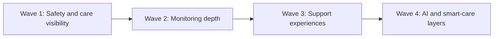

# D010 - Delivery Plan Conversion (Sprint-Ready Workstreams)

## 1. Purpose & Delivery Rule [⚠️ Partially Built] [🔴 High]
This document converts the D009 roadmap epics into execution-ready workstreams for engineering planning.

Delivery rule: this is a planning conversion, not a schedule invention. The source corpus does not specify sprint duration, team size, or effort estimates, so this document defines workstream structure, sequencing, entry criteria, exit criteria, and delivery tracks without fabricating dates or story-point totals.

This document should be read with → D009 §6 and → D009 §7.

## 2. Workstream Model [✅ 100% Built] [🔴 High]
Each workstream is defined using the same execution frame.

| Field | Meaning |
|---|---|
| Workstream ID | Execution identifier mapped to a D009 epic |
| Scope | The exact epic or enhancement set from D009 |
| Delivery tracks | Frontend, backend, data, mobile, and QA or operations tasks implied by the source docs |
| Entry gate | Preconditions required before sprint planning can start |
| Exit gate | Minimum condition for a workstream to be considered delivery-ready |
| Dependencies | Other documents or workstreams that must be in place first |

### 2.1 Definition of Ready [✅ 100% Built] [🟠 Medium]
A workstream is sprint-ready when:

1. The target routes or service surfaces are already named in the source corpus.
2. The governing workflow and ownership model are already defined in D003, D004, D005, D006, D007, or D008.
3. The workstream can be cut into frontend, backend, and integration tasks without adding undocumented product behavior.

### 2.2 Definition of Done [✅ 100% Built] [🟠 Medium]
A workstream is complete when:

1. The named page, service, or extension in the source corpus exists in the correct module.
2. The required data path, if documented, is connected end to end.
3. Workflow, permission, and mobile behavior remain aligned with the suite rules.

## 3. Wave Structure [⚠️ Partially Built] [🔴 High]
The corpus already recommends a sequence: core marketplace → scheduling → care logging → payments → messaging → analytics → AI. D009 translated that into four roadmap waves. This delivery conversion preserves that order.

| Wave | Workstreams |
|---|---|
| Wave 1 | W01, W02, W03 |
| Wave 2 | W04, W05, W09 |
| Wave 3 | W06, W07, W08 |
| Wave 4 | W10, W11, W12, W13 |

## 4. Sprint-Ready Workstreams [⚠️ Partially Built] [🔴 High]

### W01 - Daily Care Visibility [❌ Not Built – v2.0] [🔴 High]

| Field | Detail |
|---|---|
| Epic source | E01 |
| Scope | P1 Daily Care Log, P2 Patient Care Plan |
| Delivery tracks | Frontend patient and guardian pages; care-log read APIs; care-plan presentation layer; export/share UX where documented |
| Entry gate | Care-log and care-plan source records are available through the current care log and patient domains in → D004 §8 and → D005 §6 |
| Exit gate | Patient and guardian can access the named pages with documented timeline, summary, team, goals, and export views |
| Dependencies | → D004 §8, → D005 §6, → D007 §8 |

### W02 - Automated Safety Alerts [❌ Not Built – v2.0] [🔴 High]

| Field | Detail |
|---|---|
| Epic source | E02 |
| Scope | P3 Smart Health Alerts / Alert Rules |
| Delivery tracks | Alert-rule UI; threshold evaluation path; notifications integration; alert history and acknowledgment flows |
| Entry gate | Kafka topic design and alert-related endpoints are already defined in → D006 §7 and the vitals/alerts routes exist in the source corpus |
| Exit gate | Alert rules, alert history, severity handling, and notification channels match the documented rule set |
| Dependencies | → D006 §7, → D006 §8, → D008 §7 |

### W03 - Live Care Presence and Handoff [❌ Not Built – v2.0] [🔴 High]

| Field | Detail |
|---|---|
| Epic source | E03 |
| Scope | P4 Real-Time Tracking, P5 Shift Handoff |
| Delivery tracks | Mobile geolocation path, live shift presence UI, handoff checklist UI, check-in timeline integration |
| Entry gate | Shift lifecycle, geolocation plugin, and mobile shell patterns are already defined in → D004 §7 and → D008 §7 |
| Exit gate | Guardians can see caregiver arrival state and caregivers can complete formal handoff flow with documented checklist and acknowledgment |
| Dependencies | → D004 §7, → D008 §4, → D008 §7 |

### W04 - Subjective and Visual Monitoring [❌ Not Built – v2.0] [🟠 Medium]

| Field | Detail |
|---|---|
| Epic source | E04 |
| Scope | P6 Symptom Journal, P7 Photo Journal |
| Delivery tracks | Patient journaling UI, charting/trend views, photo capture and comparison flow, secure sharing output |
| Entry gate | Patient domain and attachment/media patterns are already present through patient records and mobile camera support |
| Exit gate | Symptom and wound-photo workflows reflect the documented form fields, trend views, and sharing behavior |
| Dependencies | → D005 §4, → D008 §5, → D008 §7 |

### W05 - Real-Time Guardian Oversight [❌ Not Built – v2.0] [🟠 Medium]

| Field | Detail |
|---|---|
| Epic source | E05 |
| Scope | P8 Guardian Live Dashboard, P9 Care Quality Scorecard |
| Delivery tracks | Dashboard aggregation layer; quality metrics UI; trend and compliance summaries; real-time feed surfaces |
| Entry gate | Placement, shift, care-log, and analytics event surfaces are already defined in → D004 §6 and → D006 §8 |
| Exit gate | Guardian monitoring views expose the documented status banner, latest vitals, care feed, and scorecard metrics |
| Dependencies | → D004 §6, → D006 §8, → D007 §8 |

### W06 - Remote Clinical Access [❌ Not Built – v2.0] [🟠 Medium]

| Field | Detail |
|---|---|
| Epic source | E06 |
| Scope | P10 Telehealth |
| Delivery tracks | Patient-facing telehealth pages, appointment flow, waiting-room state, in-call support surfaces, post-consultation output |
| Entry gate | Patient frontend branch and mobile rollout assumptions exist; however, the corpus does not define a separate telehealth backend service |
| Exit gate | The documented scheduling, waiting-room, in-call, and consultation-history surfaces exist without changing the current role and data-ownership model |
| Dependencies | → D007 §5.3, → D008 §10 |

### W07 - Daily Wellness Tracking [❌ Not Built – v2.0] [🟡 Low]

| Field | Detail |
|---|---|
| Epic source | E07 |
| Scope | P11 Nutrition Tracker, P12 Rehabilitation / Exercise Tracker |
| Delivery tracks | Patient daily logging UI, caregiver-assisted entry support, trend charts, weekly summaries |
| Entry gate | Patient context and care-log adjacent structures are already present in the patient and care domains |
| Exit gate | Nutrition and rehab pages support the documented intake, compliance, and progress views |
| Dependencies | → D005 §4.2, → D005 §4.4 |

### W08 - Family and Financial Support Tools [❌ Not Built – v2.0] [🟡 Low]

| Field | Detail |
|---|---|
| Epic source | E08 |
| Scope | P13 Family Communication Board, P14 Insurance & Coverage Tracker |
| Delivery tracks | Shared communication board UI, membership panel behavior, insurance policy and claims views, document upload handling |
| Entry gate | Messaging rules and guardian ownership model are already defined; insurance workflow pages are documented but no separate insurance backend service is named |
| Exit gate | Shared board and insurance pages match the documented post types, member model, policy summary, and claims surfaces |
| Dependencies | → D003 §6, → D007 §5.1 |

### W09 - Residual Operational Enhancement [🔄 Enhancement] [🟠 Medium]

| Field | Detail |
|---|---|
| Epic source | E09 |
| Scope | Agency incidents list enhancement |
| Delivery tracks | Agency incident list view, resolution workflow, severity filtering, admin escalation path |
| Entry gate | Existing incident wizard already creates incidents in the agency module |
| Exit gate | Agency can view, filter, and resolve incident records through the documented list-management view at `/agency/incidents` |
| Dependencies | → D006 §6, → D007 §5.4 |

### W10 - AI Vitals Monitoring [❌ Not Built – v2.0] [🔴 High]

| Field | Detail |
|---|---|
| Epic source | E10 |
| Scope | AI anomaly detection for vitals |
| Delivery tracks | `patient_vitals` data path, anomaly service, alert generation, acknowledgment flow, patient alert views |
| Entry gate | Vitals event flow, Kafka topics, and alert endpoints are already documented |
| Exit gate | The documented pipeline exists: vitals submission → queue/event → anomaly detection → alert engine → guardian/agency notification |
| Dependencies | → D006 §7, → D006 §8, → D005 §8 |

### W11 - Voice-Driven Documentation [❌ Not Built – v2.0] [🟠 Medium]

| Field | Detail |
|---|---|
| Epic source | E11 |
| Scope | Voice care logging plus voice notes integration |
| Delivery tracks | Caregiver record-and-confirm flow, speech-to-text path, NLP parsing, voice-note attachment UX |
| Entry gate | Care-log workflow and mobile capability plan are already defined; voice-specific backend components are named in the architecture corpus |
| Exit gate | Caregiver can record a voice log, receive structured output, confirm or edit, and submit to the care-log flow |
| Dependencies | → D004 §8, → D008 §7 |

### W12 - Wearable and Device Ingestion [❌ Not Built – v2.0] [🟠 Medium]

| Field | Detail |
|---|---|
| Epic source | E12 |
| Scope | Caregiver wearable integration |
| Delivery tracks | Device registration flow, mobile sync path, Device API Gateway, device-reading retrieval, fall detection alert path |
| Entry gate | Device endpoints, registry tables, and mobile extension path are already named in the corpus |
| Exit gate | Devices can be registered, data can be ingested, readings can be viewed, and fall detection can trigger the documented alert recipients |
| Dependencies | → D006 §6, → D008 §8 |

### W13 - Scheduling Intelligence [❌ Not Built – v2.0] [🟠 Medium]

| Field | Detail |
|---|---|
| Epic source | E13 |
| Scope | Automatic shift optimization |
| Delivery tracks | Shift candidate scoring path, optimizer invocation, candidate acceptance flow, supervisor review controls |
| Entry gate | Shift creation and acceptance endpoints plus shift lifecycle are already documented |
| Exit gate | Shift optimization supports the documented candidate, scoring, notify, accept, and confirm workflow |
| Dependencies | → D004 §7, → D006 §6 |

## 5. Delivery Board Cut [⚠️ Partially Built] [🔴 High]
The workstreams above can be used as planning-board columns or initiative swimlanes.

| Board Lane | Workstreams |
|---|---|
| Patient safety core | W01, W02, W03 |
| Monitoring depth | W04, W05, W09 |
| Expanded care experience | W06, W07, W08 |
| Smart-care platform | W10, W11, W12, W13 |

## 6. Practical Sprint Planning Notes [⚠️ Partially Built] [🟠 Medium]
To keep the conversion source-safe, the sprint-ready use of this document should follow these rules:

1. Use each workstream as a parent planning item.
2. Split delivery tracks into implementation tickets only after confirming the existing code owners and repository boundaries.
3. Do not assign numeric effort or calendar dates from this document alone; the source corpus does not support that level of estimation.
4. Preserve D009 wave order unless the user explicitly reprioritizes.

## 7. Final Planning Position [✅ 100% Built] [🔴 High]
D009 has now been converted into an execution layer that is ready for delivery planning.

1. Every roadmap epic now maps to a workstream.
2. Each workstream has a clear entry gate and exit gate.
3. Dependencies remain anchored to the planning suite rather than to undocumented assumptions.
4. The result is sprint-ready as a backlog-structuring artifact, while remaining source-safe on dates and effort.