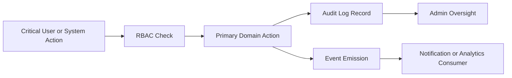

# D011 - Security, Compliance & Non-Functional Requirements

## 1. Scope & Authority [✅ 100% Built] [🔴 High]
This addendum extracts the platform-level operational requirements that are explicit in the architecture corpus but only lightly compressed in the core planning suite.

Source authority is the system architecture specification sections covering security requirements, event model, technology stack, and non-functional requirements. This document should be read with → D003 §4, → D006 §5, → D006 §9, → D007 §5.5, and → D013 §4.7.

## 2. Security Baseline [⚠️ Partially Built] [🔴 High]
The architecture corpus defines a mandatory baseline rather than optional hardening ideas.

| Requirement | Source Meaning | Planning Implication |
|---|---|---|
| RBAC access control | Access must be role-governed | All route, data, and service surfaces remain subordinate to → D003 |
| Audit logging | Critical actions must be recorded | Admin, compliance, and dispute handling require durable event history |
| Two-factor authentication for admin | Admin accounts require stronger sign-in controls | Administrative auth flows cannot be treated as standard user auth only |
| Device logging | Sessions and device activity must be attributable | User inspector, security review, and session oversight need device history |
| Encrypted file storage | Stored files require protected-at-rest handling | Documents, attachments, and clinical uploads cannot be handled as plain file blobs |

### 2.1 Administrative Security Controls [✅ 100% Built] [🔴 High]
The source is explicit that elevated accounts require stronger protection than baseline role access.

| Control Area | Required Direction |
|---|---|
| Admin authentication | Two-factor authentication is mandatory |
| Oversight surface | Audit logs must exist for critical actions |
| Device oversight | Session or device history must be viewable |
| File governance | Sensitive uploads must use encrypted storage |

## 3. Audit & Evidence Model [✅ 100% Built] [🔴 High]
Auditability is a first-class platform requirement.

| Audit Surface | Corpus Signal | Related Suite Area |
|---|---|---|
| User and role actions | Must be logged | → D003 §4 |
| Placement and care operations | Critical workflow state changes matter | → D004 |
| Administrative interventions | Suspensions, approvals, disputes, policy actions need traceability | → D007 §5.5 |
| File-backed evidence | Verification, incidents, claims, and support uploads require controlled handling | → D005 §4.5 |

## 4. Event & Observability Baseline [✅ 100% Built] [🟠 Medium]
The source architecture couples security and operational visibility to an event model.

| Explicit Event | Why It Matters Operationally |
|---|---|
| `requirement.created` | Intake traceability |
| `job.posted` | Hiring workflow traceability |
| `application.submitted` | Workforce pipeline traceability |
| `placement.created` | Contract creation traceability |
| `shift.started` | Live care execution traceability |
| `shift.completed` | Service completion traceability |
| `carelog.created` | Clinical activity traceability |
| `incident.reported` | Safety and escalation traceability |

These events support both async processing and compliance visibility. Related reading: → D006 §7 and → D006 §8.

## 5. Technology Controls [⚠️ Partially Built] [🟠 Medium]
The stack section is not only technical preference; it implies operational control points.

| Layer | Explicit Direction | Operational Relevance |
|---|---|---|
| Frontend | React or Svelte, Tailwind, role-based routing | RBAC must carry through the client route layer |
| Backend | Node, Go, or Python with REST APIs and PostgreSQL | Core transactional and audit data remain relational |
| Infrastructure | Docker, S3-compatible object storage, Redis or Kafka queueing, WebSocket messaging | Files, events, and real-time communication require governed infrastructure |

### 5.1 File and Attachment Governance [✅ 100% Built] [🔴 High]
The encrypted file storage requirement materially affects these documented surfaces:

1. Patient documents and medical uploads.
2. Verification documents.
3. Incident evidence uploads.
4. Message attachments.
5. Support tickets and claims evidence.

## 6. Non-Functional Requirements [✅ 100% Built] [🔴 High]
The architecture corpus defines four explicit non-functional targets.

| Area | Explicit Requirement | Planning Meaning |
|---|---|---|
| Scalability | Support 1M users | Architecture choices must scale beyond small-team operation |
| Availability | 99.9% uptime | Platform operations and system health monitoring are not optional |
| Data retention | 7 years for care logs | Storage, archival, and retrieval must preserve long-lived clinical history |
| Audit compliance | All critical actions logged | Security and operations are inseparable from governance |

## 7. Service and UI Implications [⚠️ Partially Built] [🟠 Medium]
These operational requirements affect multiple existing planning documents.

| Requirement | Impacted Areas |
|---|---|
| Admin 2FA | Auth routes, admin access model, device/session controls |
| Device logging | Admin user inspector, security review, operational audit |
| Encrypted storage | Patient, support, incident, message, and verification file flows |
| 99.9% uptime | System health, service topology, deployment target |
| 7-year care-log retention | Care logs, vitals, incident evidence, data lifecycle planning |

Related reading: → D006 §3, → D006 §7, → D006 §9, → D007 §5.5, and → D013 §4.7.

## 8. Final Planning Position [✅ 100% Built] [🔴 High]
This addendum closes a real documentation gap in the suite.

1. The source corpus defines a mandatory security baseline.
2. It also defines explicit scalability, uptime, retention, and audit requirements.
3. Those requirements were previously distributed across D003 and D006, but not preserved as a dedicated operational planning artifact.
4. D011 now makes those constraints explicit without adding any new requirements beyond the source corpus.