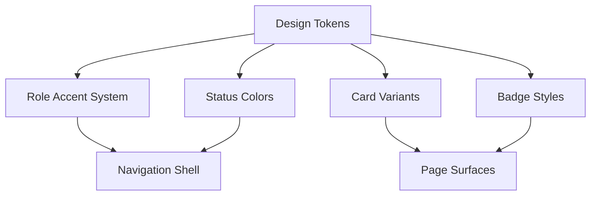

# D012 - Design System & UI Standards Addendum

## 1. Scope & Intent [✅ 100% Built] [🔴 High]
This addendum preserves the explicit design-system layer from the wireframe corpus: token values, card styles, badge rules, status colors, and breakpoint behavior.

The planning suite already documents navigation and mobile architecture in → D002 and → D008. This addendum captures the visual-system details those documents intentionally compressed.

This document should be read with → D007 §2, → D007 §4, and → D013 §5.

## 2. Brand & Role Color System [✅ 100% Built] [🔴 High]
The source corpus defines both brand colors and role-facing accents.

| Token | Value | Usage |
|---|---|---|
| `--cn-pink` | `#DB869A` | Caregiver accent, primary CTA |
| `--cn-pink-light` | `#FEB4C5` | Caregiver light tint |
| `--cn-green` | `#5FB865` | Guardian accent, success states |
| `--cn-green-light` | `#7CE577` | Guardian light tint |
| `--cn-purple` | `#7B5EA7` | Admin accent, special elements |
| `--cn-amber` | `#E8A838` | Moderator and warning states |
| `--cn-blue` | `#0288D1` | Patient accent |
| `--cn-gradient-caregiver` | Pink radial gradient | Caregiver primary buttons |
| `--cn-gradient-guardian` | Green radial gradient | Guardian primary buttons |
| `--cn-gradient-shop` | Orange radial gradient | Shop primary buttons |

### 2.1 Role Accent Mapping [✅ 100% Built] [🔴 High]

| Role | Accent |
|---|---|
| Caregiver | Pink |
| Guardian | Green |
| Patient | Blue |
| Agency | Teal |
| Admin | Purple |
| Moderator | Amber |
| Shop | Orange |

This remains aligned with → D002 §4.3.

## 3. Shell Visual Standards [✅ 100% Built] [🔴 High]
The wireframe corpus treats the shell as a reusable visual system.

| Shell Surface | Explicit Rule |
|---|---|
| PublicNavBar | Brand anchor left, discovery center, utility and conversion right |
| BottomNav | Persistent mobile footer with active underline and role treatment |
| Authenticated layout | Sidebar plus top bar on desktop, sticky mobile header plus bottom nav on mobile |
| Content spacing | Bottom padding preserved for mobile bottom-nav clearance |

## 4. Card System [✅ 100% Built] [🟠 Medium]
The source corpus explicitly names reusable card styles.

| Variant | Visual Meaning | Usage Direction |
|---|---|---|
| `finance-card` | White background, rounded corners, shadow, light border | Primary card style across dashboards, forms, and lists |
| `cn-card` | Themed background, bordered, rounded | Semantic or themed panels |
| `cn-card-flat` | Flatter bordered surface | Lower-emphasis content blocks |
| `cn-stat-card` | Compact KPI surface | Dashboard stats and metrics |

## 5. Badge & Status Standards [✅ 100% Built] [🔴 High]

### 5.1 Badge Rules [✅ 100% Built] [🟠 Medium]

| Variant | Rule |
|---|---|
| `cn-badge` | Inline-flex pill with compact spacing and extra-small text |
| `badge-pill` | Same pill pattern with slightly smaller display treatment |

### 5.2 Status Colors [✅ 100% Built] [🔴 High]

| Status | Background | Text |
|---|---|---|
| Active or Completed | `#7CE57720` | `#5FB865` |
| Pending | `#FFB54D20` | `#E8A838` |
| Cancelled or Suspended | `#EF444420` | `#EF4444` |
| Verified | `#7CE57720` | `#5FB865` |

These colors appear repeatedly across operations, commerce, support, and safety surfaces.

## 6. Responsive Layout Standards [✅ 100% Built] [🔴 High]
The wireframe corpus explicitly defines the breakpoint model.

| Breakpoint | Explicit Behavior |
|---|---|
| Mobile-first baseline | Single-column stacks by default |
| `sm:` at 640px | Row and grid layouts begin |
| `lg:` at 1024px | Sidebar and multi-column operational surfaces activate |
| Mobile sidebar behavior | Sidebar is hidden and replaced with drawer-style navigation |

### 6.1 Mobile-First Reading [✅ 100% Built] [🔴 High]
The design system assumes handheld-first interaction, especially under the documented 95 percent mobile target. This makes the visual system inseparable from → D008.

Related reading: → D007 §2 and → D013 §5.

## 7. Surface Patterns Preserved by the Corpus [⚠️ Partially Built] [🟠 Medium]
The source corpus repeatedly uses the same visual language across modules.

| Pattern | Corpus Signal |
|---|---|
| Gradient hero surfaces | Public home, support, dashboard banners, patient-safety pages |
| Rounded high-radius cards | Marketplace, commerce, dashboards, support, patient monitoring |
| Stat-card grids | Dashboards across guardian, agency, admin, shop, patient |
| Pill filters and tabs | Search, community, order history, moderation, analytics |
| Overlapping hero-plus-card layouts | Support, shop, monitoring, profile-like surfaces |

This document does not create new component taxonomy beyond what the source explicitly names.

## 8. Final Planning Position [✅ 100% Built] [🔴 High]
This addendum gives the suite a preserved UI governance layer.

1. The source corpus contains explicit visual standards, not only page descriptions.
2. Those standards were partially referenced in D002 and D008, but not preserved in one place.
3. D012 now provides a stable source-backed reference for tokens, statuses, cards, badges, and breakpoint behavior.
4. Its frontend implementation context is anchored back into → D007 and its audited built surfaces are anchored into → D013.