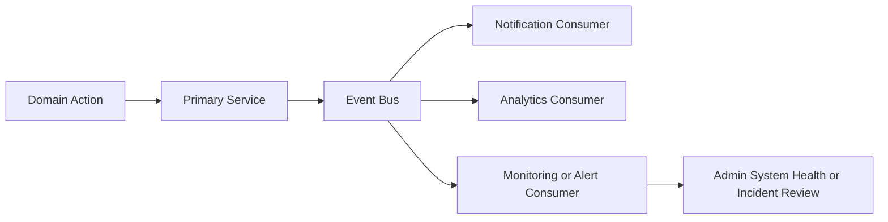
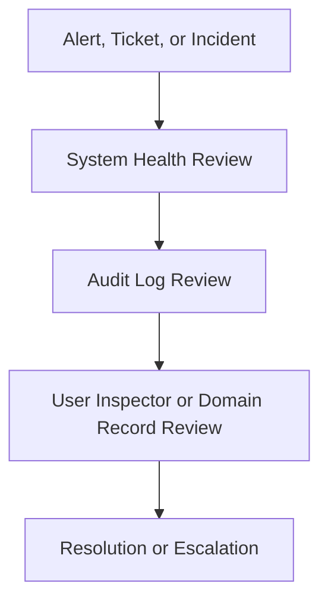

# D014 - Operations Runbook Addendum

## 1. Scope & Runbook Rule [✅ 100% Built] [🔴 High]
This addendum converts the operations-related signals in the source corpus into a planning-baseline runbook document.

Runbook rule: the source corpus defines operational surfaces, alerts, health indicators, and infrastructure direction, but it does not define numeric incident SLAs, named on-call rotations, or step-by-step recovery scripts. This document therefore captures what operations must watch, what events matter, what evidence must exist, and what escalation surfaces are explicitly present, without inventing unsupported operational policy.

This document should be read with → D006 §7, → D006 §8, → D007 §5.5, → D011 §2, and → D013 §4.7.

## 2. Operational Control Surfaces [✅ 100% Built] [🔴 High]
The corpus already defines the main surfaces an operations team would use.

| Surface | Source Signal | Operational Use |
|---|---|---|
| Admin System Health | Service indicators, uptime percentages, error rate charts, recent alerts and incidents | Primary health dashboard |
| Admin Audit Logs | Chronological event log with filters and export | Evidence, traceability, post-incident review |
| Admin User Inspector | Session or device log, account activity timeline, manual actions | Account investigation and security review |
| Admin Tickets | Support ticket detail with assignment and status flow | Support operations and issue coordination |
| Moderator Reports and Content Queues | Open reports, flagged content, escalation path | Trust and safety operations |

### 2.1 System Health Reading [✅ 100% Built] [🔴 High]
The system health page explicitly names five watch surfaces.

| Health Indicator | Corpus Status Surface |
|---|---|
| API | Service status indicator |
| Database | Service status indicator |
| Payments | Service status indicator |
| Notifications | Service status indicator |
| Search | Service status indicator |

The source also explicitly expects uptime percentages, error-rate charts, and recent alerts or incidents to be visible in this surface.

Related reading: → D007 §5.5 and → D013 §4.7.

## 3. Event-Driven Operating Model [✅ 100% Built] [🔴 High]
Operations in CareNet are not only page-driven; they are event-driven.

| Event Family | Operational Relevance |
|---|---|
| `requirement.created` | Intake health and workflow continuity |
| `job.posted` | Agency hiring flow continuity |
| `application.submitted` | Workforce pipeline continuity |
| `placement.created` | Contract and billing downstream continuity |
| `shift.started` | Live care execution visibility |
| `shift.completed` | Delivery completion visibility |
| `carelog.created` | Clinical activity visibility |
| `incident.reported` | Safety escalation visibility |

### 3.1 Explicit Consumer Paths [✅ 100% Built] [🟠 Medium]
The source architecture defines consumer patterns that an operations runbook must recognize.

| Consumer | Event or Input | Operational Meaning |
|---|---|---|
| Notification | `shift.started` and related workflow events | User-facing communications depend on async health |
| Analytics | `carelog.created` | Reporting completeness depends on event continuity |
| Alert Engine | `vital.recorded` | Patient safety monitoring depends on this path |
| Scheduling | `shift.missed` | Shift replacement and punctuality oversight depend on this path |
| Billing | `placement.completed` | Financial downstream processing depends on this path |

## 4. Operational Incident Classes [⚠️ Partially Built] [🔴 High]
The source corpus does not define named severity matrices, but it does define categories of operational issues that must be visible.

| Incident Class | Source Basis | Primary Watch Surface |
|---|---|---|
| Platform availability issue | 99.9% uptime requirement plus System Health page | Admin System Health |
| Domain workflow interruption | Event model and service topology | Audit logs plus health dashboard |
| Shift execution issue | `shift.missed`, check-in and check-out workflows | Shift operations and recent alerts |
| Patient safety alert | Vitals anomaly and alert-engine path | Alert surfaces plus recent alerts and incidents |
| Security or account anomaly | Device logging, audit logging, admin 2FA requirement | User Inspector plus Audit Logs |
| Support escalation | Ticket status flow and assignment | Admin ticket detail |
| Trust and safety escalation | Moderator reports and content queues | Moderator and admin escalation surfaces |

### 4.1 What the Runbook Must Not Assume [✅ 100% Built] [🟠 Medium]
The source corpus does not specify:

1. Exact severity labels such as Sev1 or Sev2.
2. Numeric response-time SLAs.
3. Pager rotations or staff rosters.
4. Step-by-step recovery commands.

Those items must be added later only if the user wants an implementation-specific runbook.

## 5. Service Dependency Watchlist [⚠️ Partially Built] [🔴 High]
The system health page lists only five visible platform surfaces, but the architecture corpus implies broader dependency chains underneath them.

| Watch Surface | Downstream or Supporting Dependencies From Corpus |
|---|---|
| API | Domain REST services and API gateway |
| Database | PostgreSQL transactional store |
| Payments | Billing or payment event flow |
| Notifications | Notification service plus event delivery |
| Search | Search layer in the recommended deployment topology |

Related reading: → D006 §3 and → D006 §9.

### 5.1 Extended Dependency Paths [⚠️ Partially Built] [🟠 Medium]

| Operational Capability | Dependency Chain |
|---|---|
| Care alerts | Care Logs API -> vital event -> anomaly detection -> alert engine -> notification |
| Device ingestion | Wearable or app sync -> Device API Gateway -> Vitals Service |
| Billing follow-through | Placement lifecycle -> event emission -> billing consumer |
| Messaging continuity | Conversation or message events plus user-facing message surfaces |

## 6. Evidence, Logging & Investigation Flow [✅ 100% Built] [🔴 High]
The source corpus provides a minimum evidence model for operational investigation.

| Investigation Surface | Source Signal |
|---|---|
| System Health | Service status, uptime, error rate, recent incidents |
| Audit Logs | Timestamp, actor, action, target, IP address |
| User Inspector | Session or device log, account activity timeline |
| Ticket Detail | Assignee, status flow, conversation thread |

## 7. Data Governance in Operations [✅ 100% Built] [🔴 High]
The source corpus makes operations partly a data-governance function.

| Governance Rule | Operational Meaning |
|---|---|
| Audit compliance for all critical actions | Investigations must preserve action traceability |
| 7-year care-log retention | Operational cleanup cannot violate long-lived clinical history requirements |
| Encrypted file storage | File review and attachment flows must remain within protected storage boundaries |
| Device logging | Session or device review is part of account-level incident handling |

## 8. Practical Operating Baseline [⚠️ Partially Built] [🟠 Medium]
The corpus supports a planning-baseline operating model.

1. Watch the five named health surfaces continuously: API, Database, Payments, Notifications, and Search.
2. Treat domain events as operational signals, not only application internals.
3. Use Audit Logs, User Inspector, and Ticket Detail as the minimum investigation stack.
4. Treat patient-safety monitoring flows as special operational paths because vitals anomaly detection and incident reporting are explicitly defined.
5. Preserve retention, encryption, and auditability constraints during any operational response.

## 9. Final Planning Position [✅ 100% Built] [🔴 High]
D014 gives the suite an explicit operations layer without inventing SRE policy the source corpus does not contain.

1. The corpus defines clear health, audit, and ticketing surfaces.
2. It defines an event-driven backend where operational visibility depends on Kafka or queue-backed flow continuity.
3. It defines data-governance constraints that affect incident handling.
4. D014 now preserves those requirements in runbook form while staying source-safe.
5. Its operational reading path is now explicitly tied back into → D006, → D007, and → D013.
