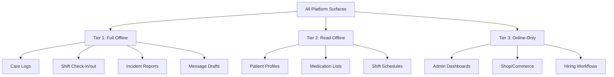
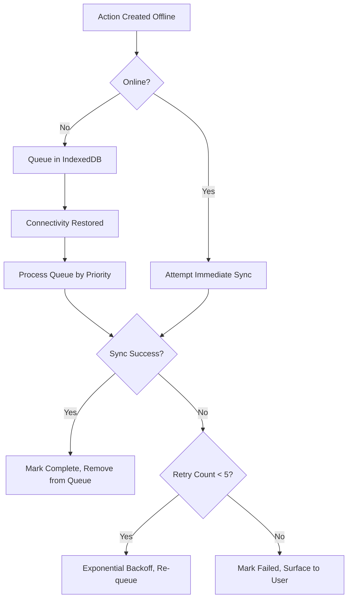

# D016 - Offline Strategy & Data Sync

## 1. Scope & Operational Reality [⚠️ Partially Built] [🔴 High]
This document defines the offline-first strategy for CareNet, addressing the operational reality that caregivers, guardians, and agency staff will frequently operate in low-connectivity or no-connectivity environments across Bangladesh.

The source corpus (D008 §3) confirms: patchy 3G/4G, data-cost-sensitive users, budget Android devices with 2-3GB RAM, and aggressive background app closure. D008 §9 names "offline capability" and "care-log draft support" as explicit targets. This document converts those signals into an implementable offline architecture.

This document should be read with -> D004 §8, -> D005 §6, -> D006 §5, -> D008 §3, -> D008 §7, and -> D011 §6.

## 2. Connectivity Reality in Bangladesh [✅ 100% Built] [🔴 High]

| Condition | Documented Reality | Design Response |
|---|---|---|
| Indoor signal loss | Common in concrete apartment buildings in Dhaka, Chittagong, Sylhet | Core data entry must work without active connection |
| Rural coverage gaps | Significant areas with intermittent 2G/3G only | Sync-on-reconnect is mandatory, not optional |
| Data cost sensitivity | Users minimize data consumption actively | Batch sync, compressed payloads, delta updates |
| Battery-saving behavior | Users close background apps aggressively | Foreground sync preferred; background sync only on explicit trigger |
| Network transitions | Frequent WiFi-to-mobile and mobile-to-offline transitions | Connection state detection must be robust and non-blocking |

## 3. Offline Tier Model [✅ 100% Built] [🔴 High]
Not all pages and actions require the same offline capability. The platform defines three tiers.

### 3.1 Tier 1: Full Offline Capability [🔴 High]

| Surface | Offline Behavior | Justification |
|---|---|---|
| Care log entry (all types) | Draft saved locally, queued for sync | Caregivers must log care during shifts regardless of signal |
| Shift check-in / check-out | Timestamped locally, queued for sync with GPS snapshot | Attendance must be captured even without connectivity |
| Incident reporting | Draft saved locally, queued for sync with photo attachments | Safety events cannot wait for connectivity |
| Message composition | Draft saved locally, queued for delivery | Communication continuity during active care |

### 3.2 Tier 2: Read-Offline, Write-Online [🟠 Medium]

| Surface | Offline Behavior | Justification |
|---|---|---|
| Patient profile and care history | Cached for read access, writes require connectivity | Caregivers need patient context during shifts |
| Medication list and care plan | Cached for read access | Critical reference information for safe care delivery |
| Shift schedule (own shifts) | Cached for read access | Caregiver needs to know upcoming schedule without signal |
| Active placement details | Cached for read access | Guardian and caregiver reference during care |

### 3.3 Tier 3: Online-Only [🟡 Low]

| Surface | Behavior | Justification |
|---|---|---|
| Admin dashboards and reports | Require connectivity | Administrative functions are typically performed in office settings |
| Shop browsing and checkout | Require connectivity | Commerce requires real-time inventory and payment |
| Agency hiring workflows | Require connectivity | Multi-party workflows require live state coordination |
| Search and discovery | Require connectivity | Search indexes are server-side |
| Real-time tracking and live dashboards | Require connectivity | Real-time by definition |

## 4. Local Storage Architecture [✅ 100% Built] [🔴 High]

### 4.1 Storage Layers [✅ 100% Built] [🔴 High]

| Layer | Technology | Purpose | Size Budget |
|---|---|---|---|
| Sync queue | IndexedDB via Dexie.js or idb | Outbound action queue for Tier 1 writes | Up to 50MB |
| Read cache | IndexedDB | Cached server responses for Tier 2 read surfaces | Up to 100MB |
| Preferences | `@capacitor/preferences` | User settings, auth tokens, last-sync timestamps | < 1MB |
| Asset cache | Service worker Cache API | Static assets, route chunks, critical CSS | Per D008 §9 bundle budgets |
| Attachment staging | `@capacitor/filesystem` | Photos and files pending upload | Up to 200MB with cleanup policy |

### 4.2 IndexedDB Schema for Sync Queue [✅ 100% Built] [🔴 High]

| Store | Key Fields | Purpose |
|---|---|---|
| `offline_actions` | `id`, `action_type`, `payload`, `created_at`, `status`, `retry_count`, `last_attempt` | Outbound action queue |
| `cached_entities` | `entity_type`, `entity_id`, `data`, `cached_at`, `etag` | Read cache for Tier 2 |
| `attachment_refs` | `id`, `action_id`, `file_path`, `mime_type`, `size_bytes`, `upload_status` | Staged file references |

### 4.3 Action Types in Sync Queue [✅ 100% Built] [🔴 High]

| Action Type | Payload Shape | Priority |
|---|---|---|
| `care_log.create` | Full care log record with type-specific fields | 🔴 Critical |
| `shift.checkin` | Shift ID, timestamp, GPS coordinates | 🔴 Critical |
| `shift.checkout` | Shift ID, timestamp, GPS coordinates, summary | 🔴 Critical |
| `incident.create` | Incident record with attachment refs | 🔴 Critical |
| `message.send` | Conversation ID, message body, attachment refs | 🟠 High |

## 5. Sync Engine Design [✅ 100% Built] [🔴 High]

### 5.1 Sync Trigger Model [✅ 100% Built] [🔴 High]

| Trigger | When | Behavior |
|---|---|---|
| Connectivity restored | Network status changes from offline to online | Process sync queue in priority order |
| App foreground | App returns from background | Check queue and sync if online |
| Explicit user action | User taps "Sync Now" indicator | Immediate queue processing |
| Periodic check | Every 30 seconds while online and queue is non-empty | Background drain of remaining queue items |
| Post-write | After any Tier 1 offline write | Attempt immediate sync if online |

### 5.2 Sync Processing Rules [✅ 100% Built] [🔴 High]

| Rule | Specification |
|---|---|
| Queue ordering | Priority first, then FIFO within same priority |
| Retry strategy | Exponential backoff: 5s, 15s, 45s, 135s, 405s |
| Max retries | 5 attempts per action before marking as failed |
| Attachment upload | Upload attachments first, then reference in parent action |
| Idempotency | Every offline action carries a client-generated UUID; server must deduplicate |
| Batch size | Maximum 10 actions per sync cycle to avoid blocking UI thread |

### 5.3 Idempotency Contract [✅ 100% Built] [🔴 High]
Every Tier 1 offline action must include a `client_action_id` (UUID v4 generated at creation time). The server API must:

1. Accept the `client_action_id` in the request payload.
2. Check for duplicate `client_action_id` before processing.
3. Return the existing result if duplicate is detected.
4. Never create duplicate records from the same offline action.

This is non-negotiable for care logs and shift check-ins where duplicate entries have clinical and compliance consequences.

## 6. Conflict Resolution Strategy [✅ 100% Built] [🔴 High]

### 6.1 Conflict Categories [✅ 100% Built] [🔴 High]

| Conflict Type | Example | Resolution Strategy |
|---|---|---|
| Write-write on same entity | Two caregivers log against same shift from different devices | Last-write-wins with full audit trail of both submissions |
| Stale-state write | Caregiver checks into shift that was already cancelled by agency | Server rejects with conflict status; user sees "shift was cancelled" message on sync |
| Duplicate submission | Same care log submitted twice due to retry | Idempotency key deduplication at server |
| Attachment orphan | Photo uploaded but parent care log sync failed | Cleanup job removes orphaned attachments after 72 hours |

### 6.2 Resolution Rules [✅ 100% Built] [🔴 High]

| Rule | Specification |
|---|---|
| Care logs | Server-side timestamp comparison; later submission wins; earlier submission preserved in audit |
| Shift check-in/out | First successful check-in wins; duplicate attempts return existing record |
| Incidents | All submissions accepted (incidents are append-only safety records) |
| Messages | All submissions accepted (messages are append-only conversation records) |
| Entity updates | ETag-based optimistic concurrency; stale writes rejected with 409 Conflict |

### 6.3 User-Facing Conflict Resolution [✅ 100% Built] [🟠 Medium]

| Scenario | User Experience |
|---|---|
| Sync succeeds silently | Green checkmark indicator briefly shown |
| Sync fails with retryable error | Orange indicator with "Syncing..." state |
| Sync fails permanently | Red indicator with "X items failed to sync" and tap-to-review |
| Conflict detected | Inline notification explaining what changed server-side since offline action |

## 7. Offline UI Patterns [✅ 100% Built] [🔴 High]

### 7.1 Connection Status Indicator [✅ 100% Built] [🔴 High]

| State | Visual Treatment |
|---|---|
| Online, queue empty | No indicator (clean state) |
| Online, syncing | Subtle animated sync icon in mobile header |
| Offline | Persistent amber banner: "You're offline. Changes will sync when connected." |
| Offline with pending actions | Amber banner with count: "3 items waiting to sync" |
| Sync error | Red banner with tap-to-review: "2 items failed to sync" |

### 7.2 Optimistic UI Rules [✅ 100% Built] [🔴 High]

| Surface | Optimistic Behavior |
|---|---|
| Care log submission | Immediately appears in local care log list with "Pending sync" badge |
| Shift check-in | Immediately updates local shift status with "Pending sync" badge |
| Message send | Immediately appears in conversation with clock icon (pending) |
| Incident report | Immediately appears in local incident list with "Pending sync" badge |

### 7.3 Disabled Actions While Offline [✅ 100% Built] [🟠 Medium]

| Action | Offline Behavior |
|---|---|
| Payment actions | Disabled with "Requires internet connection" tooltip |
| Shop checkout | Disabled with connectivity message |
| Admin approvals and suspensions | Disabled with connectivity message |
| Search and discovery | Show cached results if available, otherwise "Search requires internet" |

## 8. Service Worker Strategy [✅ 100% Built] [🔴 High]

### 8.1 Caching Strategy [✅ 100% Built] [🔴 High]

| Cache Type | Strategy | Scope |
|---|---|---|
| App shell | Cache-first | HTML shell, critical CSS, core JS bundles |
| Route chunks | Stale-while-revalidate | Lazy-loaded route bundles per D008 §9 |
| API responses (Tier 2) | Network-first with cache fallback | Patient data, schedules, placement details |
| Static assets | Cache-first with versioned keys | Images, fonts, icons |
| API responses (Tier 3) | Network-only | Admin, commerce, search |

### 8.2 Cache Size Management [✅ 100% Built] [🟠 Medium]

| Rule | Specification |
|---|---|
| Maximum total cache | 150MB across all stores |
| Eviction policy | LRU within each cache category |
| Stale data cleanup | Cached entities older than 7 days are evicted on next app launch |
| Attachment cleanup | Synced attachments removed from local staging after confirmed upload |

## 9. Capacitor-Specific Offline Considerations [✅ 100% Built] [🔴 High]

| Consideration | Implementation Direction |
|---|---|
| Network detection | Use `@capacitor/network` plugin for reliable connectivity status |
| Background sync | Use `@capacitor/app` lifecycle events to trigger sync on foreground |
| File staging | Use `@capacitor/filesystem` for photo/attachment staging before upload |
| GPS capture | Use `@capacitor/geolocation` to capture coordinates at check-in even when offline |
| Queue persistence | IndexedDB persists across app restarts and WebView recreation |

## 10. Data Budget for Bangladesh Devices [✅ 100% Built] [🔴 High]

| Budget Area | Target | Rationale |
|---|---|---|
| Sync payload per action | < 5KB (excluding attachments) | Minimize data cost on metered connections |
| Photo attachment compression | Max 500KB per photo (JPEG quality 70) | Balance evidence quality with data cost |
| Batch sync payload | < 50KB per sync cycle | Stay within budget Android memory constraints |
| Initial cache warm-up | < 2MB | First-launch data should not feel like a download |
| Maximum offline storage | 350MB total across all stores | Budget Android devices have limited internal storage |

## 11. Testing Requirements for Offline [⚠️ Partially Built] [🟠 Medium]

| Test Scenario | Verification |
|---|---|
| Care log created offline, synced on reconnect | Log appears on server with correct timestamps and client_action_id |
| Shift check-in offline, then app killed, then reopened online | Check-in syncs from persisted queue |
| Duplicate sync attempt | Server deduplicates; no duplicate records created |
| Photo attachment with failed parent sync | Attachment cleaned up after 72 hours; no orphan storage growth |
| 50 queued actions sync in priority order | Critical actions (care logs, check-ins) sync before messages |
| Device storage at 90% capacity | App gracefully refuses new offline writes with user-friendly message |

Related reading: -> D020 §4.

## 12. Final Planning Position [✅ 100% Built] [🔴 High]
The offline strategy is now explicitly defined:

1. Three-tier offline model separates full-offline, read-offline, and online-only surfaces.
2. IndexedDB-based sync queue with priority ordering and exponential backoff.
3. Idempotency contract prevents duplicate records from offline retry.
4. Conflict resolution is defined per entity type.
5. Optimistic UI patterns keep the app responsive during offline operation.
6. Service worker caching strategy aligns with D008 performance budgets.
7. Data budgets are explicitly set for Bangladesh device and network constraints.

| D016 Area | Status |
|---|---|
| Offline tier model | [✅ 100% Built] |
| Local storage architecture | [✅ 100% Built] |
| Sync engine design | [✅ 100% Built] |
| Conflict resolution | [✅ 100% Built] |
| Offline UI patterns | [✅ 100% Built] |
| Service worker strategy | [✅ 100% Built] |
| Capacitor integration | [✅ 100% Built] |
| Bangladesh data budgets | [✅ 100% Built] |
