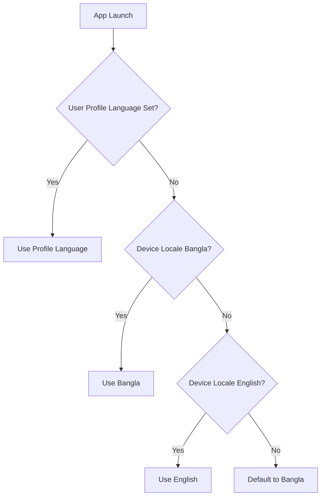
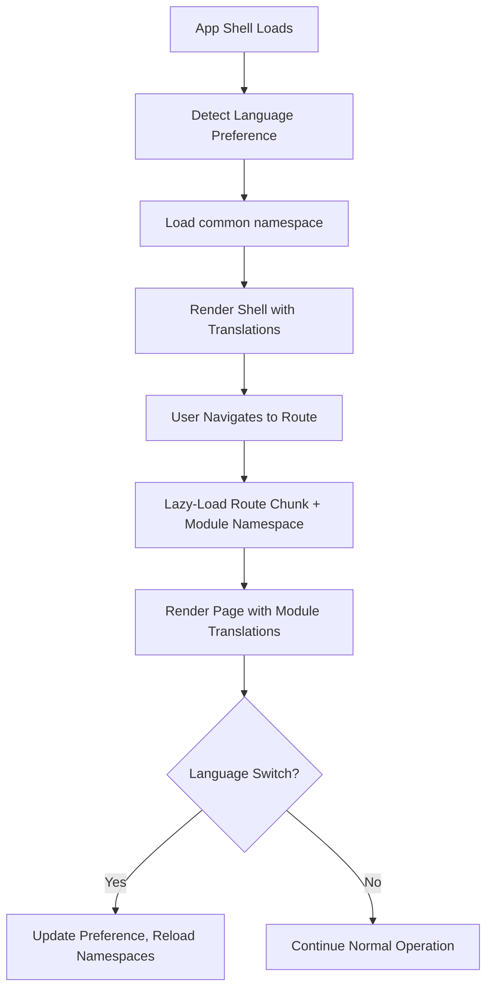

# D017 - Localization & Bangla Language Strategy

## 1. Scope & Market Reality [✅ 100% Built] [🔴 High]
This document defines the internationalization (i18n) and localization (l10n) strategy for CareNet, with Bangla (বাংলা) as the primary user-facing language for the Bangladesh market.

The source corpus (D008 §3) establishes that 95%+ of usage will be mobile in Bangladesh. The platform serves caregivers, guardians, agency staff, and shop operators who overwhelmingly communicate, read, and write in Bangla. An English-only interface is not viable for production deployment.

This document should be read with -> D002 §3, -> D008 §3, -> D012 §2, and -> D012 §6.

## 2. Language Model [✅ 100% Built] [🔴 High]

### 2.1 Supported Languages [✅ 100% Built] [🔴 High]

| Language | Code | Priority | Usage Context |
|---|---|---|---|
| Bangla (বাংলা) | `bn` | Primary | Default language for all user-facing UI, forms, labels, navigation, notifications |
| English | `en` | Secondary | Fallback language, admin/developer surfaces, international agency staff |

### 2.2 Language Selection Rules [✅ 100% Built] [🔴 High]

| Rule | Specification |
|---|---|
| Default language | Bangla (`bn`) for new users |
| Detection order | 1) User preference in profile, 2) `@capacitor/device` locale, 3) `navigator.language`, 4) Default to `bn` |
| Switching | User can switch language from Settings page; persists via localStorage and user profile |
| Persistence | Language preference stored in `@capacitor/preferences` for offline availability |
| Per-session override | Not supported; language is account-level or device-level |



## 3. i18n Framework [✅ 100% Built] [🔴 High]

### 3.1 Technology Choice [✅ 100% Built] [🔴 High]

| Component | Choice | Rationale |
|---|---|---|
| i18n library | `react-i18next` with `i18next` | Industry standard for React; supports namespaces, lazy loading, interpolation, pluralization |
| Translation file format | JSON namespace files | Simple, tooling-friendly, supports nested keys |
| Namespace strategy | One namespace per module family | Aligns with route-based code splitting per D008 §9 |
| Lazy loading | Load translation namespace with route chunk | Keeps initial bundle small for budget devices |

### 3.2 Namespace Map [✅ 100% Built] [🔴 High]

| Namespace | Scope | Loaded With |
|---|---|---|
| `common` | Shared labels, buttons, status text, navigation, errors | App shell (always loaded) |
| `auth` | Login, registration, role selection, OTP, password reset | Auth route chunk |
| `guardian` | Guardian module labels, forms, dashboard text | Guardian route chunk |
| `caregiver` | Caregiver module labels, forms, dashboard text | Caregiver route chunk |
| `patient` | Patient module labels, forms, health record text | Patient route chunk |
| `agency` | Agency module labels, forms, dashboard text | Agency route chunk |
| `admin` | Admin module labels, forms, dashboard text | Admin route chunk |
| `moderator` | Moderator module labels | Moderator route chunk |
| `shop` | Shop merchant and storefront labels | Shop route chunk |
| `community` | Community module labels | Community route chunk |
| `support` | Support and help labels | Support route chunk |

### 3.3 Translation Key Convention [✅ 100% Built] [🟠 Medium]

| Convention | Example |
|---|---|
| Dot-separated hierarchical keys | `guardian.dashboard.activePlacements` |
| Action keys use verb prefix | `common.actions.save`, `common.actions.cancel`, `common.actions.submit` |
| Status keys use status prefix | `common.status.active`, `common.status.pending`, `common.status.cancelled` |
| Form labels use field prefix | `caregiver.careLog.fields.mealType`, `caregiver.careLog.fields.notes` |
| Error messages use error prefix | `common.errors.required`, `common.errors.networkError` |
| Interpolation uses named variables | `guardian.placements.shiftCount: "{{count}}টি শিফট"` |

## 4. Bangla Typography & Rendering [✅ 100% Built] [🔴 High]

### 4.1 Font Strategy [✅ 100% Built] [🔴 High]

| Concern | Specification |
|---|---|
| Primary Bangla font | Noto Sans Bengali (Google Fonts) |
| Fallback stack | `'Noto Sans Bengali', 'Hind Siliguri', 'Kalpurush', sans-serif` |
| Loading strategy | `font-display: swap` to prevent FOIT on budget devices |
| Font weight coverage | 400 (regular) and 700 (bold) minimum; 300 and 600 if budget allows |
| Subset | Bengali Unicode range only (U+0980-09FF) to minimize download size |
| Font file size budget | < 150KB total for both weights (WOFF2 format) |

### 4.2 Typography Adjustments for Bangla [✅ 100% Built] [🔴 High]

| Property | English Value | Bangla Adjustment | Reason |
|---|---|---|---|
| Line height | 1.5 | 1.6-1.7 | Bangla script has taller ascenders and descenders with matras |
| Letter spacing | Normal | Slightly reduced or normal | Bangla conjuncts (যুক্তাক্ষর) need tight spacing |
| Minimum body text size | 14px | 16px | Bangla glyphs are visually denser; smaller sizes reduce readability |
| Input field height | 48px | 48px (unchanged) | Already meets touch target; Bangla fits within this height |
| Button text padding | Standard | +4px horizontal | Bangla words tend to be wider than English equivalents |

### 4.3 Font Loading in CSS [✅ 100% Built] [🟠 Medium]
The font import must be added to `/src/styles/fonts.css` per the project font convention. The Bangla font should be conditionally prioritized when the `lang` attribute on `<html>` is set to `bn`.

## 5. Number, Date & Currency Formatting [✅ 100% Built] [🔴 High]

### 5.1 Digit System [✅ 100% Built] [🔴 High]

| Context | Digit System | Example |
|---|---|---|
| User-facing display (Bangla mode) | Bengali digits (০১২৩৪৫৬৭৮৯) | ১২৩৪৫ |
| User-facing display (English mode) | Western digits (0123456789) | 12345 |
| Data entry (all modes) | Accept both Bengali and Western digit input | User types either; system normalizes to Western for storage |
| API payloads and storage | Always Western digits | Server never stores Bengali digits |

### 5.2 Date & Time Formatting [✅ 100% Built] [🔴 High]

| Context | Bangla Format | English Format |
|---|---|---|
| Full date | ১৫ মার্চ ২০২৬ | March 15, 2026 |
| Short date | ১৫/০৩/২০২৬ | 03/15/2026 |
| Time | বিকাল ৩:৩০ | 3:30 PM |
| Relative time | ৫ মিনিট আগে | 5 minutes ago |
| Day names | শনিবার, রবিবার, সোমবার... | Saturday, Sunday, Monday... |
| Month names | জানুয়ারি, ফেব্রুয়ারি, মার্চ... | January, February, March... |

Implementation: Use `Intl.DateTimeFormat('bn-BD')` and `Intl.RelativeTimeFormat('bn')` for Bangla formatting. These are natively supported in modern WebViews (Android 9+).

### 5.3 Currency Formatting [✅ 100% Built] [🔴 High]

| Context | Bangla Format | English Format |
|---|---|---|
| Bangladesh Taka | ৳১,২৩,৪৫৬ | ৳1,23,456 |
| Grouping | South Asian grouping (lakhs/crores) | South Asian grouping (consistent) |
| Decimal separator | দশমিক (.) | Decimal (.) |

Implementation: Use `Intl.NumberFormat('bn-BD', { style: 'currency', currency: 'BDT' })`.

Note: Bangladesh uses the South Asian numbering system (lakh = 1,00,000; crore = 1,00,00,000), not the Western thousand/million grouping. Both Bangla and English modes must use this grouping when displaying BDT amounts.

## 6. Content Categories & Translation Priority [✅ 100% Built] [🔴 High]

### 6.1 System-Generated Content (Must Translate) [✅ 100% Built] [🔴 High]

| Category | Examples | Translation Approach |
|---|---|---|
| Navigation labels | BottomNav tabs, sidebar links, page titles | Static translation keys in `common` namespace |
| Button text | Save, Cancel, Submit, Apply, Next, Back | Static translation keys in `common.actions` |
| Status labels | Active, Pending, Completed, Cancelled, Verified | Static translation keys in `common.status` |
| Form labels and placeholders | Name, Phone, Address, Notes, Select care type | Per-module namespace keys |
| Error messages | Required field, Invalid phone, Network error | `common.errors` namespace |
| Notification templates | "Your shift starts in 30 minutes", "New message from agency" | Server-rendered with translation template |
| Empty states | "No placements yet", "No messages" | Per-module namespace keys |

### 6.2 User-Generated Content (Do Not Translate) [✅ 100% Built] [🟠 Medium]

| Category | Examples | Handling |
|---|---|---|
| Care log notes | Free-text observations by caregiver | Stored and displayed as-is; user writes in their preferred language |
| Messages | Chat content between users | Stored and displayed as-is |
| Patient names and addresses | Personal information | Stored and displayed as-is |
| Agency descriptions | Business profile text | Stored and displayed as-is |
| Review text | Written feedback | Stored and displayed as-is |

### 6.3 Translation Priority Waves [✅ 100% Built] [🔴 High]

| Wave | Scope | Rationale |
|---|---|---|
| Wave 1 | `common` namespace: nav, buttons, statuses, errors | Affects every screen |
| Wave 2 | `auth` + `caregiver` + `guardian` namespaces | Primary user journeys |
| Wave 3 | `patient` + `agency` namespaces | Core operational surfaces |
| Wave 4 | `admin` + `moderator` + `shop` + remaining namespaces | Secondary user groups (admin/moderator may prefer English) |

## 7. RTL & Script Direction [✅ 100% Built] [🟡 Low]
Bangla is a left-to-right (LTR) script. No RTL layout changes are required.

| Concern | Status |
|---|---|
| Text direction | LTR (same as English) |
| Layout mirroring | Not required |
| Flex direction changes | Not required |
| Icon mirroring | Not required |

## 8. Accessibility Implications [✅ 100% Built] [🟠 Medium]

| Concern | Specification |
|---|---|
| `lang` attribute | Set `<html lang="bn">` or `<html lang="en">` based on active language |
| `aria-label` translations | All ARIA labels must be translated alongside visible text |
| Screen reader pronunciation | Bangla content should be read by Bangla TTS engines (available on Android) |
| Input mode hints | Use `inputmode="tel"` for phone fields, `inputmode="numeric"` for number fields to trigger appropriate keyboard |

## 9. Translation Workflow [⚠️ Partially Built] [🟠 Medium]

| Step | Process |
|---|---|
| Key extraction | Developer adds English key in code; key automatically appears in translation file |
| Translation | Bangla translation added to `bn` JSON files by native Bangla speaker |
| Review | Translation reviewed for accuracy, tone, and technical terminology |
| Testing | Visual review on budget Android device to verify Bangla rendering and layout fit |
| Maintenance | New keys flagged as untranslated; fallback to English until translated |

### 9.1 Glossary of Key Platform Terms [✅ 100% Built] [🟠 Medium]

| English Term | Bangla Translation | Notes |
|---|---|---|
| Caregiver | কেয়ারগিভার / সেবাদানকারী | Use কেয়ারগিভার for brand consistency |
| Guardian | অভিভাবক | Standard Bangla term |
| Patient | রোগী | Standard Bangla term |
| Agency | এজেন্সি | Transliteration preferred for brand clarity |
| Placement | প্লেসমেন্ট | Transliteration; no natural Bangla equivalent in this context |
| Shift | শিফট | Transliteration; widely understood |
| Care Log | কেয়ার লগ / সেবা রেকর্ড | Use সেবা রেকর্ড for user-facing, কেয়ার লগ for technical |
| Dashboard | ড্যাশবোর্ড | Transliteration; widely understood |
| Care Requirement | সেবার প্রয়োজনীয়তা | Full Bangla translation preferred |
| Marketplace | মার্কেটপ্লেস | Transliteration; widely understood |

## 10. Implementation Architecture [✅ 100% Built] [🔴 High]



### 10.1 File Structure [✅ 100% Built] [🟠 Medium]

```
/src/locales/
  bn/
    common.json
    auth.json
    guardian.json
    caregiver.json
    patient.json
    agency.json
    admin.json
    moderator.json
    shop.json
    community.json
    support.json
  en/
    common.json
    auth.json
    ... (same structure)
```

## 11. Final Planning Position [✅ 100% Built] [🔴 High]
The localization strategy is now explicitly defined:

1. Bangla is the primary language; English is the secondary fallback.
2. `react-i18next` with namespace-per-module aligns with route-based code splitting.
3. Bangla typography requires specific font, line-height, and minimum size adjustments.
4. Bengali digits, South Asian number grouping, and Bangla date formats are specified.
5. Translation priority waves align with user journey importance.
6. Platform term glossary provides consistent Bangla terminology.

| D017 Area | Status |
|---|---|
| Language model and detection | [✅ 100% Built] |
| i18n framework and namespaces | [✅ 100% Built] |
| Bangla typography | [✅ 100% Built] |
| Number, date, currency formatting | [✅ 100% Built] |
| Translation priority waves | [✅ 100% Built] |
| Translation workflow | [⚠️ Partially Built] |
| Platform term glossary | [✅ 100% Built] |
