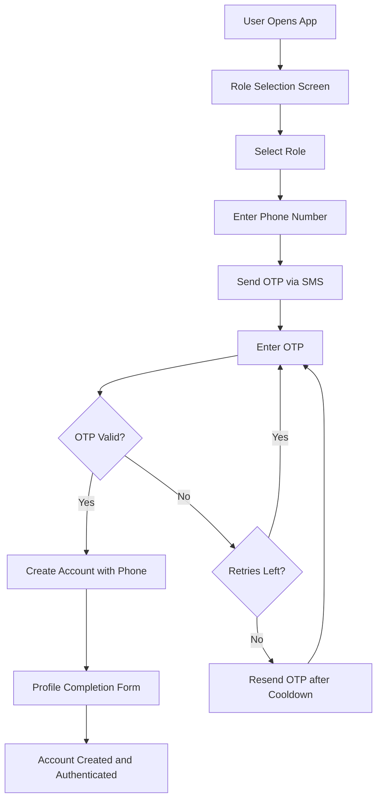
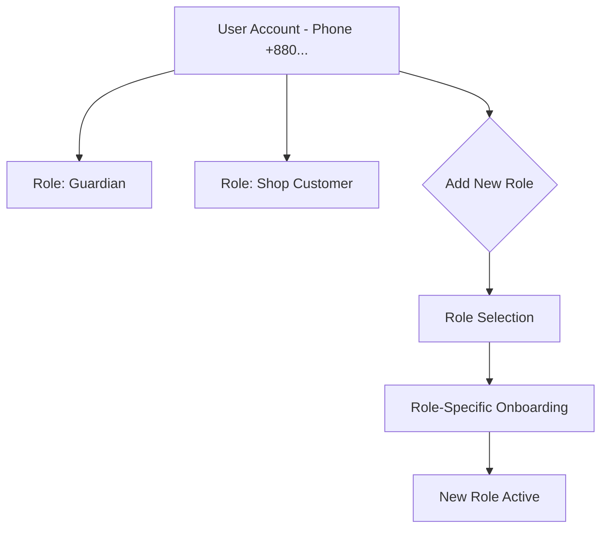
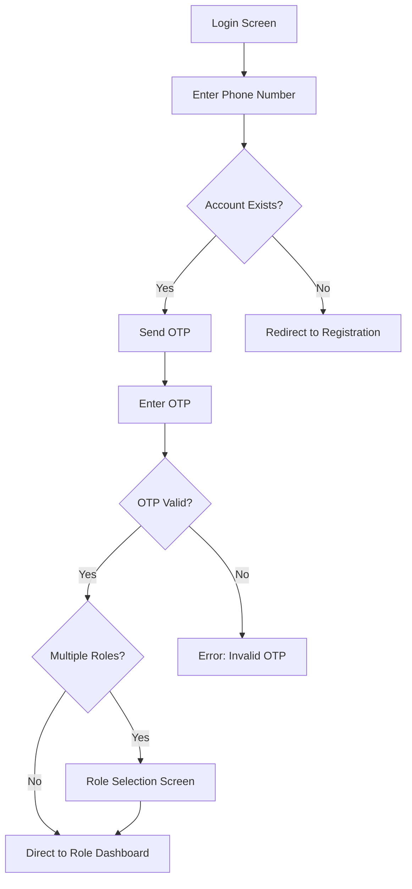
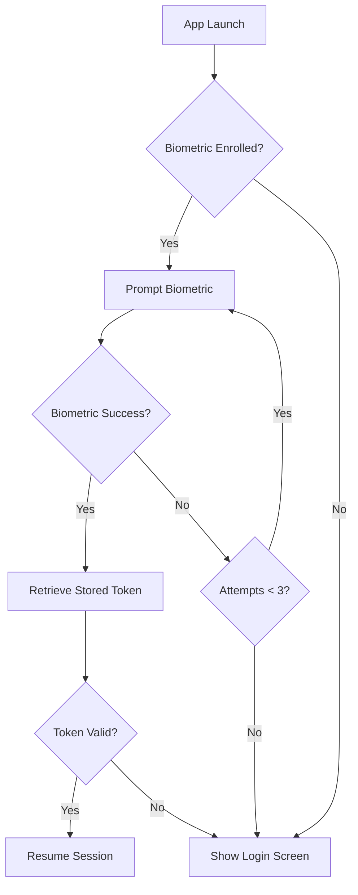
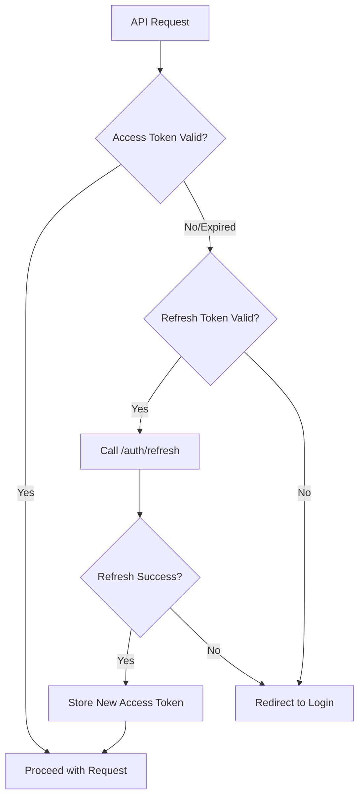
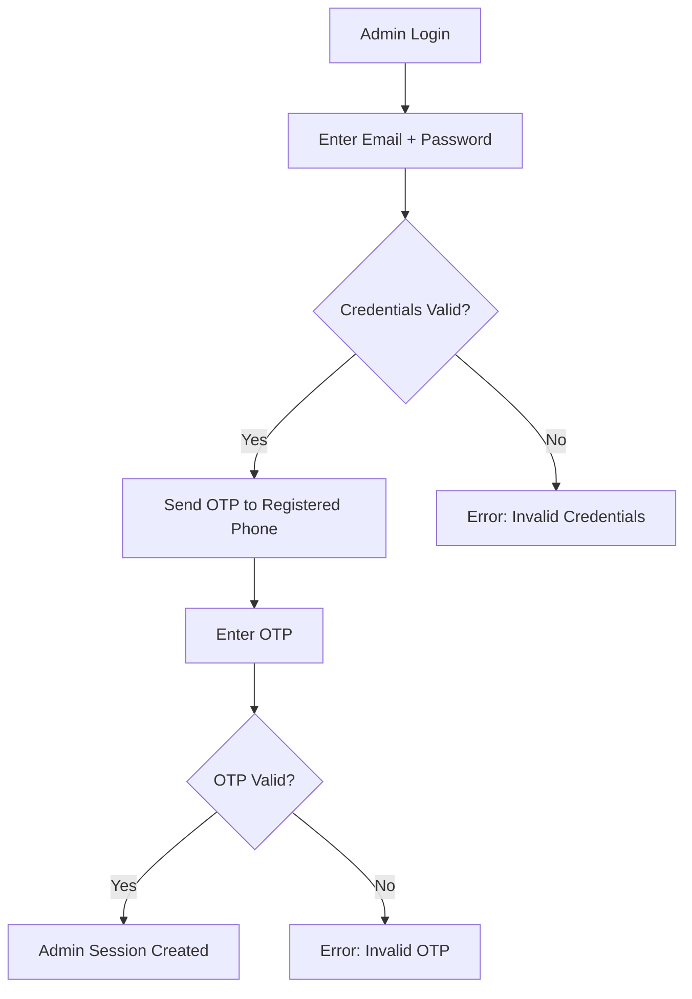

# D018 - Authentication & Session Flows

## 1. Scope & Bangladesh Context [✅ 100% Built] [🔴 High]
This document defines the authentication, session management, and identity verification flows for CareNet, grounded in the Bangladesh market reality where phone-based authentication is the standard pattern.

D003 defines the role model and RBAC structure. D008 §7 lists biometric auth as a Capacitor plugin. This document bridges the gap between identity model and implementation-ready auth flows.

This document should be read with -> D003 §2, -> D003 §4, -> D006 §6.1, -> D008 §7, -> D011 §2, and -> D016 §4.

## 2. Authentication Model [✅ 100% Built] [🔴 High]

### 2.1 Primary Authentication: Phone + OTP [✅ 100% Built] [🔴 High]
Bangladesh has low email adoption relative to phone penetration. Phone + OTP is the standard auth pattern used by bKash, Pathao, Daraz, and every major Bangladeshi digital platform.

| Decision | Specification |
|---|---|
| Primary auth method | Bangladesh mobile phone number + SMS OTP |
| Phone format | +880 country code, 10-digit national number |
| OTP delivery | SMS via aggregator (e.g., Twilio, SSL Wireless BD, BulkSMS BD) |
| OTP length | 6 digits |
| OTP validity | 5 minutes from generation |
| OTP retry limit | 3 attempts per OTP code before regeneration required |
| OTP cooldown | 60 seconds between OTP generation requests |
| Fallback OTP delivery | WhatsApp message (optional, for users who prefer) |

### 2.2 Secondary Authentication: Email + Password [✅ 100% Built] [🟠 Medium]

| Decision | Specification |
|---|---|
| Availability | Optional for users who prefer email-based auth |
| Primary audience | Admin, moderator, and international agency staff |
| Password requirements | Minimum 8 characters, at least 1 uppercase, 1 lowercase, 1 digit |
| Password storage | bcrypt hash with cost factor 12 |
| Password reset | Email-based reset link with 15-minute validity |

### 2.3 Authentication Method Matrix [✅ 100% Built] [🔴 High]

| Role | Primary Auth | Secondary Auth | 2FA Required |
|---|---|---|---|
| Guardian | Phone + OTP | Email + password (optional) | No |
| Caregiver | Phone + OTP | Email + password (optional) | No |
| Patient (via guardian) | Not independently authenticated | Accessed through guardian session | N/A |
| Agency owner | Phone + OTP | Email + password (recommended) | Recommended |
| Agency staff | Phone + OTP | Email + password (optional) | No |
| Shop owner | Phone + OTP | Email + password (optional) | No |
| Admin | Email + password | Phone + OTP as 2FA | Yes (mandatory per D011 §2) |
| Moderator | Email + password | Phone + OTP as 2FA | Yes (mandatory per D011 §2) |
| Super Admin | Email + password | Phone + OTP as 2FA + biometric | Yes (mandatory) |

## 3. Registration Flow [✅ 100% Built] [🔴 High]

### 3.1 Phone-First Registration [✅ 100% Built] [🔴 High]

### 3.2 Registration Data by Role [✅ 100% Built] [🔴 High]

| Role | Required at Registration | Collected Post-Registration |
|---|---|---|
| Guardian | Phone, name, district/area | Patient profiles, care requirements, payment method |
| Caregiver | Phone, name, NID number, district/area | Skills, certifications, experience, documents, background check |
| Agency | Phone, agency name, trade license number, district | Staff, service areas, documents, bank details |
| Shop | Phone, shop name, trade license number, area | Products, inventory, payment configuration |
| Admin/Moderator | Email, name (created by super admin) | N/A (provisioned accounts) |

### 3.3 Multi-Role Accounts [✅ 100% Built] [🔴 High]

| Rule | Specification |
|---|---|
| One phone = one account | A single phone number maps to exactly one user account |
| Multiple roles per account | A user can hold multiple roles (e.g., guardian + shop customer) |
| Role switching | After login, user can switch active role from profile/settings |
| Role addition | User can add a new role from settings without re-registering |
| Role-specific onboarding | Adding a new role triggers role-specific profile completion |

## 4. Login Flow [✅ 100% Built] [🔴 High]

### 4.1 Phone + OTP Login [✅ 100% Built] [🔴 High]

### 4.2 Biometric Quick Login (Capacitor) [✅ 100% Built] [🔴 High]

| Rule | Specification |
|---|---|
| Availability | Capacitor native app only (not PWA or mobile web) |
| Plugin | `capacitor-native-biometric` per D008 §7 |
| Enrollment | User opts in after first successful OTP login |
| Stored credential | Encrypted refresh token stored in device secure enclave |
| Biometric types | Fingerprint (primary), face unlock (where available) |
| Fallback | Phone + OTP if biometric fails 3 times |
| Session requirement | Biometric login only valid if last full auth was within 30 days |

## 5. Session Management [✅ 100% Built] [🔴 High]

### 5.1 Token Architecture [✅ 100% Built] [🔴 High]

| Token | Purpose | Lifetime | Storage |
|---|---|---|---|
| Access token | API authentication | 15 minutes | Memory (React state) |
| Refresh token | Access token renewal | 30 days | `@capacitor/preferences` (encrypted) or httpOnly cookie (web) |
| Device token | Device identification | Persistent until logout | `@capacitor/preferences` |

### 5.2 Token Refresh Flow [✅ 100% Built] [🔴 High]

### 5.3 Session Rules [✅ 100% Built] [🔴 High]

| Rule | Specification |
|---|---|
| Concurrent sessions | Allowed across multiple devices |
| Maximum devices | 5 active sessions per account |
| Session visibility | User can see active sessions in Settings (per D011 §2 device logging) |
| Remote logout | User can terminate other sessions from Settings |
| Inactivity timeout | 30 minutes for admin/moderator; no timeout for guardian/caregiver (mobile users leave app open) |
| Force logout | Server can invalidate all sessions for suspended accounts |

### 5.4 Offline Session Handling [✅ 100% Built] [🔴 High]

| Scenario | Behavior |
|---|---|
| Access token expires while offline | Queue API calls; refresh token on reconnect |
| Refresh token expires while offline | Require re-authentication on reconnect; preserve offline queue |
| App killed and restarted offline | Load last-known session from `@capacitor/preferences`; allow Tier 1 offline actions per D016 |
| Account suspended while user is offline | Reject all queued actions on sync; show suspension notice |

## 6. Phone Number Verification [✅ 100% Built] [🔴 High]

### 6.1 Bangladesh Phone Number Validation [✅ 100% Built] [🔴 High]

| Operator | Prefix Pattern | Example |
|---|---|---|
| Grameenphone | 013, 017 | +880 1712345678 |
| Robi | 016, 018 | +880 1812345678 |
| Banglalink | 014, 019 | +880 1912345678 |
| Teletalk | 015 | +880 1512345678 |

| Validation Rule | Specification |
|---|---|
| Format | Must be valid Bangladeshi mobile number |
| Length | 11 digits (0XXXXXXXXXX) or 13 with country code (+880XXXXXXXXXX) |
| Display format | +880 XXXX-XXXXXX |
| Input normalization | Strip spaces, dashes; prepend +880 if entered as 0-prefix |
| Duplicate check | Reject registration if phone already has an account |

### 6.2 OTP Delivery Reliability [✅ 100% Built] [🟠 Medium]

| Concern | Mitigation |
|---|---|
| SMS delivery delay | Show countdown timer; allow resend after 60s |
| SMS non-delivery | Offer WhatsApp OTP as fallback after 2 failed SMS attempts |
| SIM not in phone (WiFi-only device) | Offer email-based verification as alternative |
| Dual-SIM devices | Accept OTP regardless of which SIM slot receives it (OTP is code-based, not SIM-based) |

## 7. Identity Verification Flows [⚠️ Partially Built] [🔴 High]
Beyond authentication, CareNet requires identity verification for trust-critical roles.

### 7.1 Caregiver Verification [⚠️ Partially Built] [🔴 High]

| Step | Description | Owner |
|---|---|---|
| NID upload | Caregiver uploads National ID card photo | Caregiver |
| Document review | Admin or automated system verifies NID | Admin / platform |
| Background check | Platform initiates background verification | Admin / platform |
| Certification upload | Caregiver uploads training certificates | Caregiver |
| Certification review | Admin verifies authenticity | Admin |
| Verification badge | Profile marked as "Verified" | Platform |

### 7.2 Agency Verification [⚠️ Partially Built] [🔴 High]

| Step | Description | Owner |
|---|---|---|
| Trade license upload | Agency uploads valid trade license | Agency owner |
| Business verification | Admin reviews license and business registration | Admin |
| Agency approval | Admin approves agency to operate on platform | Admin (per D003 §7) |
| Periodic re-verification | Annual license validity check | Platform |

## 8. Security Controls [✅ 100% Built] [🔴 High]

### 8.1 Rate Limiting [✅ 100% Built] [🔴 High]

| Endpoint | Rate Limit | Window |
|---|---|---|
| OTP generation | 5 requests | Per phone per hour |
| OTP verification | 3 attempts | Per OTP code |
| Login attempts | 10 attempts | Per IP per hour |
| Registration | 3 accounts | Per IP per day |
| Password reset | 3 requests | Per email per hour |

### 8.2 Account Security Events [✅ 100% Built] [🔴 High]

| Event | Action |
|---|---|
| 5 failed OTP attempts | Temporary 15-minute lockout |
| 10 failed login attempts | Account locked; admin review required |
| Login from new device | Notification sent to user |
| Password changed | Notification sent; all other sessions invalidated |
| Account suspended | All active sessions terminated; refresh tokens revoked |

### 8.3 Admin 2FA Flow [✅ 100% Built] [🔴 High]

## 9. Final Planning Position [✅ 100% Built] [🔴 High]
The authentication and session architecture is now explicitly defined:

1. Phone + OTP is the primary auth method aligned with Bangladesh market norms.
2. Biometric quick-login via Capacitor provides convenience for returning mobile users.
3. Multi-role accounts allow one phone to hold multiple platform roles.
4. Token architecture supports both online and offline operation per D016.
5. Admin 2FA is mandatory per D011 security baseline.
6. Bangladesh phone validation and OTP delivery patterns are specified.

| D018 Area | Status |
|---|---|
| Phone + OTP authentication | [✅ 100% Built] |
| Registration flow | [✅ 100% Built] |
| Multi-role account model | [✅ 100% Built] |
| Biometric quick-login | [✅ 100% Built] |
| Session management | [✅ 100% Built] |
| Token architecture | [✅ 100% Built] |
| Phone validation (BD) | [✅ 100% Built] |
| Identity verification | [⚠️ Partially Built] |
| Admin 2FA | [✅ 100% Built] |
| Security controls | [✅ 100% Built] |
