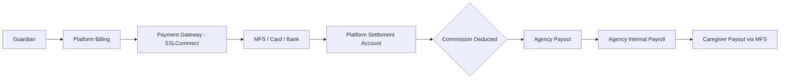
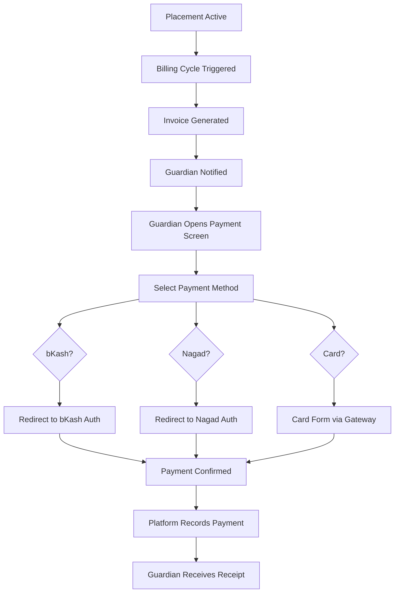
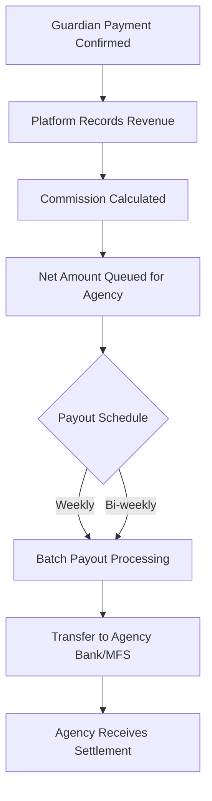
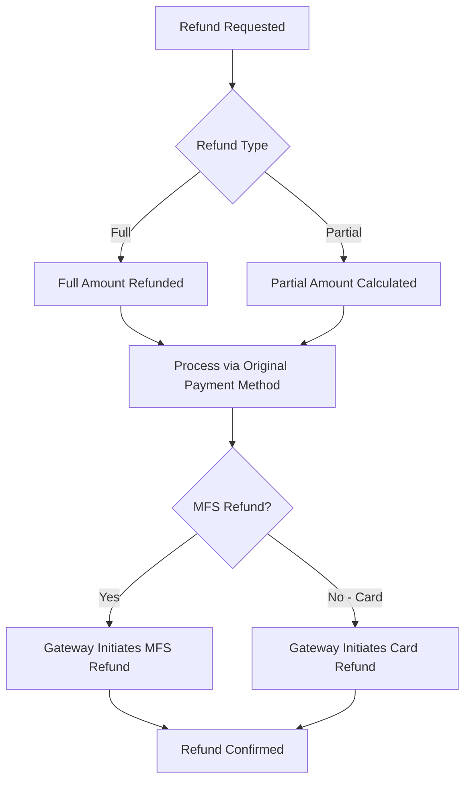
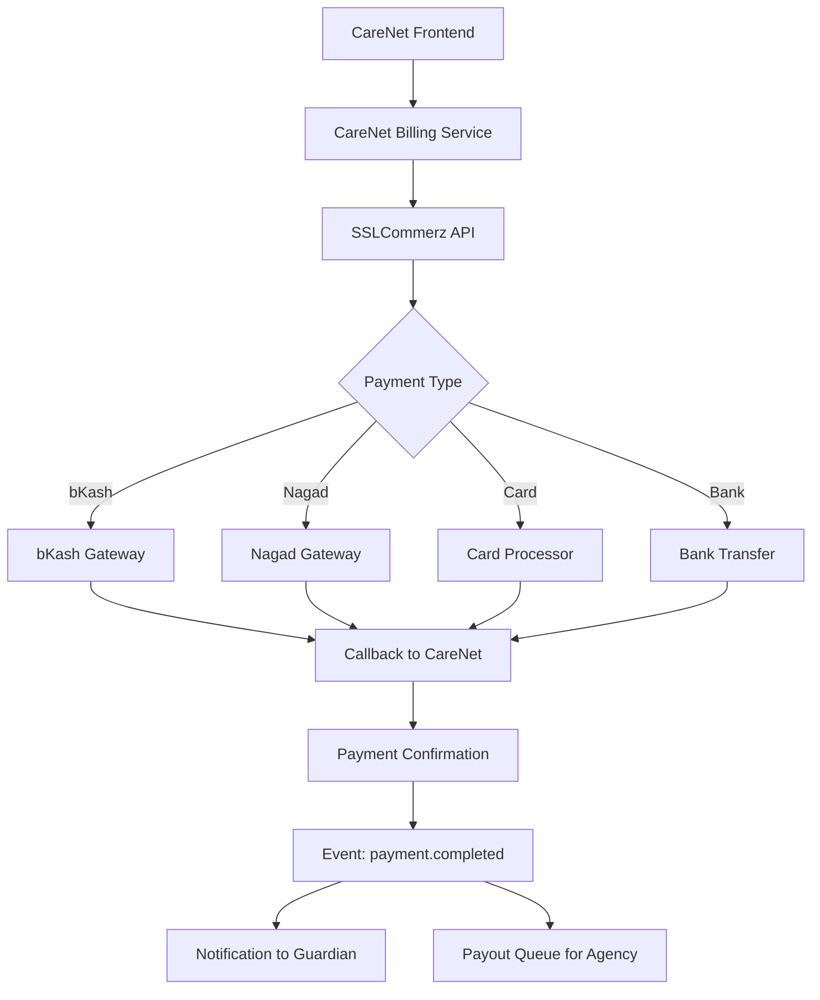

# D019 - Bangladesh Payment Integration

## 1. Scope & Market Context [✅ 100% Built] [🔴 High]
This document defines the payment integration strategy for CareNet in Bangladesh, where Mobile Financial Services (MFS) dominate digital payments and traditional card-based payments are a minority channel.

D004 §6 defines the payment ownership model: Guardian -> Platform -> Agency -> Caregiver payroll. D005 §6 identifies payment-related tables. This document specifies how those flows connect to Bangladesh's actual payment infrastructure.

This document should be read with -> D003 §6.4, -> D004 §6, -> D005 §4.5, -> D006 §6.5, and -> D011 §6.

## 2. Bangladesh Payment Landscape [✅ 100% Built] [🔴 High]

### 2.1 Mobile Financial Services (MFS) Dominance [✅ 100% Built] [🔴 High]

| Provider | Market Position | Monthly Active Users (approx.) | Integration Priority |
|---|---|---|---|
| bKash | Market leader, ~65% MFS market share | 65M+ | 🔴 Must-have |
| Nagad | Second largest, government-backed (Bangladesh Post Office) | 40M+ | 🔴 Must-have |
| Rocket (DBBL) | Third largest, bank-backed | 15M+ | 🟠 High |
| Upay | Growing, UCB-backed | 5M+ | 🟡 Low (phase 2) |

### 2.2 Other Payment Methods [✅ 100% Built] [🟠 Medium]

| Method | Usage Context | Priority |
|---|---|---|
| Bank transfer (NPSB/BEFTN) | Agency payroll disbursement, large transactions | 🟠 High |
| Debit/credit card (Visa/Mastercard) | Urban, higher-income guardians | 🟡 Low |
| Cash on delivery | Shop marketplace orders | 🟠 High |
| Platform wallet | Internal balance for micro-transactions | 🟡 Low (phase 2) |

### 2.3 Payment Gateway Options [✅ 100% Built] [🔴 High]

| Gateway | MFS Coverage | Card Support | BD Focus | Integration Priority |
|---|---|---|---|---|
| SSLCommerz | bKash, Nagad, Rocket, cards, bank | Yes | Primary BD gateway | 🔴 Primary |
| AamarPay | bKash, Nagad, Rocket, cards | Yes | Strong BD presence | 🟠 Backup |
| ShurjoPay | bKash, Nagad, cards | Yes | Growing BD gateway | 🟡 Alternative |
| Stripe (via Stripe Atlas) | Cards only; no MFS | Yes | International | 🟡 Future (international expansion) |

**Recommended primary gateway: SSLCommerz** — widest MFS coverage, established in Bangladesh, supports all major MFS providers plus cards and bank transfer.

## 3. Payment Flow Architecture [✅ 100% Built] [🔴 High]

### 3.1 End-to-End Payment Chain [✅ 100% Built] [🔴 High]

| Flow Step | Owner | Payment Method |
|---|---|---|
| Guardian pays for care service | Guardian | bKash / Nagad / Card via gateway |
| Platform receives payment | Platform settlement account | Gateway settlement |
| Platform deducts commission | Platform | Automatic calculation |
| Agency receives net payment | Agency | Bank transfer or MFS |
| Agency pays caregiver | Agency | bKash / Nagad / Bank (agency-managed) |

### 3.2 Payment Ownership Rules (from D003/D004) [✅ 100% Built] [🔴 High]

| Rule | Specification |
|---|---|
| Guardian pays agency-facing service bill | Guardian never pays caregiver directly |
| Platform mediates settlement | Platform receives full amount, deducts commission, settles to agency |
| Agency manages caregiver payroll | Caregiver payout is agency's internal operation |
| Guardian does not see caregiver split | Per D003 §6.4 payment ownership rules |
| Placement is the billing anchor | All care service charges reference a placement |

## 4. Guardian Payment Flow [✅ 100% Built] [🔴 High]

### 4.1 Care Service Payment [✅ 100% Built] [🔴 High]

### 4.2 bKash Payment UX (Primary Flow) [✅ 100% Built] [🔴 High]

| Step | User Experience |
|---|---|
| 1 | Guardian taps "Pay Now" on invoice |
| 2 | Payment method selection sheet appears (bKash highlighted as recommended) |
| 3 | User selects bKash |
| 4 | App redirects to bKash checkout (in-app WebView or bKash app deep link) |
| 5 | User enters bKash PIN on bKash interface |
| 6 | bKash confirms payment |
| 7 | Gateway callback confirms to CareNet |
| 8 | CareNet shows success screen with receipt |

### 4.3 Invoice Model [✅ 100% Built] [🔴 High]

| Field | Description |
|---|---|
| `invoice_id` | Unique invoice identifier |
| `placement_id` | Reference to active placement |
| `guardian_id` | Payer reference |
| `agency_id` | Payee reference |
| `billing_period_start` | Start of billing period |
| `billing_period_end` | End of billing period |
| `base_amount` | Care service charge |
| `platform_fee` | Platform commission |
| `total_amount` | Total guardian pays |
| `currency` | BDT |
| `status` | `generated`, `sent`, `paid`, `overdue`, `cancelled` |
| `payment_method` | bKash, Nagad, Card, Bank |
| `gateway_transaction_id` | SSLCommerz transaction reference |

## 5. Agency Payout Flow [✅ 100% Built] [🔴 High]

### 5.1 Settlement to Agency [✅ 100% Built] [🔴 High]

| Rule | Specification |
|---|---|
| Payout frequency | Weekly or bi-weekly (agency configurable) |
| Payout method | Bank transfer (BEFTN) or bKash business account |
| Minimum payout threshold | ৳500 minimum before payout triggers |
| Payout visibility | Agency dashboard shows pending, processing, and completed payouts |
| Reconciliation | Agency can view payment-to-payout mapping per placement |

### 5.2 Caregiver Payroll (Agency-Managed) [✅ 100% Built] [🟠 Medium]
Per D003 §6.4, caregiver payroll is agency-internal. The platform provides:

| Platform Surface | Purpose |
|---|---|
| Agency Payroll Dashboard (per D013) | Agency manages caregiver payment schedules |
| Caregiver Earnings View | Caregiver sees expected and received earnings |
| Payout confirmation | Agency marks payout as completed with reference number |

The platform does **not** directly transfer funds to caregivers. Agency sends caregiver payroll via their own bKash/Nagad/bank channels and records the transaction on the platform.

## 6. Shop Marketplace Payments [✅ 100% Built] [🟠 Medium]

### 6.1 Shop Order Payment [✅ 100% Built] [🟠 Medium]

| Method | Availability |
|---|---|
| bKash / Nagad | Primary (via SSLCommerz) |
| Cash on delivery (COD) | Supported for physical goods |
| Card | Supported via gateway |

### 6.2 Shop Settlement [✅ 100% Built] [🟠 Medium]

| Rule | Specification |
|---|---|
| Settlement frequency | Weekly |
| Commission | Platform marketplace commission on each order |
| Settlement method | Bank transfer or MFS business account |
| Refund handling | Platform-mediated refund back to original payment method |

## 7. Refund & Dispute Handling [✅ 100% Built] [🔴 High]

### 7.1 Refund Flow [✅ 100% Built] [🔴 High]

| Rule | Specification |
|---|---|
| Refund window | 30 days from payment for care services; 14 days for shop orders |
| Refund method | Always back to original payment method |
| MFS refund timeline | 3-7 business days (bKash/Nagad processing) |
| Card refund timeline | 7-14 business days |
| Dispute resolution | Admin-mediated per D003 §7 |
| Partial refund | Supported for prorated care service adjustments |

### 7.2 Dispute-to-Refund Path [✅ 100% Built] [🟠 Medium]

| Step | Owner |
|---|---|
| Guardian raises dispute | Guardian via placement detail or support |
| Admin reviews dispute | Admin (per D003 §7) |
| Resolution determined | Admin decides full refund, partial refund, or rejection |
| Refund initiated | Platform processes through gateway |
| All parties notified | Guardian, agency, and admin see resolution |

## 8. Tax & Regulatory Compliance [⚠️ Partially Built] [🔴 High]

### 8.1 VAT/Tax Handling [⚠️ Partially Built] [🔴 High]

| Concern | Current Direction |
|---|---|
| VAT on platform fee | 15% VAT on service charges (standard BD rate) |
| VAT display | Shown as line item on guardian invoice |
| Tax invoice requirement | Platform must generate BIN-compliant invoices |
| Agency tax withholding | Platform may need to withhold at source (TDS) on agency payouts |
| Regulatory authority | National Board of Revenue (NBR) Bangladesh |

Note: Specific tax compliance requires legal counsel for the Bangladesh market. This section captures the known structural requirements without specifying exact rates or exemptions that may change.

### 8.2 MFS Transaction Limits [✅ 100% Built] [🟠 Medium]

| Provider | Single Transaction Limit | Monthly Limit | Implication |
|---|---|---|---|
| bKash | ৳25,000 (personal) / ৳75,000 (merchant) | ৳200,000 (personal) | Large care invoices may need split payments or bank transfer |
| Nagad | ৳25,000 (personal) / ৳50,000 (merchant) | ৳200,000 (personal) | Same consideration for large amounts |
| Rocket | ৳25,000 (personal) | ৳200,000 (personal) | Same consideration |

For care placements with monthly billing exceeding MFS limits, the platform should offer bank transfer as the recommended method.

## 9. Payment Data Model Additions [✅ 100% Built] [🔴 High]

| Table | Key Fields | Purpose |
|---|---|---|
| `invoices` | `id`, `placement_id`, `guardian_id`, `agency_id`, `amount`, `platform_fee`, `vat`, `total`, `status`, `billing_period` | Billing records |
| `payments` | `id`, `invoice_id`, `amount`, `method`, `gateway_txn_id`, `status`, `paid_at` | Payment transaction records |
| `payouts` | `id`, `agency_id`, `amount`, `method`, `reference`, `status`, `period_start`, `period_end` | Agency settlement records |
| `refunds` | `id`, `payment_id`, `amount`, `reason`, `status`, `initiated_by`, `processed_at` | Refund tracking |
| `payment_methods` | `id`, `user_id`, `type`, `provider`, `account_ref`, `is_default` | Saved payment methods |

These extend the commerce and billing table families in D005 §4.5.

## 10. Gateway Integration Architecture [✅ 100% Built] [🔴 High]

### 10.1 Gateway Integration Rules [✅ 100% Built] [🔴 High]

| Rule | Specification |
|---|---|
| Environment | SSLCommerz sandbox for development; production for live |
| Callback URL | Server-side IPN (Instant Payment Notification) endpoint |
| Transaction validation | Always verify payment server-side via SSLCommerz validation API |
| Never trust client-side | Payment confirmation must come from server-side callback, never frontend redirect alone |
| Idempotency | Use invoice_id as unique transaction reference to prevent duplicate charges |
| Currency | BDT only for v1.0 |

## 11. Final Planning Position [✅ 100% Built] [🔴 High]
The Bangladesh payment integration is now explicitly defined:

1. bKash and Nagad are mandatory MFS integrations covering 95%+ of digital payment users.
2. SSLCommerz is the recommended primary gateway with broadest MFS coverage.
3. The Guardian -> Platform -> Agency -> Caregiver payment chain is gateway-connected.
4. Refund and dispute flows connect to the admin oversight model.
5. MFS transaction limits are documented with fallback guidance.
6. Tax/VAT handling is structurally addressed pending legal finalization.

| D019 Area | Status |
|---|---|
| Bangladesh payment landscape | [✅ 100% Built] |
| Payment flow architecture | [✅ 100% Built] |
| Guardian payment flow | [✅ 100% Built] |
| Agency payout flow | [✅ 100% Built] |
| Shop marketplace payments | [✅ 100% Built] |
| Refund and dispute handling | [✅ 100% Built] |
| Tax and regulatory | [⚠️ Partially Built] |
| Payment data model | [✅ 100% Built] |
| Gateway integration | [✅ 100% Built] |
