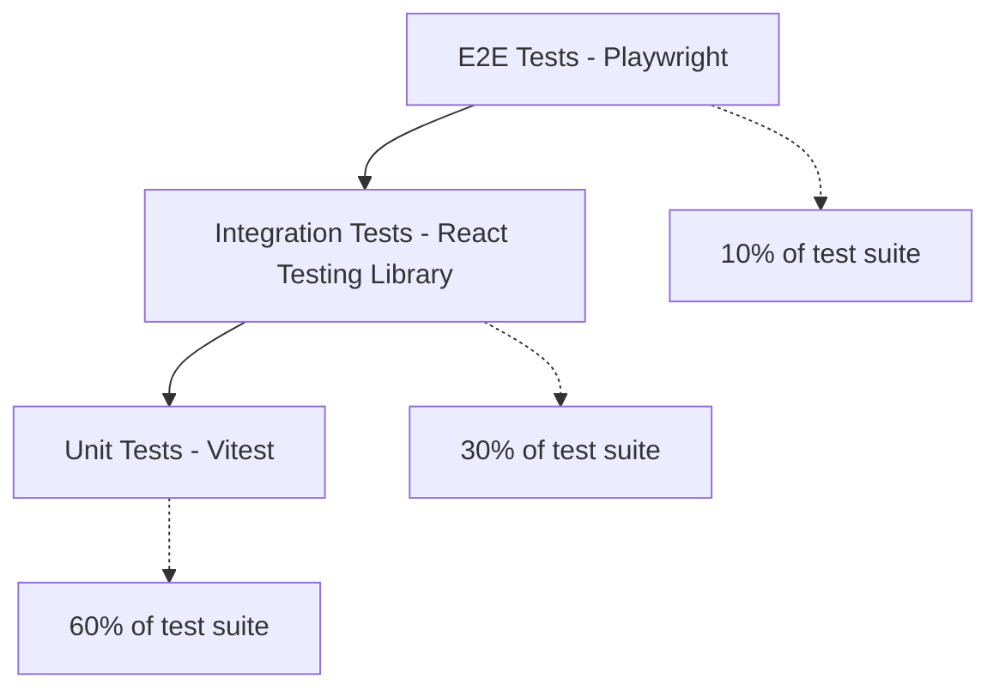

# D020 - Testing & Quality Strategy

## 1. Scope & Quality Baseline [✅ 100% Built] [🔴 High]
This document defines the testing strategy for CareNet: what must be tested, how it should be tested, which devices and environments matter, and how quality gates connect to the delivery workstreams in D010.

CareNet is a care platform serving vulnerable populations (elderly patients, people with disabilities) through an agency-mediated model. Testing is not optional polish — errors in care logs, shift attendance, medication records, or payment flows have real clinical, financial, and safety consequences.

This document should be read with -> D004 §2, -> D008 §3, -> D010, -> D011 §6, -> D016 §11, and -> D012 §6.

## 2. Testing Pyramid [✅ 100% Built] [🔴 High]

| Layer | Tool | Scope | Coverage Target |
|---|---|---|---|
| Unit tests | Vitest | Pure functions, utilities, state logic, formatters, validators | 80%+ line coverage |
| Integration tests | React Testing Library + Vitest | Component rendering, form behavior, navigation, role-based rendering | Key user journeys covered |
| E2E tests | Playwright | Full workflow paths across pages, API integration, mobile viewport | Critical business flows covered |
| Visual regression | Playwright screenshots | Layout integrity across breakpoints | Key pages per module |
| Accessibility | axe-core + Playwright | WCAG 2.1 AA compliance | All public pages, all form pages |
| Performance | Lighthouse CI | Bundle size, FCP, TTI per D008 §9 | Every route chunk |

## 3. Critical Business Flow Tests [✅ 100% Built] [🔴 High]
The following end-to-end test scenarios map directly to the D004 workflow state machines.

### 3.1 Core Workflow E2E Tests [✅ 100% Built] [🔴 High]

| Test ID | Flow | Steps | Roles Involved | Priority |
|---|---|---|---|---|
| E2E-001 | Care Requirement to Job | Guardian creates requirement -> Agency reviews -> Agency creates job | Guardian, Agency | 🔴 Critical |
| E2E-002 | Job to Placement | Job posted -> Caregiver applies -> Agency reviews -> Agency hires -> Placement created | Agency, Caregiver | 🔴 Critical |
| E2E-003 | Shift Lifecycle | Shift scheduled -> Caregiver checks in -> Care delivered -> Caregiver checks out -> Shift completed | Agency, Caregiver | 🔴 Critical |
| E2E-004 | Care Log Entry | Caregiver opens shift -> Selects log type -> Enters data -> Saves -> Log visible to guardian and agency | Caregiver, Guardian, Agency | 🔴 Critical |
| E2E-005 | Payment Flow | Invoice generated -> Guardian pays via mock gateway -> Payment confirmed -> Agency payout queued | Guardian, Agency | 🔴 Critical |
| E2E-006 | Incident Report | Caregiver reports incident -> Agency notified -> Admin visibility | Caregiver, Agency, Admin | 🔴 Critical |
| E2E-007 | Full End-to-End | Requirement -> Job -> Application -> Hire -> Placement -> Shift -> Care Log -> Payment | All roles | 🔴 Critical |

### 3.2 Auth & Session Tests [✅ 100% Built] [🔴 High]

| Test ID | Scenario | Priority |
|---|---|---|
| AUTH-001 | Phone + OTP registration for each role type | 🔴 Critical |
| AUTH-002 | Phone + OTP login with role selection | 🔴 Critical |
| AUTH-003 | Biometric quick-login enrollment and use (Capacitor only) | 🟠 High |
| AUTH-004 | Multi-role account switches role correctly | 🟠 High |
| AUTH-005 | Token refresh on expired access token | 🔴 Critical |
| AUTH-006 | Session termination on account suspension | 🔴 Critical |
| AUTH-007 | Admin 2FA login flow | 🟠 High |

### 3.3 Offline & Sync Tests [✅ 100% Built] [🔴 High]

| Test ID | Scenario | Priority |
|---|---|---|
| SYNC-001 | Care log created offline syncs on reconnect | 🔴 Critical |
| SYNC-002 | Shift check-in offline with GPS capture syncs correctly | 🔴 Critical |
| SYNC-003 | Duplicate offline action deduplicated by server | 🔴 Critical |
| SYNC-004 | 50 queued actions sync in priority order | 🟠 High |
| SYNC-005 | App killed while offline, reopened online, queue processes | 🟠 High |
| SYNC-006 | Stale-state conflict shows user-friendly resolution | 🟠 High |

### 3.4 Payment Tests [✅ 100% Built] [🔴 High]

| Test ID | Scenario | Priority |
|---|---|---|
| PAY-001 | bKash payment via SSLCommerz sandbox | 🔴 Critical |
| PAY-002 | Nagad payment via SSLCommerz sandbox | 🔴 Critical |
| PAY-003 | Payment callback verification (server-side) | 🔴 Critical |
| PAY-004 | Full refund flow | 🟠 High |
| PAY-005 | Partial refund calculation | 🟠 High |
| PAY-006 | Agency payout batch processing | 🟠 High |

## 4. Device Testing Matrix [✅ 100% Built] [🔴 High]

### 4.1 Budget Android Devices (Primary) [✅ 100% Built] [🔴 High]
Per D008 §3, budget Android devices in the BDT 8K-15K range are the primary target.

| Device Category | Representative Models | Android Version | RAM | Screen | Priority |
|---|---|---|---|---|---|
| Ultra-budget | Samsung Galaxy A03, Redmi 9A, Realme C11 | Android 11-12 | 2GB | 6.5" HD+ | 🔴 Must test |
| Budget | Samsung Galaxy A14, Redmi 12C, Realme C55 | Android 12-13 | 3-4GB | 6.6" FHD+ | 🔴 Must test |
| Low-mid | Samsung Galaxy A25, Redmi Note 12, Realme 10 | Android 13-14 | 4-6GB | 6.5" FHD+ | 🟠 Should test |
| Older devices | Samsung Galaxy J7 (2018), Redmi 7 | Android 9-10 | 2GB | 5.5-6.0" HD | 🟠 Should test |

### 4.2 Minimum WebView Requirements [✅ 100% Built] [🔴 High]

| Requirement | Specification |
|---|---|
| Minimum Android WebView | Chrome 80+ (covers Android 9+) |
| Required JS features | ES2020, Intl API, IndexedDB, Service Workers, CSS Grid, CSS Custom Properties |
| Polyfill strategy | Core-js for Promise.allSettled, Array.flat; no polyfills for CSS |
| Testing requirement | Verify on Android System WebView (not Chrome app) since Capacitor uses system WebView |

### 4.3 Desktop & Tablet Testing [✅ 100% Built] [🟠 Medium]

| Environment | Browser | Priority |
|---|---|---|
| Desktop Windows | Chrome latest, Edge latest | 🟠 Should test |
| Desktop macOS | Chrome latest, Safari latest | 🟡 Nice to test |
| iPad / Android tablet | Chrome, Safari | 🟡 Nice to test |

### 4.4 Network Condition Testing [✅ 100% Built] [🔴 High]

| Condition | Simulation | Must-Pass Criteria |
|---|---|---|
| 4G LTE | Default | All features work normally |
| 3G | Chrome DevTools throttle: 750kbps down, 250kbps up, 100ms RTT | FCP < 3s, TTI < 6s, all workflows complete |
| 2G | Chrome DevTools throttle: 280kbps down, 56kbps up, 800ms RTT | App shell loads, Tier 1 offline features work |
| Offline | Network disconnected | Tier 1 actions (care logs, check-in) work per D016 |
| Flaky | Random packet loss (10-30%) | No data corruption, sync recovers gracefully |

## 5. Accessibility Testing [✅ 100% Built] [🟠 Medium]

### 5.1 WCAG 2.1 AA Targets [✅ 100% Built] [🟠 Medium]

| Criterion | Requirement | Testing Method |
|---|---|---|
| Color contrast | 4.5:1 for normal text, 3:1 for large text | axe-core automated scan |
| Touch targets | 44x44px minimum per D008 §5.1 | Manual measurement + automated check |
| Focus management | Logical tab order, visible focus indicators | Manual keyboard testing |
| Screen reader | Meaningful labels, ARIA attributes, role announcements | TalkBack on Android, VoiceOver on iOS |
| Language attribute | `lang="bn"` or `lang="en"` per D017 §8 | Automated HTML validation |
| Form labels | All inputs have associated labels | axe-core scan |
| Error identification | Form errors identified by more than color alone | Manual + automated |

### 5.2 Care Platform Accessibility Notes [✅ 100% Built] [🟠 Medium]

| Concern | Specification |
|---|---|
| Elderly guardians | Larger touch targets (already covered by D008 §5.1 48px standard) |
| Low-literacy users | Icon-led navigation (already in shell design), Bangla labels |
| Motor impairment | Generous spacing, no time-limited interactions except OTP |
| Visual impairment | High-contrast status colors per D012 §5.2, sufficient text size per D017 §4.2 |

## 6. Performance Testing [✅ 100% Built] [🔴 High]

### 6.1 Performance Budget Enforcement [✅ 100% Built] [🔴 High]

| Metric | Target (from D008 §9) | Enforcement Method |
|---|---|---|
| First Contentful Paint | < 2s on 3G | Lighthouse CI in CI pipeline |
| Time to Interactive | < 4s on 3G | Lighthouse CI in CI pipeline |
| Bundle per route | < 50KB gzipped | Build-time bundle analyzer with CI gate |
| Total JS bundle | < 300KB gzipped initial | Build-time check |
| Image lazy loading | All below-fold images | Automated Lighthouse audit |
| Memory usage | < 150MB | Manual testing on budget devices |
| Largest Contentful Paint | < 3s on 3G | Lighthouse CI |
| Cumulative Layout Shift | < 0.1 | Lighthouse CI |

### 6.2 Performance Regression Detection [✅ 100% Built] [🟠 Medium]

| Method | Frequency | Gate |
|---|---|---|
| Lighthouse CI | Every PR | Fail if score drops below 70 on mobile |
| Bundle size check | Every PR | Fail if any route chunk exceeds 50KB gzipped |
| Manual device testing | Every sprint | Test on Samsung Galaxy A03 (2GB RAM) |

## 7. Localization Testing [✅ 100% Built] [🟠 Medium]

| Test Area | Verification |
|---|---|
| Bangla rendering | All Bangla text renders correctly with proper conjuncts (যুক্তাক্ষর) |
| Text overflow | Bangla labels fit within buttons, cards, navigation without truncation |
| Number formatting | Bengali digits display correctly in Bangla mode |
| Date formatting | Bangla month names and date formats display correctly |
| Currency | BDT amounts use South Asian grouping in both languages |
| Fallback | Missing translation keys fall back to English gracefully |
| Font loading | Noto Sans Bengali loads and renders before user interaction |

## 8. Security Testing [✅ 100% Built] [🔴 High]

| Test Area | Method | Priority |
|---|---|---|
| RBAC enforcement | Attempt to access role-restricted routes without permission | 🔴 Critical |
| Token security | Verify access token not stored in localStorage | 🔴 Critical |
| OTP brute force | Verify rate limiting prevents OTP enumeration | 🔴 Critical |
| Payment callback | Verify server-side validation of gateway callbacks | 🔴 Critical |
| XSS prevention | Input sanitization on all user-generated content | 🔴 Critical |
| CSRF protection | Verify token-based CSRF protection on state-changing endpoints | 🟠 High |
| File upload | Verify file type validation and size limits on document uploads | 🟠 High |
| Session hijacking | Verify session invalidation on password change | 🟠 High |

## 9. Test Environment Strategy [✅ 100% Built] [🟠 Medium]

| Environment | Purpose | Data |
|---|---|---|
| Local development | Developer testing | Seeded mock data per role |
| CI/CD | Automated test suite on every PR | Generated test fixtures |
| Staging | Full integration testing with real services | Sanitized production-like data |
| Device lab | Manual testing on budget Android devices | Same as staging |
| Production | Smoke tests post-deployment | Synthetic test accounts |

### 9.1 Test Data Seeding [✅ 100% Built] [🟠 Medium]

| Seed Data Set | Contents | Purpose |
|---|---|---|
| Roles and users | 1 user per role type with complete profiles | Role-switching and permission testing |
| Active placement | Complete chain: requirement -> job -> application -> placement -> shifts | Workflow testing |
| Care log history | 30 days of varied care log types | Timeline and history view testing |
| Message threads | Conversations across placement stages | Messaging stage-gate testing |
| Shop inventory | 50 products across categories | Commerce flow testing |
| Agency with staff | Agency org with owner, supervisor, staff | Organization hierarchy testing |

## 10. Quality Gates for Delivery Workstreams [✅ 100% Built] [🔴 High]
Each workstream from D010 must pass these gates before delivery sign-off.

| Gate | Requirement |
|---|---|
| Unit test coverage | > 80% line coverage for new code |
| Integration tests | All component-level tests pass |
| E2E critical paths | All E2E tests for the affected workflow pass |
| Accessibility scan | Zero critical axe-core violations |
| Performance budget | No route chunk exceeds 50KB gzipped |
| Lighthouse mobile | Score >= 70 on mobile profile |
| Device verification | Tested on at least one budget Android device (2GB RAM) |
| Offline behavior | Tier 1 offline features verified if applicable |
| Bangla rendering | Bangla text verified on key screens |
| Security check | RBAC enforcement verified for new routes |

## 11. Final Planning Position [✅ 100% Built] [🔴 High]
The testing strategy is now explicitly defined:

1. Testing pyramid with Vitest, React Testing Library, and Playwright.
2. Critical business flow E2E tests map directly to D004 state machines.
3. Device testing matrix targets Bangladesh budget Android reality.
4. Performance budgets from D008 are enforced via CI gates.
5. Accessibility, localization, and security testing are structured.
6. Quality gates connect to D010 delivery workstreams.

| D020 Area | Status |
|---|---|
| Testing pyramid | [✅ 100% Built] |
| Critical business flow tests | [✅ 100% Built] |
| Device testing matrix | [✅ 100% Built] |
| Accessibility testing | [✅ 100% Built] |
| Performance testing | [✅ 100% Built] |
| Localization testing | [✅ 100% Built] |
| Security testing | [✅ 100% Built] |
| Test environment strategy | [✅ 100% Built] |
| Quality gates | [✅ 100% Built] |
