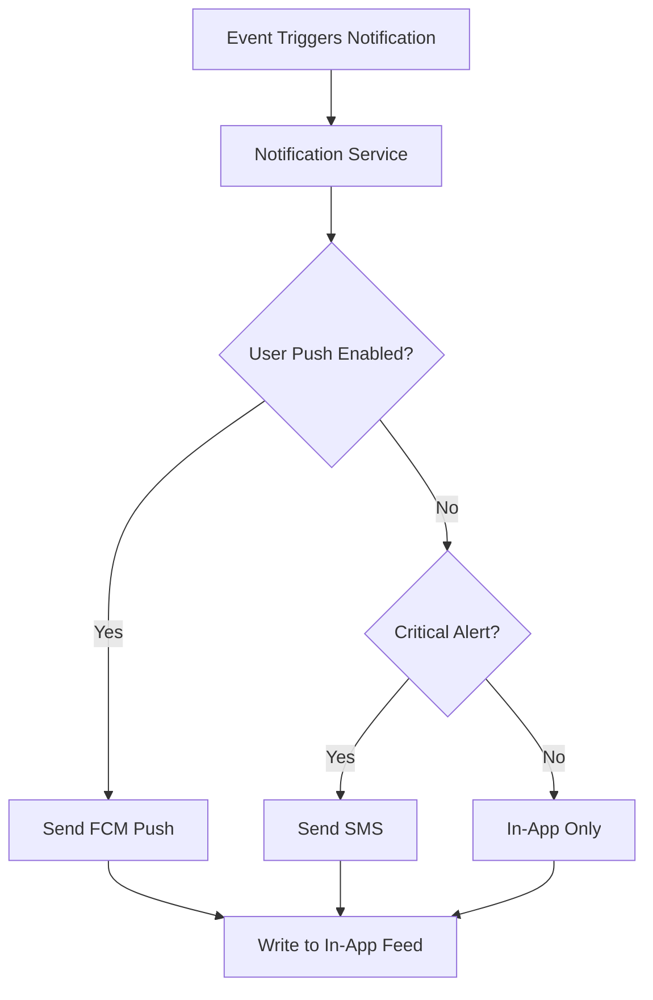
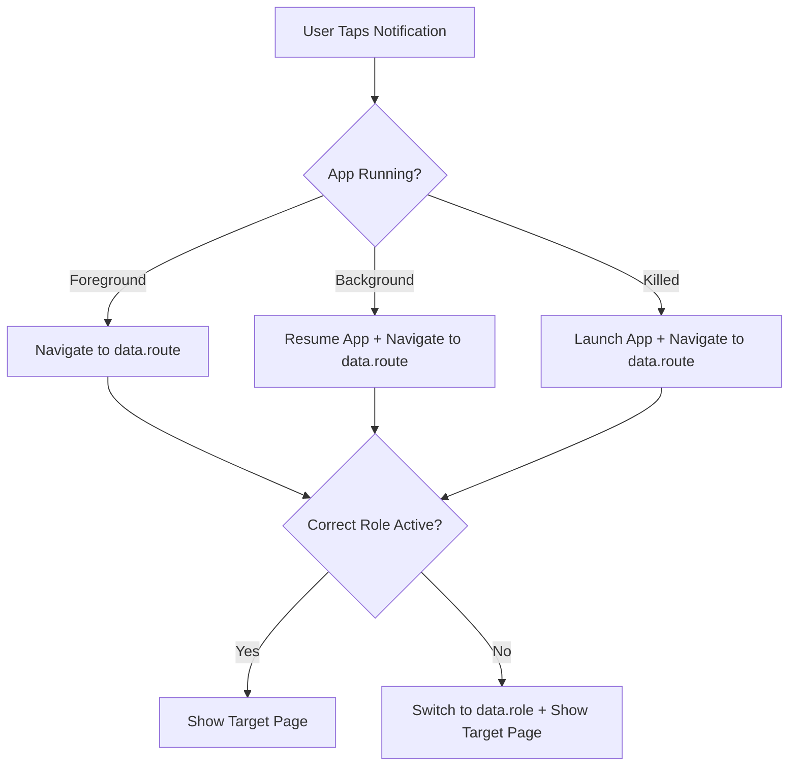
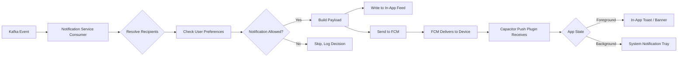

# D021 - Push Notification Design

## 1. Scope & Delivery Context [✅ 100% Built] [🔴 High]
This document defines the push notification architecture for CareNet: which events trigger notifications, how they are categorized, how users control preferences, and how the notification system integrates with the Capacitor native layer and the Kafka event bus.

D006 §7 defines Kafka topics and the notification service as an event consumer. D008 §7 lists `@capacitor/push-notifications` + FCM as the delivery mechanism. This document bridges those references into an implementable notification design.

This document should be read with -> D006 §7, -> D006 §8, -> D008 §7, -> D014 §3, and -> D016 §5.

## 2. Notification Delivery Channels [✅ 100% Built] [🔴 High]

| Channel | Technology | Use Case | Priority |
|---|---|---|---|
| Push notification (mobile) | FCM via `@capacitor/push-notifications` | Primary real-time alert delivery | 🔴 Primary |
| In-app notification | CareNet notification feed (`/notifications`) | Persistent notification history | 🔴 Primary |
| SMS | SMS gateway (per D018 OTP provider) | Critical safety alerts when app is not installed | 🟠 Fallback |
| Email | Transactional email service | Receipts, weekly summaries, admin alerts | 🟡 Secondary |

### 2.1 Channel Selection Rules [✅ 100% Built] [🔴 High]

| Scenario | Channels Used |
|---|---|
| User has Capacitor app installed and push enabled | Push + in-app |
| User has PWA installed | Web push + in-app |
| User has push disabled | In-app only + SMS for critical alerts |
| User is offline | Queued for delivery on reconnect; SMS for critical time-sensitive alerts |
| Admin/moderator | Email + in-app (may not use mobile app) |



## 3. Android Notification Channels [✅ 100% Built] [🔴 High]
Android 8+ (Oreo) requires notification channels. Users can independently control each channel in system settings.

| Channel ID | Channel Name | Description | Default State | Sound | Vibration |
|---|---|---|---|---|---|
| `care_safety` | Care & Safety Alerts | Incident reports, emergency alerts, vitals anomalies | Enabled | Alert tone | Yes |
| `shift_reminders` | Shift Reminders | Upcoming shifts, check-in reminders, missed shift alerts | Enabled | Default | Yes |
| `messages` | Messages | New messages in conversations | Enabled | Message tone | Yes |
| `placement_updates` | Placement Updates | Placement status changes, caregiver assignments, requirement updates | Enabled | Default | No |
| `payment_billing` | Payments & Billing | Payment confirmations, invoice notifications, payout alerts | Enabled | Default | No |
| `platform_updates` | Platform Updates | Account status, verification updates, system announcements | Enabled | None | No |
| `marketing` | News & Updates | Platform news, feature announcements, promotions | Disabled by default | None | No |

### 3.1 Channel Priority Mapping [✅ 100% Built] [🔴 High]

| Channel | Android Importance | iOS Equivalent |
|---|---|---|
| `care_safety` | IMPORTANCE_HIGH | Critical (bypasses Do Not Disturb) |
| `shift_reminders` | IMPORTANCE_HIGH | Time Sensitive |
| `messages` | IMPORTANCE_DEFAULT | Active |
| `placement_updates` | IMPORTANCE_DEFAULT | Active |
| `payment_billing` | IMPORTANCE_DEFAULT | Active |
| `platform_updates` | IMPORTANCE_LOW | Passive |
| `marketing` | IMPORTANCE_MIN | Passive |

## 4. Event-to-Notification Mapping [✅ 100% Built] [🔴 High]

### 4.1 Care & Safety Notifications [✅ 100% Built] [🔴 High]

| Kafka Event | Recipient(s) | Title (EN) | Title (BN) | Channel | Priority |
|---|---|---|---|---|---|
| `incident.reported` | Agency supervisor, Guardian, Admin | "Incident Reported" | "ঘটনা রিপোর্ট হয়েছে" | `care_safety` | 🔴 Critical |
| `vital.anomaly.detected` | Guardian, Agency supervisor, Caregiver | "Health Alert" | "স্বাস্থ্য সতর্কতা" | `care_safety` | 🔴 Critical |
| `patient.alert.generated` | Guardian, Agency supervisor | "Patient Alert" | "রোগীর সতর্কতা" | `care_safety` | 🔴 Critical |
| `shift.missed` | Agency supervisor, Guardian | "Missed Shift Alert" | "শিফট মিস হয়েছে" | `care_safety` | 🔴 Critical |

### 4.2 Shift Notifications [✅ 100% Built] [🔴 High]

| Kafka Event | Recipient(s) | Title (EN) | Title (BN) | Channel | Priority |
|---|---|---|---|---|---|
| `shift.created` | Assigned caregiver | "New Shift Assigned" | "নতুন শিফট নির্ধারিত" | `shift_reminders` | 🟠 High |
| (Scheduled: 30min before) | Assigned caregiver | "Shift Starts in 30 Minutes" | "৩০ মিনিটে শিফট শুরু" | `shift_reminders` | 🔴 Critical |
| (Scheduled: 15min before) | Assigned caregiver | "Shift Starts in 15 Minutes" | "১৫ মিনিটে শিফট শুরু" | `shift_reminders` | 🔴 Critical |
| `shift.started` | Guardian | "Caregiver Has Checked In" | "কেয়ারগিভার চেক-ইন করেছেন" | `shift_reminders` | 🟠 High |
| `shift.completed` | Guardian, Agency | "Shift Completed" | "শিফট সম্পন্ন" | `shift_reminders` | 🟠 High |
| `shift.replacement.assigned` | Guardian, Replacement caregiver | "Replacement Caregiver Assigned" | "বিকল্প কেয়ারগিভার নির্ধারিত" | `shift_reminders` | 🟠 High |

### 4.3 Messaging Notifications [✅ 100% Built] [🔴 High]

| Kafka Event | Recipient(s) | Title (EN) | Title (BN) | Channel |
|---|---|---|---|---|
| `message.sent` | Conversation participants (not sender) | "New Message from [Name]" | "[নাম] থেকে নতুন বার্তা" | `messages` |

| Rule | Specification |
|---|---|
| Batching | If 3+ messages from same sender within 5 minutes, collapse to "X new messages from [Name]" |
| Active conversation | Do not send push if user is currently viewing the conversation |
| Typing indicator | No push notification for typing events |

### 4.4 Placement & Workflow Notifications [✅ 100% Built] [🟠 Medium]

| Kafka Event | Recipient(s) | Title (EN) | Title (BN) | Channel |
|---|---|---|---|---|
| `requirement.approved` | Guardian | "Requirement Accepted" | "প্রয়োজনীয়তা গৃহীত" | `placement_updates` |
| `job.created` | Eligible caregivers (matching skills/area) | "New Job Available" | "নতুন কাজ পাওয়া যাচ্ছে" | `placement_updates` |
| `application.reviewed` | Caregiver | "Application Update" | "আবেদন আপডেট" | `placement_updates` |
| `application.accepted` | Caregiver | "Application Accepted!" | "আবেদন গৃহীত!" | `placement_updates` |
| `placement.created` | Guardian, Caregiver | "Placement Confirmed" | "প্লেসমেন্ট নিশ্চিত" | `placement_updates` |
| `placement.completed` | Guardian, Caregiver, Agency | "Placement Completed" | "প্লেসমেন্ট সম্পন্ন" | `placement_updates` |

### 4.5 Payment & Billing Notifications [✅ 100% Built] [🟠 Medium]

| Trigger | Recipient | Title (EN) | Title (BN) | Channel |
|---|---|---|---|---|
| Invoice generated | Guardian | "New Invoice" | "নতুন ইনভয়েস" | `payment_billing` |
| `payment.completed` | Guardian | "Payment Confirmed" | "পেমেন্ট নিশ্চিত" | `payment_billing` |
| `payment.failed` | Guardian | "Payment Failed" | "পেমেন্ট ব্যর্থ" | `payment_billing` |
| Payout processed | Agency | "Payout Processed" | "পেআউট প্রক্রিয়া সম্পন্ন" | `payment_billing` |
| `refund.processed` | Guardian | "Refund Processed" | "রিফান্ড প্রক্রিয়া সম্পন্ন" | `payment_billing` |

### 4.6 Platform & Account Notifications [✅ 100% Built] [🟡 Low]

| Trigger | Recipient | Title (EN) | Title (BN) | Channel |
|---|---|---|---|---|
| Account verified | Caregiver / Agency | "Account Verified" | "অ্যাকাউন্ট যাচাই সম্পন্ন" | `platform_updates` |
| Account suspended | Affected user | "Account Suspended" | "অ্যাকাউন্ট স্থগিত" | `platform_updates` |
| New login from device | User | "New Login Detected" | "নতুন লগইন শনাক্ত" | `platform_updates` |
| Review received | Caregiver / Agency | "New Review" | "নতুন রিভিউ" | `platform_updates` |

## 5. Notification Payload Structure [✅ 100% Built] [🔴 High]

### 5.1 FCM Payload Format [✅ 100% Built] [🔴 High]

```json
{
  "notification": {
    "title": "Shift Starts in 30 Minutes",
    "body": "Your shift at [Patient Name]'s location begins at 2:00 PM",
    "android_channel_id": "shift_reminders",
    "click_action": "OPEN_ACTIVITY"
  },
  "data": {
    "type": "shift.reminder",
    "entity_type": "shift",
    "entity_id": "shift_abc123",
    "route": "/caregiver/shifts/shift_abc123",
    "role": "caregiver",
    "locale": "bn"
  }
}
```

### 5.2 Payload Rules [✅ 100% Built] [🔴 High]

| Rule | Specification |
|---|---|
| Title language | Based on user's language preference (per D017) |
| Body language | Based on user's language preference |
| Deep link | `data.route` maps to CareNet route for navigation on tap |
| Role context | `data.role` ensures correct role is active when navigating |
| Sensitive data | Never include patient health details, payment amounts, or PII in notification body |
| Payload size | < 4KB total (FCM limit) |

### 5.3 Notification Tap Behavior [✅ 100% Built] [🔴 High]



## 6. User Preference Management [✅ 100% Built] [🔴 High]

### 6.1 In-App Notification Settings [✅ 100% Built] [🔴 High]
Accessible from Settings page (per D013 settings route).

| Preference | Options | Default |
|---|---|---|
| Care & safety alerts | On / Off | On (cannot be disabled for guardians with active placements) |
| Shift reminders | On / Off | On |
| Message notifications | On / Off / Muted conversations only | On |
| Placement updates | On / Off | On |
| Payment notifications | On / Off | On |
| Platform updates | On / Off | On |
| News & marketing | On / Off | Off |

### 6.2 Quiet Hours [✅ 100% Built] [🟠 Medium]

| Rule | Specification |
|---|---|
| Default quiet hours | 10:00 PM - 7:00 AM local time |
| Quiet hours behavior | Non-critical notifications are silenced; in-app feed still records them |
| Override for critical | `care_safety` channel always delivers regardless of quiet hours |
| User customization | Start time and end time adjustable from Settings |

### 6.3 Preference Storage [✅ 100% Built] [🟠 Medium]

| Storage | Location | Sync |
|---|---|---|
| Server-side | User preferences table | Authoritative source |
| Local cache | `@capacitor/preferences` | Offline reference |
| Android system | Channel-level settings | User can override per-channel in system settings |

## 7. Badge Count Management [✅ 100% Built] [🟠 Medium]

| Rule | Specification |
|---|---|
| App icon badge | Total unread notification count |
| BottomNav message badge | Unread message count (red dot per D002 §6.2) |
| Badge update | Real-time via push data payload; reconciled on app foreground |
| Badge clear | Mark-all-read on `/notifications` page; individual dismiss |
| Maximum badge number | Display "99+" for counts exceeding 99 |

## 8. Rate Limiting & Anti-Spam [✅ 100% Built] [🟠 Medium]

| Rule | Specification |
|---|---|
| Per-user per-hour limit | Maximum 20 push notifications per user per hour |
| Message notification batching | Collapse rapid messages from same sender (3+ in 5 minutes) |
| Job notification throttle | Maximum 5 "New Job" notifications per day per caregiver |
| Duplicate suppression | Same event_type + entity_id within 10 minutes = suppress duplicate |
| Marketing limit | Maximum 1 marketing notification per week per user |

## 9. FCM Integration Architecture [✅ 100% Built] [🔴 High]



### 9.1 FCM Token Management [✅ 100% Built] [🔴 High]

| Rule | Specification |
|---|---|
| Token registration | On app launch and after permission grant |
| Token refresh | Handle `registration` event from `@capacitor/push-notifications` |
| Token storage | Server associates FCM token with user account and device |
| Multi-device | User may have multiple FCM tokens (one per device) |
| Token cleanup | Remove token on logout; invalidate stale tokens after 30 days of inactivity |
| Permission request | Prompt user on first login after registration (not on install) |

### 9.2 Permission Request UX [✅ 100% Built] [🟠 Medium]

| Step | UX |
|---|---|
| 1 | After first successful login, show in-app explanation: "Enable notifications to receive shift reminders, care alerts, and messages" |
| 2 | User taps "Enable" -> trigger system permission dialog |
| 3 | If denied, record preference; show Settings link to re-enable later |
| 4 | Never re-prompt after denial (Android blocks re-prompt; respect user choice) |

## 10. Notification Service Infrastructure [✅ 100% Built] [🟠 Medium]

| Component | Specification |
|---|---|
| Kafka consumer group | `notification-service` consuming from relevant topics |
| Processing | Stateless consumer; reads event, resolves recipients, checks preferences, sends |
| Delivery tracking | Log delivery status per notification (sent, delivered, failed, opened) |
| Retry | FCM failures retried 3 times with 30s backoff |
| Dead letter | Failed notifications after 3 retries logged to dead-letter topic for investigation |
| Monitoring | Alert if notification delivery rate drops below 95% |

## 11. Final Planning Position [✅ 100% Built] [🔴 High]
The push notification design is now explicitly defined:

1. Seven Android notification channels with distinct importance levels.
2. Complete event-to-notification mapping covering care, shifts, messages, payments, and platform events.
3. Bilingual notification titles (English and Bangla) aligned with D017.
4. FCM payload structure with deep-linking to specific CareNet routes.
5. User preference management with quiet hours and per-channel control.
6. Rate limiting and anti-spam rules prevent notification fatigue.
7. FCM token lifecycle and permission request UX are specified.

| D021 Area | Status |
|---|---|
| Notification channels | [✅ 100% Built] |
| Event-to-notification mapping | [✅ 100% Built] |
| Payload structure | [✅ 100% Built] |
| User preferences | [✅ 100% Built] |
| Badge management | [✅ 100% Built] |
| Rate limiting | [✅ 100% Built] |
| FCM integration | [✅ 100% Built] |
| Bilingual support | [✅ 100% Built] |
